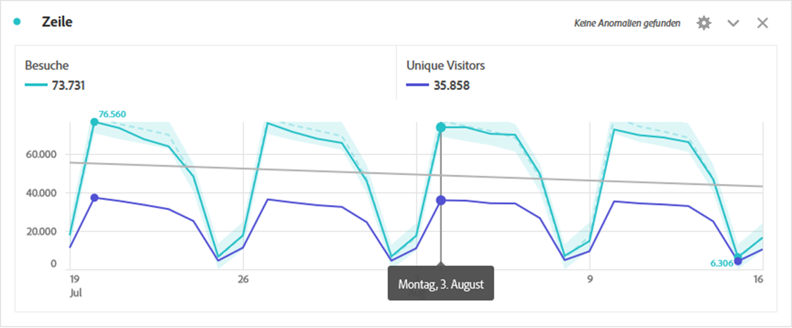
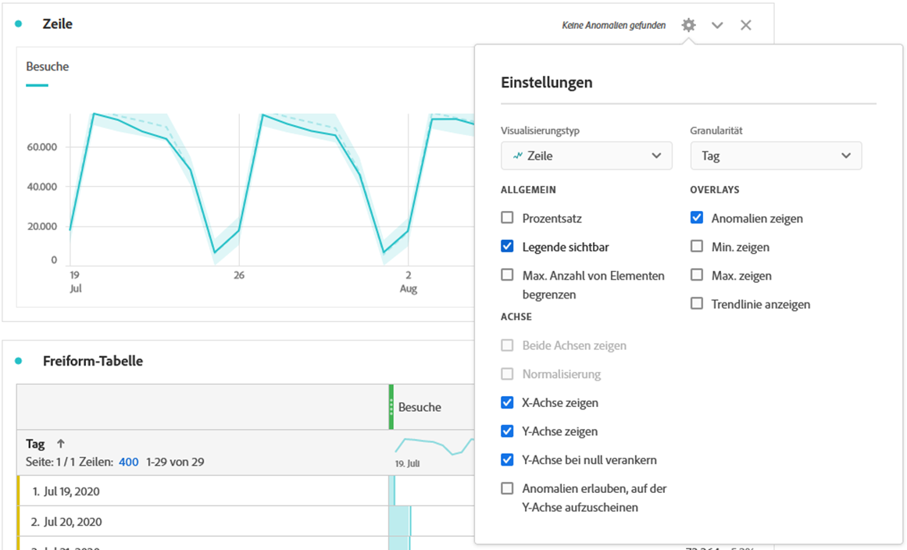
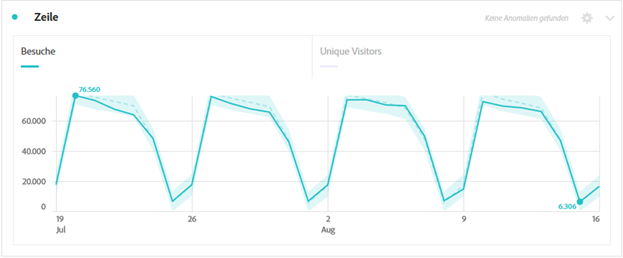
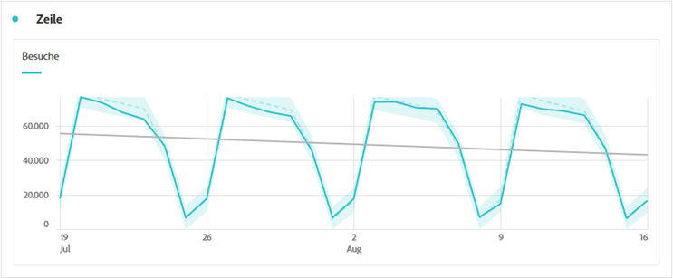

# Linie

Die Linienvisualisierung stellt Metriken anhand einer Linie dar, die den Wertverlauf über einen bestimmten Zeitraum hinweg zeigt. Ein Liniendiagramm kann nur verwendet werden, wenn die Zeit als Dimension verwendet wird.

Klicken Sie auf das Zahnradsymbol oben rechts in der Linienvisualisierung, um auf die verfügbaren [**Visualisierungseinstellungen**](freeform-analysis-visualizations.md) zuzugreifen. Die Einstellungen sind in folgende Kategorien unterteilt:

* **Allgemein**: Einstellungen, die für verschiedene Visualisierungstypen gelten
* **Achse**: Einstellungen, die sich auf die x- oder y-Achse der Linienvisualisierung auswirken
* **Überlagerungen**: Optionen zum Hinzufügen von zusätzlichem Kontext zu den in Ihrer Linienvisualisierung angezeigten Serien.

## Granularität ändern

In den [Visualisierungseinstellungen](freeform-analysis-visualizations.md) können Sie über ein Dropdown-Menü für die Granularität eine Trend-Visualisierung (z. B. Linie, Balken) von täglich zu wöchentlich zu monatlich usw. ändern. Die Granularität wird auch in der Datenquellentabelle aktualisiert.

## Min. oder Max. anzeigen

Unter **[!UICONTROL Visualisierungseinstellungen]** > **[!UICONTROL Überlagerungen]** > **[!UICONTROL Min/Max anzeigen]** können Sie eine Beschriftung für Minimal- und Maximalwerte überlagern, um die Spitzen und Täler schnell in einer Metrik hervorzuheben. Hinweis: Die Min/Max-Werte werden aus den sichtbaren Datenpunkten in der Visualisierung abgeleitet, nicht aus dem vollständigen Satz von Werten innerhalb einer Dimension.

## Trendzeilenüberlagerung anzeigen

Under **[!UICONTROL Visualization Settings]** > **[!UICONTROL Overlays]** > **[!UICONTROL Show trendline]**, you can choose to add a regression or moving average trendline to your line series. Trendlinien helfen, ein Muster in den Daten besser darzustellen.

>[!TIP]
>
>Es wird empfohlen, Trendlinien auf Daten anzuwenden, die weder aktuelle (partielle Daten) noch zukünftige Daten enthalten, da diese die Trendlinie verfälschen. Wenn Sie jedoch zukünftige Daten einbeziehen müssen, entfernen Sie Nullen aus den Daten, um eine Verzerrung dieser Tage zu vermeiden. Gehen Sie dazu zur Datenquelle-Tabelle der Visualisierung, wählen Sie Ihre Metrikspalte und aktivieren Sie dann **[!UICONTROL Spalteneinstellungen]** > Null als Wert **[!UICONTROL interpretieren]**.

Alle Trendlinien des Regressionsmodells passen mit den üblichen Minimalquadraten:

| Modell | Beschreibung |
| --- | --- |
| Linear | Erstellt eine am besten passende gerade Linie für einfache lineare Datensätze und ist nützlich, wenn die Daten stetig zunehmen oder abnehmen. Gleichung: `y = a + b * x` |
| Logarithmisch | Erstellt eine am besten passende gekrümmte Linie und ist nützlich, wenn die Änderungsrate der Daten schnell zunimmt oder abnimmt und dann abflacht. Eine logarithmische Trendlinie kann negative und positive Werte verwenden. Gleichung: `y = a + b * log(x)` |
| Exponentiell | Erstellt eine gekrümmte Linie und ist nützlich, wenn Daten mit ständig steigenden Raten steigen oder fallen. Diese Option sollte nicht verwendet werden, wenn Ihre Daten Null oder negative Werte enthalten. Gleichung: `y = a + e^(b * x)` |
| Potenzfunktion | Erstellt eine gekrümmte Linie und ist nützlich für Datensätze, die Messungen vergleichen, die mit einer bestimmten Rate ansteigen. Diese Option sollte nicht verwendet werden, wenn Ihre Daten Null oder negative Werte enthalten. Gleichung: `y = a * x^b` |
| Quadratisch | Findet die beste Anpassung für einen Datensatz in Form einer Parabel (konkav nach oben oder unten). Gleichung: `y = a + b * x + c * x^2` |
| Anpassbarer Durchschnittswert | Erstellt eine glatte Trendlinie basierend auf einer Reihe von Durchschnittswerten. Auch als rollierender Durchschnitt bezeichnet, verwendet ein sich bewegender Durchschnitt eine bestimmte Anzahl von Datenpunkten (bestimmt durch die Auswahl der &quot;Zeiträume&quot;), verwendet Durchschnittswerte und verwendet den Durchschnitt als Punkt in der Zeile. Beispiele sind der Durchschnitt für 7 Tage oder der Durchschnitt für 4 Wochen. |
