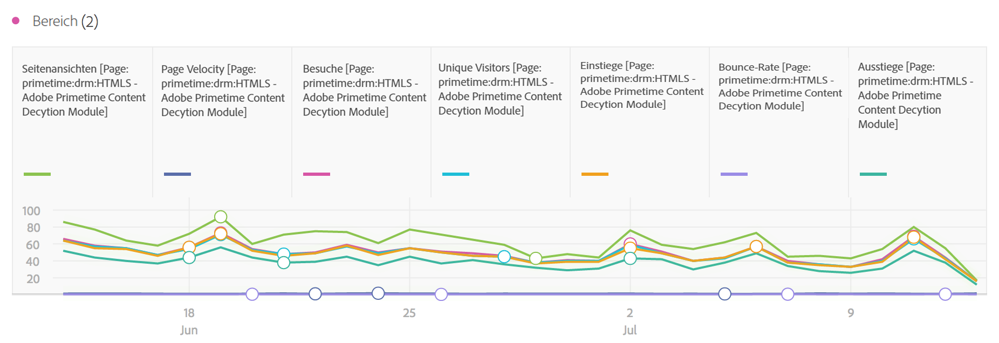
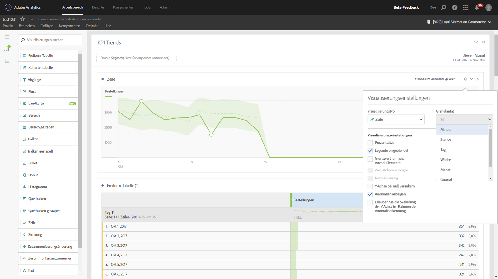

# Linie

Diese Visualisierung stellt Metriken anhand einer Linie dar, die den Wertverlauf über einen bestimmten Zeitraum hinweg zeigt. Ein Liniendiagramm kann nur verwendet werden, wenn die Zeit eine der Achsen ist.

In den [Visualisierungseinstellungen](../../../analyze/analysis-workspace/visualizations/freeform-analysis-visualizations.md#section_D3BB5042A92245D8BF6BCF072C66624B) können Sie über ein Dropdown-Menü für die Granularität eine Trend-Visualisierung (z. B. Linie, Balken) von täglich zu wöchentlich zu monatlich usw. ändern.

