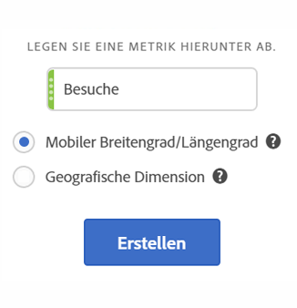
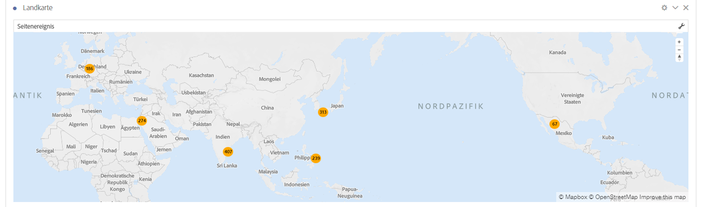
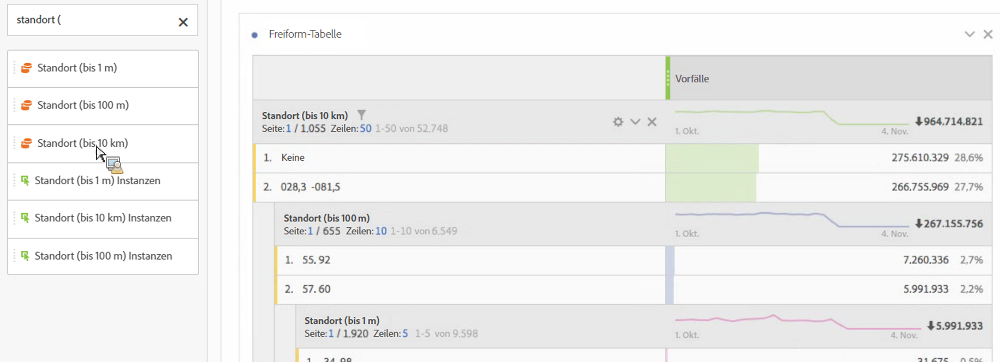
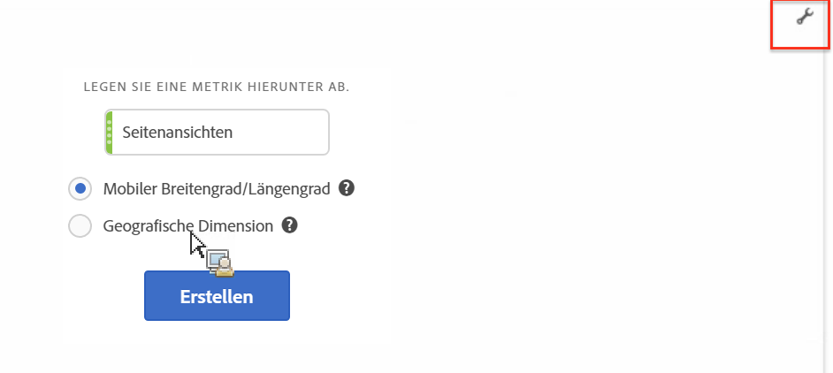

# Zuordnung

## Überblick {#section_19F740FAF08D47B1AF1EF239A74FC75C}

Die Zuordnungsvisualisierung in Analysis Workspace

* Ermöglicht die Erstellung einer visuellen Zuordnung einer beliebigen Metrik (einschließlich berechneter Metriken).
* ist hilfreich bei der Erfassung und dem Vergleich von Metrikdaten über verschiedene geographische Regionen hinweg.
* kann zwei Datenquellen verwenden: den Breitengrad/Längengrad aus der Verwendung von Mobilgeräten oder die geographische Dimension aus der Internetnutzung.
* Unterstützt PDF-Export.
* nutzt WebGL für die Grafikdarstellung. Wenn Ihre Grafiktreiber die WebGL-Ausgabe nicht unterstützen, müssen Sie Ihre Treiber unter Umständen aktualisieren.

## Eine Zuordnungsvisualisierung erstellen {#section_61BBFA3A7BFD48DA8D305A69D9416299}

1. Ziehen Sie eine **[!UICONTROL Zuordnung]** aus der Liste der Visualisierungen in ein Freiform-Bedienfeld:

   

1. Ziehen Sie eine Metrik aus der Liste der Metriken (gilt auch für berechnete Metriken) dazu.
1. Legen Sie die Datenquelle fest, die Sie nutzen möchten. (Dieses Dialogfeld wird nur angezeigt, wenn die Standortverfolgung für die Daten Ihrer mobilen App aktiviert ist.)

<table id="table_CD54B433464B4282A7524FB187016C47"> 
 <tbody> 
  <tr> 
   <td colname="col1"> 
<b>Mobiler Breitengrad/Längengrad</b> 
 </td> 
   <td colname="col2"> 
Diese Option stellt die Daten der mobilen App dar. 
 
Diese Option wird Ihnen nur angezeigt, wenn Sie sie für Ihre Report Suite unter   Analytics &gt; Admin &gt; Report Suites &gt;  &lt;gewünschte Report Suite&gt;  &gt; Einstellungen bearbeiten &gt; Mobile Management &gt; Standortverfolgung aktivieren   aktiviert haben. 
 
Das ist die Standardeinstellung (sofern die Standardverfolgung aktiviert ist). 
 </td> 
  </tr> 
  <tr> 
   <td colname="col1"> 
<b>Geographische Dimensionen</b> 
 </td> 
   <td colname="col2"> 
Diese Option stellt anhand der IP-Adresse eines Besuchers gewonnene Geo Segmentierung-Daten über seinen Standort dar. Diese Daten werden in „Land“, „Region“ und „Stadt“ umgewandelt. Beachten Sie, dass diese Daten nicht bis zu den Ebenen „Designated Market Area“ oder „Postleitzahl“ reichen. 
 
Diese Dimension ist für beinahe alle Report Suites aktiviert. Wenn das bei Ihrer Report Suite nicht der Fall ist, bitten Sie die Adobe-Kundenunterstützung um Hilfe bei der Aktivierung geographischer Berichte. 
 </td> 
  </tr> 
 </tbody> 
</table>

1. Klicken Sie auf **[!UICONTROL Erstellen]**.

   Die erste Ansicht, die Sie sehen, ist eine Weltansicht mit einer Blasendiagrammkarte, die in etwa so aussieht.

   

1. Sie können jetzt

   * die Landkarte **heranzoomen**, um bestimmte Bereiche zu vergrößern. Klicken Sie dazu doppelt auf die Landkarte oder nutzen Sie das Scrollrad. Die Landkarte wird an der Stelle herangezoomt, an der Sie den Cursor platziert haben. Durch die Zoom-Interaktion wird die erforderliche Dimension (Land > Bundesland > Stadt) basierend auf dem Zoomfaktor aktualisiert.
   * zwei oder mehr Map Visualizations im selben Projekt **vergleichen**. Platzieren Sie sie dazu nebeneinander.
   * **Zeitraumsvergleiche anzeigen (beispielsweise Jahresvergleiche)**:

      * Negative Zahlen anzeigen: Wenn Sie beispielsweise eine Metrik zum Jahresvergleich plotten, kann auf der Karte für New York -33 % angezeigt werden.
      * Mit Metriken des Typs „Prozent“ werden die Prozentanzeigen mit Durchschnitten gebündelt.
      * Grünes/rotes Farbschema: Positiv/negativ
   * die Landkarte in 2D oder 3D **drehen**. Halten Sie dazu die Taste [!UICONTROL Strg] gedrückt und verschieben Sie die Landkarte.

   * **Umschalten** auf eine andere Ansicht wie die Heatmap. Nehmen Sie dazu die unten beschriebenen [Einstellungen](/help/analyze/analysis-workspace/visualizations/map-visualization.md#section_5F89C620A6AA42BC8E0955478B3A427E) vor. Beachten Sie, dass die Blasendiagramm-Ansicht die Standardeinstellung ist.

1. **Speichern** Sie das Projekt, um alle Einstellungen an der Landkarte zu speichern (Koordinaten, Zoom, Drehung).
1. Die Freiformtabelle unterhalb der Visualisierung kann befüllt werden, indem Standortdimensionen und Metriken aus der linken Schiene hineingezogen werden:

   

## Einstellungen für die Zuordnungsvisualisierung {#section_5F89C620A6AA42BC8E0955478B3A427E}

Für die Zuordnung sind 2 Einstellungssätze vorhanden:

Über das **Schraubenschlüssel-Symbol** oben rechts können Sie den Anfangsdialog erneut anzeigen, in dem Sie die Metrik und die Datenquelle anpassen können:

Wenn Sie auf das **Zahnradsymbol** klicken, werden die folgenden Visualisierungseinstellungen angezeigt:

| Einstellung | Beschreibung |
|--- |--- |
| Blasen | Plottet Ereignisse mithilfe von Blasen. Ein Blasendiagramm ist ein multivariables Diagramm, das eine Kreuzung aus Streudiagramm und proportionalem Flächendiagramm darstellt. Dies ist die Standardansicht. |
| Heatmap | Plottet Ereignisse mithilfe einer Heatmap. Eine Heatmap ist eine graphische Darstellung von Daten, bei der die individuellen Werte in einer Matrix als Farben dargestellt werden. |
| Stile: Farbmuster | Zeigt das Farbschema für die Heatmap und die Blasen. Sie können zwischen Korallenrot, Rot, Grün oder Blau auswählen. Die Standardeinstellung ist Korallenrot. |
| Stile: Kartenstil | Sie können zwischen „Allgemein“, „Straßen“, „Hell“ (Bright), „Hell“ (Light), „Dunkel“ und „Satellit“ auswählen. |
| Clusterradius | Gruppiert Datenpunkte, die sich innerhalb der festgelegten Pixelanzahl befinden. Der Standardwert ist 50. |
| Benutzerdefinierter Maximalwert | Ermöglicht es Ihnen, die Schwelle für den Maximalwert für die Zuordnung zu verändern. Wird dieser Wert angepasst, ändert sich auch die Skala für die Werte der Blasen/Heatmap (Farbe und Größe) relativ zum festgelegten Maximalwert. |
