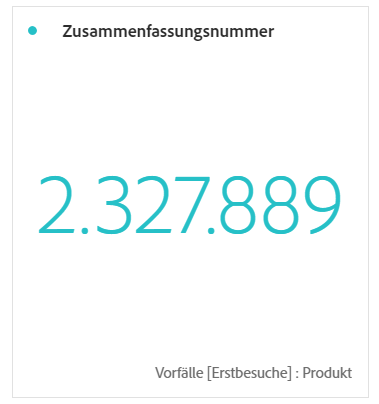

# Sammelnummer und Sammeländerung

## Visualisierung für Zusammenfassungsnummer

* Wählt die gesamte Spalte aus, wenn keine Zelle ausgewählt ist.
* Wenn eine einzelne Zelle ausgewählt ist, wird die Zusammenfassung für diese Zelle angezeigt.
* Wenn mehr als eine Zelle ausgewählt ist, wird die erste ausgewählte Zelle angezeigt.
* Wenn die Spalte ausgewählt ist, wird der erste Zellenwert in der Spalte ausgewählt.

## Visualisierung für Zusammenfassungsänderung:

* Wenn keine Zelle ausgewählt ist, werden die ersten beiden Zellenwerte in der Spalte verglichen.
* Wenn eine Zelle ausgewählt ist, wird 0 angezeigt, da der Zellwert mit dem Wert der Zelle selbst verglichen wird.
* Wenn zwei Zellen ausgewählt sind, wird die erste ausgewählte Zelle als Zähler und die zweite als Nenner verwendet.
* Wenn mehr als zwei Zellen ausgewählt sind, werden nur die ersten beiden zum Vergleich berücksichtigt.
* Wenn ein Zellenbereich ausgewählt ist, wird der erste mit der letzten ausgewählten Zelle im Bereich verglichen.
* Wenn die Spalte ausgewählt ist, wird der erste Wert mit sich selbst verglichen, was eine Änderung von 0 anzeigt.
* Die grüne und rote Farbe der Zusammenfassungsänderung können wie folgt gesteuert werden:
   * [Eigene Ereignis-Polarität](https://marketing.adobe.com/resources/help/de_DE/reference/success_event.html).
   * Die Option &quot;Aufwärts-Trend [anzeigen als](https://marketing.adobe.com/resources/help/de_DE/analytics/calcmetrics/cm_build_metrics.html) &quot;einer berechneten Metrik

## Einstellungen zur Zusammenfassungsänderung {#section_2581AC0107634FB4990AB8347E5897AA}

Klicken Sie auf das Zahnradsymbol neben der Visualisierung, um die Zusammenfassungseinstellungen zu konfigurieren:

| Einstellung | Definition |
|--- |--- |
| Prozentsatz | Verwenden Sie Prozentsätze anstelle von Rohdaten. |
| Legende eingeblendet | Zeigt die verwendeten Metriken an. |
| Optionen für Zusammenfassungsnummer: Abkürzungswert | Für abgekürzte Werte können Sie zwischen 0 und 3 Dezimalstellen wählen. |
| Optionen zum Ändern der Zusammenfassung: Prozentsatzänderung anzeigen | Zeigt die Änderung in Prozent zwischen den 2 Zahlen an. |
| Optionen zum Ändern der Zusammenfassung: Rohdifferenz anzeigen | Zeigt die Rohdifferenz zwischen den 2 Zahlen an. |
