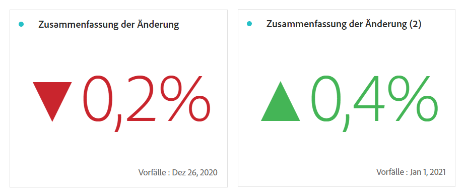

# Sammelnummer und Sammeländerung

## Visualisierung für Zusammenfassungsnummer   {#summary-number}

Verwenden Sie die Visualisierung der Zusammenfassungsnummer, um eine große Zahl hervorzuheben, die in einem Projekt wichtig ist. Diese Visualisierung verhält sich folgendermaßen:

* Wenn keine Zelle ausgewählt ist, wird die gesamte Spalte ausgewählt.
* Wenn eine einzelne Zelle ausgewählt ist, wird die Zusammenfassung für diese Zelle angezeigt.
* Wenn mehr als eine Zelle ausgewählt ist, wird die zuerst ausgewählte Zelle angezeigt.
* Wenn die Spalte ausgewählt ist, wird der erste Zellenwert in der Spalte verwendet.

Klicken Sie oben rechts auf den **Visualisierungseinstellungen**, um die Einstellungen für die Zusammenfassungsnummer zu konfigurieren:

| Einstellung | Definition |
|--- |--- |
| Prozentsatz | Zeigt Prozentsätze und keine Rohdaten an. |
| Legende sichtbar | Zeigt Informationen zur angezeigten Metrik an. |
| Wert abkürzen | Wählen Sie diese Option, um Werte zu kürzen und bis zu 3 Dezimalstellen anzuzeigen. |
| Wert zusammenfassen nach | Wählen Sie diese Option, um das Maximum, das Minimum, den Mittelwert, den Median oder die Summe für eine Auswahl von Daten anzuzeigen. |

Klicken Sie oben rechts auf den **Visualisierungseinstellungen**, um die Einstellungen für die Zusammenfassungsnummer zu konfigurieren:

| Einstellung | Definition |
|--- |--- |
| Prozentsatz | Zeigt Prozentsätze und keine Rohdaten an. |
| Legende sichtbar | Zeigt Informationen zur angezeigten Metrik an. |
| Wert abkürzen | Wählen Sie diese Option, um Werte zu kürzen und bis zu 3 Dezimalstellen anzuzeigen. |
| Wert zusammenfassen nach | Wählen Sie diese Option, um das Maximum, das Minimum, den Mittelwert, den Median oder die Summe für eine Auswahl von Daten anzuzeigen. |

## Visualisierung für Zusammenfassungsänderung: {#summary-change}

Verwenden Sie die Visualisierung für Zusammenfassungsänderung, um das Delta (die Änderung) zwischen zwei Zahlen anzuzeigen. Die grüne und rote Farbe der Zusammenfassungsänderung kann über die [benutzerdefinierte Ereignispolarität](https://docs.adobe.com/content/help/de-DE/analytics/admin/admin-tools/success-events/success-event.html) oder die Option [Aufwärts-Trend anzeigen als](https://docs.adobe.com/content/help/de-DE/analytics/components/calculated-metrics/calcmetric-workflow/cm-build-metrics.html) einer berechneten Metrik gesteuert werden.

Diese Visualisierung verhält sich folgendermaßen:

* Wenn keine Zelle ausgewählt ist, werden die ersten beiden Zellenwerte in der Spalte verglichen.
* Wenn eine Zelle ausgewählt ist, wird 0 angezeigt, weil der Zellenwert mit sich selbst verglichen wird.
* Wenn zwei Zellen ausgewählt sind, wird die erste ausgewählte Zelle als Numerator und die zweite als Denominator verwendet.
* Wenn mehr als zwei Zellen ausgewählt sind, werden nur die ersten beiden Zellen für den Vergleich berücksichtigt.
* Wenn ein Zellbereich ausgewählt ist, wird die erste Zelle mit den letzten im Bereich ausgewählten Zellen verglichen.
* Wenn die Spalte ausgewählt ist, wird der erste Wert mit sich selbst verglichen, sodass eine Änderung von 0 angezeigt wird.

Klicken Sie oben rechts auf den **Visualisierungseinstellungen**, um die Einstellungen für die Zusammenfassungsänderung zu konfigurieren:

| Einstellung | Definition |
|--- |--- |
| Prozentsatz | Zeigt Prozentsätze und keine Rohdaten an. |
| Legende sichtbar | Zeigt Informationen zur angezeigten Metrik an. |
| Prozentuale Veränderung anzeigen | Zeigt die prozentuale Änderung zwischen den 2 Zahlen an. |
| Rohdifferenz anzeigen | Zeigt den tatsächlichen Unterschied zwischen den beiden Zahlen. Mit dieser Option können Sie auch Werte kürzen und bis zu 3 Dezimalstellen anzeigen. |
