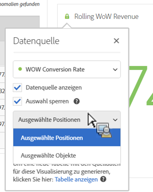
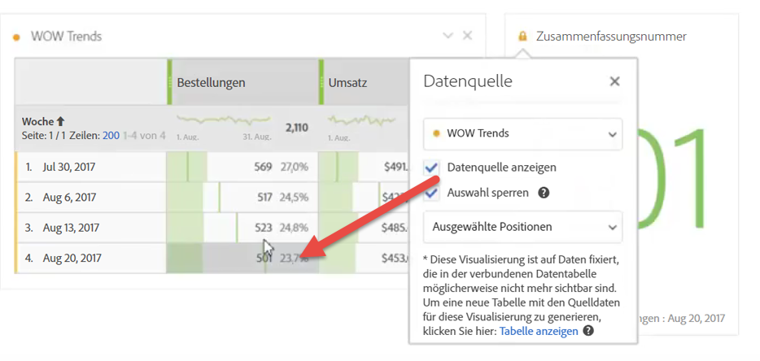
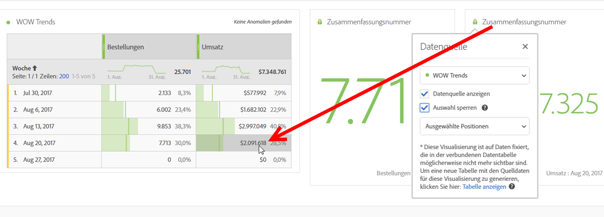

# Data Sources verwalten

Beim Synchronisieren von Visualisierungen können Sie kontrollieren, welche Datentabelle oder Datenquelle zu einer Visualisierung gehört.

**Tipp:** Die Farbe des Punkts neben dem Titel gibt an, welche Visualisierungen zusammenhängen. Übereinstimmende Farben besagen, dass Visualisierungen auf derselben Datenquelle basieren.

Beim Verwalten von Datenquellen können Sie die Datenquelle anzeigen oder die Auswahl sperren. Diese Einstellungen legen fest, ob sich die Visualisierung ändert (oder nicht ändert), sobald neue Daten eingehen.

1. [Erstellen Sie ein Projekt](/help/analyze/analysis-workspace/home.md) mit einer Datentabelle und einer [Visualisierung](/help/analyze/analysis-workspace/visualizations/freeform-analysis-visualizations.md).
1. Wählen Sie in der Datentabelle die Zellen (Datenquelle) aus, die Sie der Visualisierung zuordnen möchten.
1. Klicken Sie in der Visualisierung auf den Punkt neben dem Titel, um das Dialogfeld **[!UICONTROL Datenquelle]** zu öffnen. Wählen Sie **[!UICONTROL Datenquelle anzeigen]** oder **[!UICONTROL Auswahl sperren]** aus.

   

   Beim Synchronisieren einer Visualisierung mit einer Datenzelle wird eine neue (verborgene) Tabelle erstellt und die synchronisierte Visualisierung wird farblich kodiert.

| Element | Beschreibung |
|--- |--- |
| Verknüpfte Visualisierungen | Wenn Visualisierungen mit einer Freiform- oder Kohortentabelle verknüpft sind, öffnet sich über den Punkt oben links eine Liste der verbundenen Visualisierungen sowie ein Kontrollkästchen „Anzeigen“, über das die Tabelle angezeigt/ausgeblendet werden kann.  Wenn Sie mit der Maus über die verknüpfte Visualisierung fahren, wird sie hervorgehoben. Wenn Sie darauf klicken, werden Sie dorthin geleitet. |
| Datenquelle anzeigen | Sie können die der Visualisierung entsprechende Datentabelle anzeigen (durch Aktivieren des Kontrollkästchens) oder verbergen (durch Deaktivieren des Kontrollkästchens). |
| Auswahl sperren | Aktivieren Sie diese Einstellung, damit die Visualisierung mit den aktuell in der entsprechenden Datentabelle ausgewählten Daten verknüpft bleibt. Wenn Sie die Option aktiviert haben, können Sie Folgendes auswählen:  <ul><li>**Ausgewählte Positionen**: Wählen Sie diese Option aus, damit die Visualisierung mit den Positionen verknüpft bleibt, die in der entsprechenden Datentabelle ausgewählt sind. Diese Positionen werden weiterhin visualisiert, auch wenn sich die Elemente auf den Positionen ändern. Wählen Sie diese Option aus, wenn Sie beispielsweise immer die fünf Kampagnennamen mit dem höchsten Wert in dieser Visualisierung zeigen möchten, egal um welche Kampagnennamen es sich handelt.</li> <li>**Gewählte Elemente**: Wählen Sie diese Option aus, damit die Visualisierung mit genau den Elementen verknüpft bleibt, die aktuell in der entsprechenden Datentabelle ausgewählt sind. Diese Elemente werden weiterhin visualisiert, selbst wenn sich ihr Rang in der Tabelle ändert. Wählen Sie diese Option aus, wenn Sie z. B. immer die gleichen fünf Kampagnennamen in dieser Visualisierung zeigen möchten, egal welchen Rang diese Kampagnennamen einnehmen.</li></ul> |

Diese Architektur unterscheidet sich von der vorherigen darin, dass Analysis Workspace keine doppelte ausgeblendete Tabelle mehr erstellt, in der die gesperrte Auswahl für Sie gespeichert wird. Die Datenquelle verweist nun auf die Tabelle, aus der Sie die Visualisierung erstellt haben.

**Beispielhafte Anwendungsfälle:**

* Sie können eine Zusammenfassungsvisualisierung erstellen und mit einer Zelle in der Tabelle verknüpfen, aus der Sie sie erstellt haben. Wenn Sie „Datenquelle anzeigen“ aktivieren, wird angezeigt, wo genau die Informationen aus der Tabelle herkommen. Die Quelldaten werden abgeblendet dargestellt:

   >
* Sie können zahlreiche Visualisierungen hinzufügen und sie aus unterschiedlichen Zellen in derselben Tabelle beziehen, wie hier gezeigt wird. Es handelt sich um dieselbe Tabelle wie im Beispiel oben, allerdings ist die bezogene Zelle (und Metrik) anders:

   >
* Sie können sehen, ob es mit einer Freiform- oder Kohortentabelle verknüpfte Visualisierungen gibt, indem Sie auf den Punkt oben links klicken (Datenquelleneinstellungen). Durch Bewegen der Maus über die betreffende Stelle wird die verbundene Visualisierung hervorgehoben. Sie haben auch die Möglichkeit, durch Klicken mit der Maus dorthin zu gelangen.

   >
