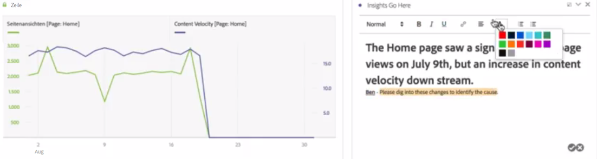
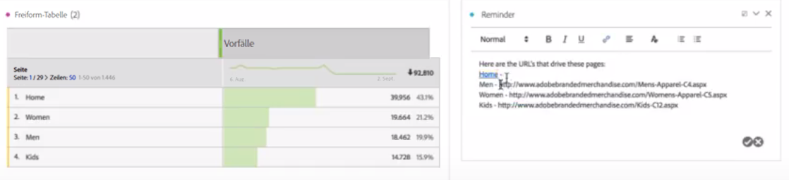

# Text

Sie können benutzerdefinierten Text zu Ihrem Arbeitsbereich hinzufügen.

Sie können die Schrifteinstellungen ändern (fett, kursiv usw.) und Hyperlinks in Textfeldvisualisierungen und Bereichs-/Visualisierungsbeschreibungen hinzufügen.

## Change font settings {#section_32727EE03FD04A8EB1D1B387DCAF6537}

Wenn Sie eine Textvisualisierung in einen Bereich gezogen und Text hinzugefügt haben, können Sie den Text formatieren, indem Sie Überschriftenebenen hinzufügen, die Schriftauszeichnung ändern (fett, kursiv oder unterstrichen), die Textfarbe ändern usw.

## Add hyperlinks {#section_D55B857188A74A06B49006DF3511DC7C}

Markieren Sie Text und klicken Sie auf das Hyperlink-Symbol im Formatierungsmenü, um Hyperlinks hinzuzufügen.
