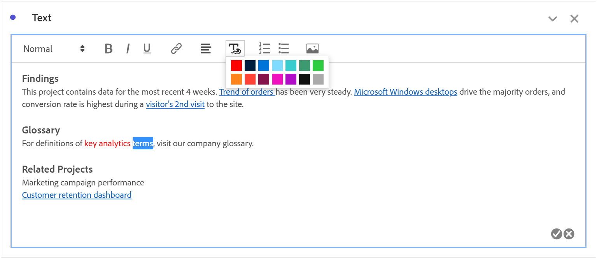
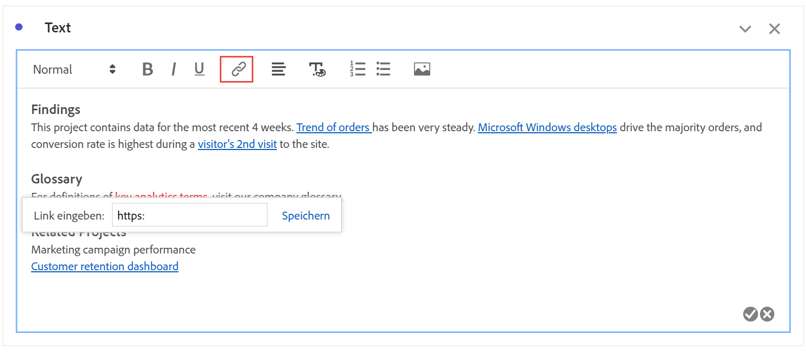
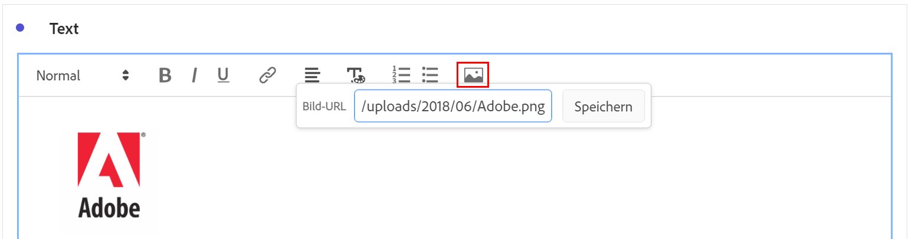

# Text

Sie können Ihrem Workspace-Projekt benutzerdefinierten Text hinzufügen, indem Sie Textvisualisierungen oder Bedienfeld-/Visualisierungsbeschreibungen verwenden (klicken Sie mit der rechten Maustaste auf die Kopfzeile > **[!UICONTROL Beschreibung bearbeiten]**). Sie können auch die Formatierung Ihres Textes ändern sowie Hyperlinks und Bilder hinzufügen.

## Formatierung anpassen {#format}

Beim Bearbeiten des Textfelds oder der Beschreibung können Sie Schriftgrad (Überschriftenebenen), Farbe, Formatierung (fett, kursiv, unterstrichen) und Ausrichtung des ausgewählten Textes anpassen. Sie können auch Aufzählungs- und nummerierte Listen hinzufügen.

## Hyperlinks hinzufügen {#hyperlinks}

Um einen Hyperlink hinzuzufügen, markieren Sie den Text und klicken Sie im Menü auf das Hyperlink-Symbol. Hyperlinks können zur zusätzlichen Unterstützung der Projektempfänger Links zu externen Websites, Dokumentationsseiten, [Workspace-Projekten/Bedienfeldern/Visualisierungen](https://experienceleague.adobe.com/docs/analytics/analyze/analysis-workspace/curate-share/shareable-links.html?lang=de) und mehr enthalten.

## Bilder hinzufügen {#images}

Um ein Bild zu Ihrem Projekt hinzuzufügen, klicken Sie auf das Bildsymbol im Menü und fügen Sie eine URL für ein öffentliches Bild ein. Die Bild-URL muss öffentlich zugänglich sein, mit `https` beginnen und das Format `.png`, `.jpeg`, `.jpg` oder `.gif` haben. Statische und animierte Bilder werden unterstützt.

