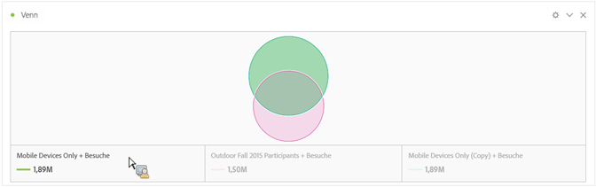
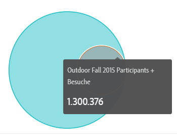
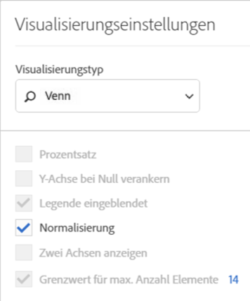

# Venn

Bei der Venn-Visualisierung können Sie bis zu 3 Segmente (aus Komponenten) und eine Metrik einfügen, um ein Venn-Diagramm zu erstellen.

Sie können den Mauszeiger über Segmente bewegen, damit mehr Details zu Prozentzahlen usw. angezeigt werden.

Um das Venn-Diagramm in eine Freiformtabelle umzuwandeln, klicken Sie auf den farbigen Punkt neben der Überschrift **[!UICONTROL Venn]** und wählen Sie **[!UICONTROL Data Sources verwalten]** > **[!UICONTROL Verfügbare Data Sources]** > **[!UICONTROL Freiformtabelle]** aus.

Um das Venn-Diagramm zu normalisieren (die Größeninformationen zu entfernen), klicken Sie auf das Symbol für seine Visualisierungseinstellungen und wählen Sie **[!UICONTROL Normalisierung aus]**.

