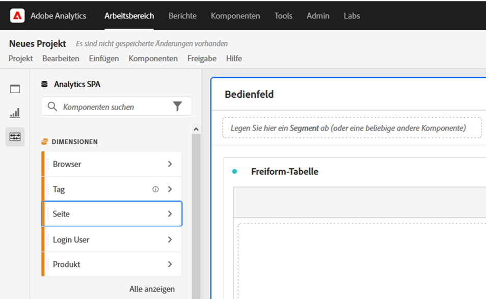
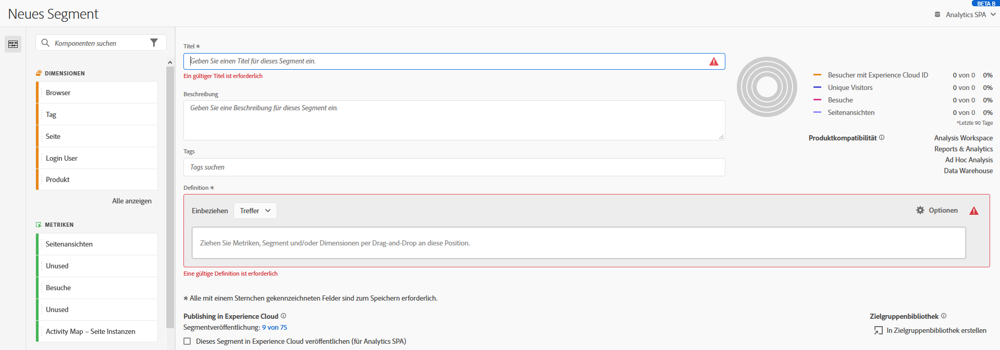

# Barrierefreiheit in Analysis Workspace

Erfahren Sie mehr über die Unterstützung der Barrierefreiheit in [!UICONTROL Analysis Workspace], dem führenden Analyse-Tool für Adobe Analytics.

Barrierefreiheit bezieht sich darauf, Produkte für Menschen mit visuellen, akustischen, kognitiven, motorischen und anderen Behinderungen nutzbar zu machen. Beispiele für Barrierefreiheitsfunktionen für Software-Produkte sind die Bildschirmleserunterstützung, Textäquivalente für Grafiken, Tastaturkürzel, Änderung der Anzeigefarben auf hohen Kontrast usw.

[!UICONTROL Analysis Workspace] bietet einige Tools, um die Verwendung zu ermöglichen, darunter:

## Navigieren in [!UICONTROL Workspace] mithilfe der Tastatur

Die Navigation in [!UICONTROL Analysis Workspace] funktioniert von oben nach unten und von links nach rechts. Die folgenden Navigationselemente erleichtern die Zugänglichkeit:

* Die `Tab`-Taste ermöglicht richtungsweisende Verknüpfungen., wobei zwischen größeren Abschnitten innerhalb von Workspace gewechselt wird. In der linken Leiste können Sie `Tab` auch von einer ziehbaren Option zur nächsten wechseln.
* Die `left/right arrows`-Bewegung zwischen einzelnen Elementen, nachdem `Tab` sie markiert hat.
* Das `F6` navigiert zum ersten Bereich im Projekt und bewegt sich zwischen den Visualisierungen in diesem Bereich. Anschließend wird zum nächsten Bereich im Projekt gewechselt und es wird wiederholt.
* Wir wenden Fokusindikatoren an, sodass sehende Tastaturbenutzer einen klaren Hinweis darauf haben, welches Element der Benutzeroberfläche derzeit im Fokus ist. Der Indikator ist ein blauer Rand um das ausgewählte Element herum.

   

### Tastaturnavigation für die Menüleiste

1. bis Sie die Menüleiste erreicht haben.
1. Verwenden Sie die Nach-links-/Nach-rechts-Taste, um zum gewünschten Menü zu navigieren.
1. Drücken Sie die Taste `Enter`, um das Menü auszuwählen und seine Optionen anzuzeigen.
1. Verwenden Sie die Nach-oben-/Nach-unten-Taste, um zur gewünschten Menüoption zu navigieren.
1. Klicken Sie auf `Enter`, um die Option auszuwählen.

### Tastaturnavigation für Drag-and-Drop-Interaktionen

[!UICONTROL Analysis Workspace] ist eine Drag-and-Drop-Benutzeroberfläche. Benutzer können jedoch stattdessen Komponenten über die Tastatur hinzufügen:

1. Tippen Sie auf eine Komponente in der linken Leiste.
1. Drücken Sie zum Auswählen `Enter`.
1. Verwenden Sie die Pfeiltasten, um zu dem Bereich zu navigieren, in dem Sie die Komponente ablegen möchten.
1. Drücken Sie `Enter`, um die Komponente zu platzieren.

### Tastaturbefehle (Hotkeys)

[!UICONTROL Analysis Workspace] bietet eine umfangreiche Auswahl an [Tastaturbefehlen](https://experienceleague.adobe.com/docs/analytics/analyze/analysis-workspace/build-workspace-project/fa-shortcut-keys.html?lang=de-DE) für einen nahtlosen Workflow. Nachfolgend sind einige allgemeine Kurzbefehle für die Navigation, die Erstellung von Analysen und die Demokratisierung von Erkenntnissen aufgeführt.

#### Navigation

| Tastaturbefehl | Aktion |
|---|---|
| Alt + Umschalt + 1/2/3 | Zu verschiedenen Leisten wechseln: [!UICONTROL Bedienfelder], [!UICONTROL Visualisierungen] oder [!UICONTROL Komponenten] |
| Alt + Links-/Rechtspfeil | Zwischen Bedienfeldern navigieren |
| Alt + M | Alle Bedienfelder reduzieren/erweitern |
| Alt + Strg + M | Aktives Bedienfeld reduzieren/erweitern |
| Strg + / | Linke Leiste durchsuchen |

#### Erstellung von Analysen

| Tastaturbefehl | Aktion |
|---|---|
| Alt + 1 | Neue Freiformtabelle |
| Strg + Umschalt + C | Neue berechnete Metrik |
| Strg + Umschalt + D | Neuer Datumsbereich |
| Strg + Umschalt + E | Neues Segment |
| Strg + Z | Rückgängig |
| Umschalttaste gedrückt halten (in der Dropzone des Bedienfeldsegments) | Einen [Dropdown-Filter](https://experienceleague.adobe.com/docs/analytics-learn/tutorials/analysis-workspace/using-panels/using-drop-down-filters.html?lang=de-DE) erstellen |

#### Demokratisierung

| Tastaturbefehl | Aktion |
|---|---|
| Strg + S | Speichern |
| Strg + Umschalt + G | Kuratieren |
| Strg + G | Freigeben |
| Alt + Umschalt + S | Zeitplan |
| Alt + L | Link zum Projekt abrufen |
| Strg + Umschalt + B | PDF herunterladen |

## Unterstützung für Bildschirmlesehilfen und Vergrößerungs-Software

Eine Bildschirmlesehilfe liest Text, der auf dem Computer-Bildschirm angezeigt wird. Es werden auch nicht textuelle Informationen wie Schaltflächenbeschriftungen oder Bildbeschreibungen in der Anwendung gelesen, die in Barrierefreiheits-Tags oder Attributen bereitgestellt werden.

## Farbpaletten und Kontrast

[!UICONTROL Analysis Workspace] strebt die Konformität mit WCAG 2.1 AA an, einschließlich der Anforderungen an den Farbkontrast.

Darüber hinaus können Benutzer ihre eigene bevorzugte Farbpalette für ein Projekt unter **[!UICONTROL Projekt]** > **[!UICONTROL Projekteinstellungen]** > [Farbpalette](https://experienceleague.adobe.com/docs/analytics/analyze/analysis-workspace/build-workspace-project/color-palettes.html?lang=de-DE) festlegen.

## Erforderliche Feldvalidierung in Komponenten-Buildern

Beim Erstellen einer Komponente werden die erforderlichen Felder beim Speichern validiert. Wenn ein erforderliches Feld die Validierung nicht erfolgreich durchläuft, wird es rot und mit einem Fehlersymbol gekennzeichnet. Es wird eine schriftliche Beschreibung des Problems angezeigt, das behoben werden muss.

Sobald eine Komponente vollständig validiert ist, wird der Builder durch Klicken auf `Save` geschlossen.

## Unterstützung für Barrierefreiheitsfunktionen des Betriebssystems

Analysis Workspace unterstützt integrierte MS Windows- und macOS-Eingabehilfen wie den Modus für hohen Kontrast, Einrastfunktionen und Anschlaggeschwindigkeit/Anschlagverzögerung. Es werden auch Informationen über die Benutzeroberfläche des Betriebssystems bereitgestellt, um die Interaktion mit Hilfstechnologien zu ermöglichen, einschließlich Bildschirmlesehilfen wie VoiceOver für macOS und NVDA unter Windows.
