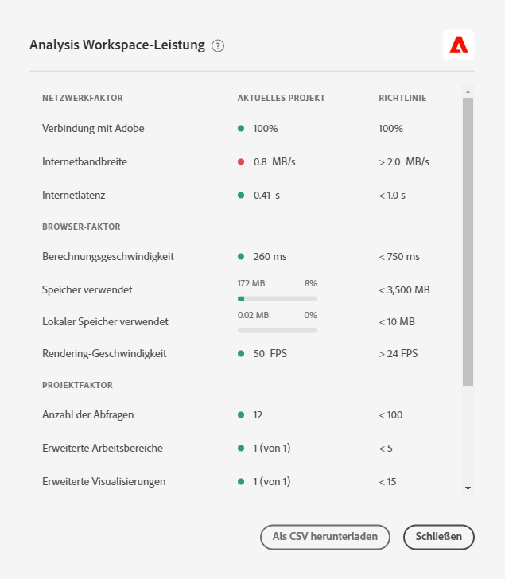

# Optimieren der Analysis Workspace-Leistung

Verschiedene Faktoren können die Leistung eines Projekts in Analysis Workspace beeinflussen. Es ist wichtig zu wissen, was diese Mitarbeiter leisten, bevor Sie ein Projekt erstellen, damit Sie das Projekt optimal planen und erstellen können. Diese Seite enthält eine Liste von Faktoren, die sich auf die Leistung und die Optimierungen auswirken, die Sie vornehmen können, um eine Spitzenleistung in Analysis Workspace sicherzustellen.

>[!IMPORTANT]
>
>Die Seite &quot;Leistung&quot;in Analysis Workspace ist in limitierter Version verfügbar. [Weitere Infos](https://docs.adobe.com/content/help/de-DE/analytics/landing/an-releases.html)

## Hilfe > Leistung in Analysis Workspace

Unter &quot; **[!UICONTROL Analysis Workspace&quot;> &quot;Hilfe&quot;> &quot;Leistung]**&quot;können Sie die Faktoren sehen, die sich auf die Leistung Ihres Projekts auswirken, einschließlich Netzwerk-, Browser- und Projektfaktoren. Um die genauesten Ergebnisse zu erzielen, müssen Sie das Projekt vor dem Öffnen der Seite &quot;Leistung&quot;vollständig laden.
* In der Spalte &quot;Aktuelles Projekt&quot;werden die Ergebnisse für Ihr aktuelles Projekt und Ihre Umgebung angezeigt.
* In der Spalte &quot;Führungslinie&quot;wird der von der Adobe empfohlene Schwellenwert für jeden Faktor angezeigt.

Darüber hinaus können Sie die Leistungsinhalte als CSV **** herunterladen, um sie einfach an die Adobe Customer Care oder Ihre IT-Teams freizugeben.

>[!NOTE]
>
>Die Informationen auf der Seite &quot;Leistung&quot;variieren bei jedem Öffnen des Modals, da sich Faktoren ändern können. Darüber hinaus wird die Adobe die bereitgestellten Leitlinien weiter verfeinern, sobald mehr Daten verfügbar sind.

## Netzwerkfaktoren

Hilfe > Leistungsnetzwerkfaktoren:

| Faktor | Definition | Beeinflusst durch | Optimierung |
| --- | --- | --- | --- |
| Verbindung mit Adobe | Adobe sendet 10 Testaufrufe, wenn die Leistungsseite geöffnet wird. Dies stellt den Prozentsatz der erfolgreichen Aufrufe zur Adobe dar. | Lokale Netzwerkprobleme oder Probleme mit der Adobe wirken sich auf diesen Faktor aus. | Überprüfen Sie status.adobe.com, ob bekannte Serviceprobleme vorliegen. Überprüfen Sie dann Ihre lokale Netzwerkverbindung. |
| Internetbandbreite | Nur für Google Chrome verfügbar. Schätzung der Bandbreite an Ihrem Standort durch Ihren Browser. Die Richtlinie ist 2,0 MB/s. | Ihre lokale Netzwerkverbindung wirkt sich auf diesen Faktor aus. | Überprüfen Sie die lokale Netzwerkverbindung. |
| Internetlatenz | Adobe sendet 10 Testaufrufe, wenn die Leistungsseite geöffnet wird. Dies stellt die Zeitdauer dar, die durchschnittlich für jede Anforderung benötigt wird, um zur Adobe zu gehen und zurückzugeben. Einfach gesagt, es ist ein Maß dafür, wie schnell das Internet zwischen Ihrer Lage und Adobe ist. Die Leitlinie ist &lt; 1 Sekunde. | Lokale Netzwerkprobleme, viele offene Browser-Registerkarten oder Probleme mit der Adobe wirken sich auf diesen Faktor aus. | Überprüfen Sie status.adobe.com, ob bekannte Serviceprobleme vorliegen. Überprüfen Sie dann Ihre lokale Netzwerkverbindung und schließen Sie nicht verwendete Browser-Registerkarten. |

## Browserfaktoren

Hilfe > Leistungsbrowserfaktoren:

| Faktor | Definition | Beeinflusst durch | Optimierung |
| --- | --- | --- | --- |
| Berechnungsgeschwindigkeit | Wie schnell Ihr Computer einen Verarbeitungstest durchführt. Die Führungslinie ist &lt; 750 ms. | Ihre Hardware und gleichzeitig erhältliche Programm wirken sich auf diesen Faktor aus. | Öffnen Sie den Aufgabe-Manager (PC) oder den Aktivität-Monitor (Mac) Ihres Computers, um zu ermitteln, ob Programm geschlossen werden können. Schließen Sie dann nicht verwendete Browser-Registerkarten oder andere Programm.   Wenn diese Aktionen nicht hilfreich sind, besprechen Sie Hardwaredetails mit Ihrem IT-Team. |
| Speicher verwendet | Nur für Google Chrome verfügbar. Jede Workspace-Registerkarte in einem Google Chrome-Browser verwendet insgesamt 4 GB Arbeitsspeicher. Dies entspricht dem Prozentsatz des Speicherlimits, das vom aktuellen Projekt belegt wird. Die Richtlinie gilt für 3500 MB. Dies ist der Punkt, an dem Workspace mit Speicherfehlern beginnen wird. | Das Arbeiten mit mehreren Registerkarten oder das Herunterladen von 50000 Zeilen mit Daten trägt zu einer höheren Speicherbelegung bei. | Wenn Sie einen Speicherfehler erhalten, schließen Sie andere Workspace-Registerkarten und/oder führen Sie 50000 Zeilen-Downloads einzeln durch. |
| Lokaler Speicher verwendet | Daten, die lokal auf Ihrem Computer zur Verwendung im Browser gespeichert werden. Jede Herkunft (z. B. experience.adobe.com) verfügt über eine 10-MB-Grenze. | Analysis Workspace verwendet lokale Datenspeicherung für verschiedene Funktionen, unter anderem zum Speichern automatisch gespeicherter (vorhandener) Projekte, Benutzereinstellungen und Funktionsmarkierungen. | Um sicherzustellen, dass Analysis Workspace-Funktionen nicht gestört werden, sollten Sie die lokale Datenspeicherung für die Domäne &quot;experience.adobe.com&quot;löschen. |
| Rendering-Geschwindigkeit | FPS steht für Frames pro Sekunde, d. h., wie oft der Browser die Seite auf Ihrem Bildschirm zeichnet. 24 FPS sind häufig das, was das menschliche Auge beobachten kann. Wenn die FPS niedriger ist, werden in Workspace Renderingprobleme beobachtet. | Die FPS wird durch Multitasking in vielen Workspace-Projekten auf einmal und in der Größe des angezeigten Projekts beeinflusst. Andere auf Ihrem Computer ausgeführte Programm können Auswirkungen haben, wie Streaming, Hintergrundscanner usw. Darüber hinaus wirkt sich Ihre Hardware auf diesen Faktor aus. | Öffnen Sie den Aufgabe-Manager (PC) oder den Aktivität-Monitor (Mac) Ihres Computers, um zu ermitteln, ob Programm geschlossen werden können. Schließen Sie dann nicht verwendete Browser-Registerkarten oder andere Programm.   Wenn diese Aktionen nicht hilfreich sind, besprechen Sie Hardwaredetails mit Ihrem IT-Team. |

## Projektfaktoren

Hilfe > Leistungsprojektfaktoren:

| Faktor | Definition | Optimierung |
| --- | --- | --- |
| Anzahl der Abfragen | Die Gesamtzahl der Abfragen (Anforderungen), die an die Adobe zum Abrufen der im Projekt angezeigten Daten vorgenommen wurden. Zu den Abfragen gehören Anforderungen mit Rangansicht für Tabellen, Anomalieerkennung, Wortgrafiken, Komponenten in der linken Leiste und mehr. Schließt ausgeblendete Bereiche und Visualisierungen aus. Die Leitlinie ist 100. | Vereinfachen Sie Ihr Projekt nach Möglichkeit, indem Sie Daten in verschiedene Projekte aufteilen, die einem bestimmten Zweck oder einer Gruppe von Interessenvertretern dienen. Verwenden Sie Tags, um Projekte in Themen zu organisieren, und verwenden Sie [direkte Verknüpfungen](https://docs.adobe.com/content/help/de-DE/analytics/analyze/analysis-workspace/curate-share/shareable-links.html) , um ein internes Inhaltsverzeichnis zu erstellen, damit die Interessenträger leichter finden können, was sie benötigen. |
| Erweiterte Bedienfelder (außerhalb der Gesamtzahl der Bedienfelder) | Die Anzahl der erweiterten Bereiche aus der Gesamtzahl der Bereiche im Projekt. Die Leitlinie ist 5. | Nachdem Sie Schritte zur Vereinfachung des Projekts unternommen haben, reduzieren Sie die Bedienfelder im Projekt, die beim Laden nicht angezeigt werden müssen. Wenn das Projekt geöffnet wird, werden nur erweiterte Bereiche verarbeitet. Reduzierte Bereiche werden erst verarbeitet, wenn der Benutzer sie erweitert. |
| Erweiterte Visualisierungen (aus der Gesamtzahl der Visualisierungen) | Die Anzahl der erweiterten Tabellen und Visualisierungen aus der Gesamtsumme im Projekt. Schließt verborgene Datenquellen aus. Die Leitlinie ist 15. | Nachdem Sie Schritte zur Vereinfachung des Projekts unternommen haben, reduzieren Sie die Visualisierungen in Ihrem Projekt, die beim Laden nicht angezeigt werden müssen. Priorisieren Sie die Visualisierungen, die für den Benutzer des Berichts am wichtigsten sind, und unterteilen Sie ggf. unterstützende Visualisierungen in einem separaten, detaillierteren Bereich oder Projekt. |
| Anzahl der Freiformzellen | Die Gesamtzahl der Freiform-Tabellenzellen im Projekt, berechnet durch Zeilen * Spalten in allen Tabellen. Schließt verborgene Datenquellen aus. Die Leitlinie ist 4000. | Reduzieren Sie die Anzahl der Spalten in Ihrer Tabelle auf die relevantesten Datenpunkte. Reduzieren Sie die Anzahl der Zeilen in Ihrer Tabelle, indem Sie die Anzahl der angezeigten Zeilen anpassen, einen Tabellenfilter anwenden oder ein Segment anwenden. |
| Verfügbare Komponenten | Die Gesamtzahl der in der linken Leiste des Projekts abgerufenen Komponenten für alle Report Suites im Projekt. Die Leitlinie ist das Jahr 2000. | Sprechen Sie mit Ihrem Produktadministrator über das Erstellen einer kuratierten Virtual Report Suite, die über einen stärker auf Ihre Bedürfnisse zugeschnittenen Satz an Komponenten verfügt. |
| Verwendete Komponenten | Die Gesamtzahl der im Projekt verwendeten Komponenten. Die Leitlinie ist 100. | Die Anzahl der verwendeten Komponenten ist kein direkter Leistungseinfluss. Die Komplexität dieser Komponenten wird jedoch zur Leistung des Projekts beitragen. Siehe Optimierungen im Abschnitt &quot;Weitere Faktoren&quot;. |
| Längster Datumsbereich | Dieser Faktor zeigt den längsten Datumsbereich an, der für das Projekt verwendet wurde. Die Leitlinie ist ein Jahr. | Rufen Sie möglichst nicht mehr Daten ab, als Sie benötigen. Schränken Sie den Bereichskalender auf die relevanten Daten für Ihre Analyse ein oder verwenden Sie Datumsbereichskomponenten (violette Komponenten) in Ihren Freiformtabellen. In einer Tabelle verwendete Datumsbereiche überschreiben den Datumsbereich des Bedienfelds. Beispielsweise können Sie den Tabellenspalten „Letzter Monat“, „Letzte Woche“ und „Gestern“ hinzufügen, um diese spezifischen Datenbereiche anzufordern. Weitere Informationen zu Datumsbereichen in Analysis Workspace erhalten Sie in [diesem Video](https://docs.adobe.com/content/help/en/analytics-learn/tutorials/analysis-workspace/calendar-and-date-ranges/date-ranges-and-calendar-in-analysis-workspace.html).   Minimieren Sie außerdem die Anzahl der im Vergleich zum Vorjahr verwendeten Vergleiche. Bei der Berechnung eines Jahresvergleichs werden die gesamten 13 Monate von Daten zwischen den betrachteten Monaten berücksichtigt. Dies hat die gleiche Auswirkung wie die Änderung des Datumsbereichs des Bedienfelds auf 13 Monate. |

## Zusätzliche Faktoren

Weitere Faktoren, die nicht unter Hilfe > Leistung aufgeführt sind, sind:

| Faktor | Definition | Beeinflusst durch | Optimierung |
| --- | --- | --- | --- |
| Segmentkomplexität | Komplizierte Segmente können einen erheblichen Einfluss auf die Projektleistung haben. | Zu den Faktoren, die einem Segment Komplexität verleihen (in grober Reihenfolge der Auswirkungen), gehören: <ul><li>Operatoren von „enthält“, „enthält beliebige von“, „stimmt überein mit“, „beginnt mit“ oder „endet mit“ </li><li>Sequentielle Segmentierung, insbesondere wenn Dimensionseinschränkungen (innerhalb/nachher) verwendet werden </li><li>Anzahl der eindeutigen Dimensionselemente innerhalb der Dimensionen, die im Segment verwendet werden (z. B.: Seite = „A“, wenn Seite 10 eindeutige Elemente hat, ist schneller als Seite = „A“, wenn Seite 100000 eindeutige Elemente hat) </li><li>Anzahl der verschiedenen verwendeten Dimensionen (z. B.: Seite = „Startseite“ und Seite = „Suchergebnisse“ sind schneller als eVar 1 = „rot“ und eVar 2 = „blau“)</li><li>Viele OR-Operatoren (anstelle von AND)</li><li>Verschachtelte Container mit unterschiedlichem Umfang (z. B. Hit innerhalb des Besuchs innerhalb des Besuchers)</li></ul> | Einige der Komplexitätsfaktoren können nicht verhindert werden. Suchen Sie jedoch nach Möglichkeiten, die Komplexität Ihrer Segmente zu reduzieren. Generell gilt: Je genauer Sie mit Ihren Segmentkriterien umgehen können, desto besser. Beispiel:<ul><li>Bei Containern ist die Verwendung eines einzelnen Containers am oberen Rand des Segments schneller als die Verwendung einer Reihe verschachtelter Container</li><li>Bei Operatoren ist „stimmt überein mit“ schneller als „enthält“ und „entspricht beliebigen von“ ist schneller als „enthält beliebige von“</li><li>Mit vielen Kriterien sind AND-Operatoren schneller als eine Reihe von OR-Operatoren.</li></ul> Suchen Sie nach Möglichkeiten, viele ODER-Anweisungen in einer einzigen Anweisung zu reduzieren, die &quot;gleich jeder von&quot; ist.  [Klassifizierungen](/help/components/classifications/c-classifications.md) können auch dazu beitragen, viele Werte zu knappen Gruppen zusammenzufassen, aus denen Sie dann Segmente erstellen können. Segmentierungen und Classification-Gruppen bieten leistungsbezogene Vorteile gegenüber Segmenten mit vielen OR-Anweisungen oder „enthält“-Kriterien. |
| Komplexität der Visualisierung (Segmente, Metriken, Filter) | Die Art der Visualisierung (z. B. Fallout oder Freiformtabelle), die zu einem Projekt hinzugefügt wird, beeinflusst die Leistung selbst nur geringfügig. Die Verarbeitungszeit wird durch die Komplexität der Visualisierung gesteigert. | U. a. machen folgende Faktoren eine Visualisierung komplexer:<ul><li>Angeforderter Datenbereich</li><li>Anzahl der angewandten Segmente, z. B. als Zeilen verwendete Segmente in einer Freiformtabelle</li><li>Verwendung komplexer Segmente</li><li>[Statische Elementzeilen oder Spalten in Freiformtabellen](https://docs.adobe.com/content/help/de-DE/analytics/analyze/analysis-workspace/build-workspace-project/column-row-settings/manual-vs-dynamic-rows.html)</li><li>Auf Zeilen angewandte Filter in Freiformtabellen</li><li>Anzahl verwendeter Metriken, insbesondere berechneter Metriken, die Segmente verwenden</li></ul> | Wenn Sie bemerken, dass Ihre Projekte langsamer als gewünscht geladen werden, sollten Sie nach Möglichkeit einige Segmente durch eVars und Filter ersetzen.  Wenn Sie sich ständig mit Segmenten und berechneten Metriken für Datenpunkte beschäftigen, die für Ihr Unternehmen wichtig sind, sollten Sie Ihre Implementierung verbessern, um diese Datenpunkte direkter zu erfassen. Die Verwendung eines Tag-Managers wie Adobe Experience Platform Launch und der Verarbeitungsregeln der Adobe können die Implementierungsänderungen schnell und einfach implementieren. |
| Größe der Report Suite | Die Menge der in Ihrer Report Suite erfassten Daten. | – | Wenden Sie sich an Ihr Implementierungsteam oder einen Experten für Adobe, um festzustellen, ob Implementierungsverbesserungen zur Verbesserung der Gesamterfahrung in Adobe Analytics möglich sind. |

## Allgemeine Fehlermeldungen

Bei der Interaktion mit Analysis Workspace können Fehler auftreten, die auch die Leistung beeinflussen. Im Folgenden sind die häufigsten Fehlertypen, die Gründe dafür und Optimierungen aufgeführt, die vorgenommen werden können.

| Fehlermeldung | Grund | Optimierung |
| --- | --- | --- |
| [!UICONTROL Die Report Suite verzeichnet derzeit ein ungewöhnlich hohes Aufkommen von Berichtsdaten. Versuchen Sie es später erneut.] | Ihr Unternehmen versucht, zu viele Anforderungen gleichzeitig für eine bestimmte Report Suite auszuführen. Zu diesem Fehler gehören API-Anforderungen, geplante Projekte, terminierte Berichte, terminierte Warnungen und gleichzeitige Benutzer, die Berichterstellungsanforderungen ausführen. | Verteilen Sie Ihre Anforderungen und Zeitpläne für die Report Suite gleichmäßig über den Tag. |
| [!UICONTROL Es ist ein Systemfehler aufgetreten. Bitte melden Sie eine Anfrage an den Kundendienst unter Hilfe > Support-Ticket senden an und geben Sie Ihren Fehlercode ein.] | Adobe hat ein Problem, das behoben werden muss. | Senden Sie den Fehlercode an die Kundenunterstützung. |
| [!UICONTROL Die Anfrage ist zu komplex.] | Ihre Berichtsanfrage ist zu groß und kann nicht ausgeführt werden. Gründe für diesen Fehler sind Zeitüberschreitungen aufgrund der Anfragengröße, zu viele übereinstimmende Elemente in einem Segment oder Suchfilter, zu viele eingeschlossene Metriken, inkompatible Dimensions- und Metrikkombinationen usw. | Vereinfachen Sie Ihre Anforderung, indem Sie einige Spalten oder Zeilen in der Tabelle entfernen oder die Tabelle in separate Anforderungen aufteilen. |
| [!UICONTROL Eines der Segmente oder die Suche in dieser Visualisierung enthält eine Textsuche, die zu viele Ergebnisse zurückgab.] | Ihre Segmentkriterien oder Berichtsfilter sind zu breit angelegt. | Schränken Sie die Suchtextkriterien ein und versuchen Sie es erneut. |
| [!UICONTROL Diese Dimension unterstützt nicht-standardmäßige Zuordnungsmodelle derzeit nicht.] | Nicht standardmäßige Zuordnung wird für die verwendete Dimension nicht unterstützt. | Replace the dimension in your table with one that is compatible with [Attribution IQ](../attribution/overview.md). |
| [!UICONTROL Ihre Anforderung schlug aufgrund zu vieler Spalten oder vorkonfigurierter Zeilen fehl.] | Ihre Tabelle enthält zu viele Freiformzellen (Zeile * Spalten). | Entfernen Sie Spalten oder Zeilen in der Tabelle oder erwägen Sie, die Tabelle in separate Anforderungen zu unterteilen. |
