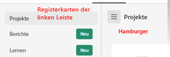
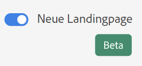
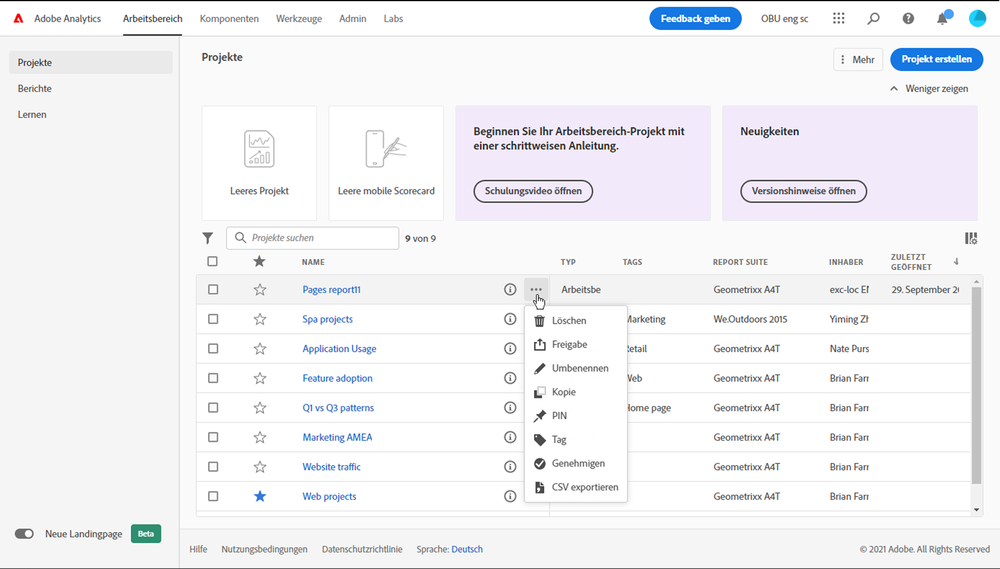
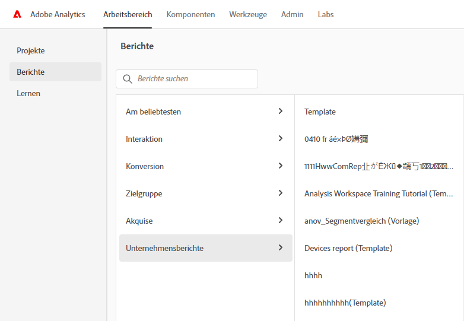

# Neue Landingpage von Adobe Analytics

Die neue Landingpage für Adobe Analytics fasst Analysis Workspace und Reports &amp; Analytics in einer Benutzeroberfläche zusammen und bietet so einen zentralen Zugriffspunkt (Workspace). Sie enthält eine neue Startseite für den Projekt-Manager, ein aktualisiertes Berichtsmenü und aktualisierte Berichte sowie einen Lernbereich, der Ihnen dabei hilft, die ersten Schritte effektiver zu bewältigen.

>[!IMPORTANT]
>
>Diese Landingpage wird ab dem 21. Juli 2021 als offene Beta-Version angezeigt. Dies ist ein optionaler Ausgangspunkt. Wenn Sie es vorziehen, können Sie weiterhin die bisherige Landingpage verwenden, unabhängig davon, ob Sie in Arbeitsbereich oder mit Berichten arbeiten. Wenn Sie sich für das Beta-Programm entscheiden, rufen Sie die Seite auf und klicken Sie oben auf dem Bildschirm auf **[!UICONTROL Feedback geben]**, um Ihr Feedback und alle Fehler, auf die Sie eventuell stoßen, zu melden. Sie können sich jederzeit vom Beta-Programm abmelden und wieder anmelden. Jede Arbeit, die in der Beta-Benutzeroberfläche ausgeführt wird, wird in das vorhandene/aktuelle Arbeitsbereich-Erlebnis übernommen.

>[!VIDEO](https://video.tv.adobe.com/v/334278/?quality=12)

## Neue Landingpage-Funktionen

>[!NOTE]
>
>Diese Ergänzungen und Änderungen sind derzeit [in begrenztem Umfang](/help/release-notes/releases.md).

| Funktion | Beschreibung | Screenshot |
| --- | --- | --- |
| Erweitern [!UICONTROL Projekte] Tabelle auf Vollbild | Um die Immobilien für den Tisch zu erweitern, klicken Sie einfach auf das Hamburger Menüsymbol. Durch diese Aktion werden die Registerkarten in der linken Leiste reduziert. |  |
| Spaltenbreite anpassen | Zuvor war die Spaltenbreite fixiert. Jetzt können Sie sie anpassen, indem Sie das Spaltentrennzeichen ziehen. |  |
| Neu anordnen von fixierten Elementen | Um die fixierten Elemente nach oben und unten zu verschieben, klicken Sie auf das Auslassungszeichen neben dem fixierten Element und wählen Sie[!UICONTROL  Nach oben] oder [!UICONTROL Nach unten]. |  |
| Neue Tabellenspalten | Klicken Sie auf [!UICONTROL Tabelle anpassen] rechts oben in der Tabelle. Die neuen Tabellenspalten umfassen: <ul><li>**[!UICONTROL Geplant]**: Legen Sie fest auf [!UICONTROL on] wenn ein Projekt geplant ist oder [!UICONTROL Aus] , wenn dies nicht der Fall ist. Klicken Sie auf [!UICONTROL on] -Link können Sie Informationen zum geplanten Projekt anzeigen. Sie können auch [den Projektplan bearbeiten](/help/analyze/analysis-workspace/curate-share/t-schedule-report.md) wenn Sie Projektinhaber sind.</li><li>**[!UICONTROL Projekt-ID]**: Die Projekt-ID kann zum Debugging von Projekten verwendet werden.</li><li>**[!UICONTROL Längster Datumsbereich]**: Längere Datumsbereiche erhöhen die Projektkomplexität und können die Verarbeitungs- und Ladezeiten erhöhen. </li><li>**[!UICONTROL Anzahl der Abfragen]**: Eine höhere Anzahl von Projektabfragen erhöht die Projektkomplexität und kann die Verarbeitungs- und Ladezeiten erhöhen.</li></ul> |  |
| Einen Bericht durch einfaches Klicken öffnen | Zuvor musste ein Doppelklick durchgeführt werden. |  |
| Neue Links zu Reports &amp; Analytics-Berichten | <ul><li>Berichte > Zielgruppe > Bots</li><li>Berichte > Zielgruppe > Bot-Seiten<li>Berichte > Interaktion > Echtzeit</li></ul> |  |
| Neue native Berichte | <ul><li>Berichte > Am beliebtesten > Nächste Seite</li><li>Berichte > Bevorzugte > Vorherige Seite</li><li>Berichte > Interaktion > Seitenanalyse > Seitenzusammenfassung</li></ul>Beachten Sie, dass diese Berichte das Workspace-Format aufweisen und konfiguriert und erstellt werden müssen. Die Ausgabe besteht aus einem Bereich mit allgemeinen Metriken, Trenddaten, [!UICONTROL Fluss] Visualisierung und mehr. Sie können diese Berichte auch ändern und Dimensionen, Dimensionselemente usw. ändern. Diese Berichte sind auch als Bedienfelder unter Workspace-Bedienfeldern verfügbar. |  |
| [!UICONTROL Neu erstellen] modal is back | Wenn Sie auf [!UICONTROL Neu erstellen] In Workspace haben Sie wieder die Wahl zwischen einem leeren Projekt und einer leeren mobilen Scorecard. Sie können auch aus beliebigen Vorlagen wählen, die Ihr Unternehmen erstellt hat. |  |
| Auch in CJA verfügbar | Diese Landingpage in geänderter Form ist auch in CJA verfügbar. |  |

{style=&quot;table-layout:auto&quot;}

## Zugriff auf die neue Landingpage {#access-landing}

Nachdem Sie sich bei Adobe Experience Cloud und Analytics angemeldet haben, aktivieren Sie die Schaltfläche [!UICONTROL Neue Landingpage - Beta] in der unteren linken Ecke. Der Zugriff auf die Umschalter-Schaltfläche ist benutzerspezifisch für jedes Unternehmen und nicht unternehmensspezifisch.

## Menüstruktur

* Top-Analytics-Menü: Die meisten Berichte befinden sich nun im Menü [!UICONTROL Berichte] in der linken Leiste.
* Die linke Leiste verfügt über drei Registerkarten: [!UICONTROL Projekte], [!UICONTROL Berichte] und [!UICONTROL Lernen].

### Terminologie

* **[!UICONTROL Projekte]** sind Dinge, die Sie erstellt haben oder die jemand anderes für Sie erstellt und freigegeben hat. [!UICONTROL Projekte] beziehen sich auch auf leere Projekte und leere mobile Scorecards.
* **[!UICONTROL Berichte]** beziehen sich auf alles, was von Adobe vorkonfiguriert wurde, z. B. Berichte in Reports &amp; Analytics und Vorlagen in Arbeitsbereich.
* **[!UICONTROL Vorlagen]** werden nicht mehr als Begriff für die vordefinierten Arbeitsbereich-Projekte von Adobe verwendet. Sie befinden sich nun unter [!UICONTROL Berichte]. Der Begriff [!UICONTROL Vorlagen] wird weiterhin für Vorlagen verwendet, die Ihr Unternehmen erstellt hat.

## Navigieren Sie zur Registerkarte [!UICONTROL Projekte]. {#navigate-projects}

[!UICONTROL Projekte] fungieren als Startseite von [!UICONTROL Arbeitsbereich]. Hier werden alle Arbeitsbereich-Projekte angezeigt, einschließlich der mobilen Scorecards.

>[!NOTE]
>
>Einige der folgenden Einstellungen bleiben sowohl während der Sitzung als auch sitzungsübergreifend bestehen (werden gespeichert). Beispiele: Auf welcher Registerkarte Sie sich befinden, welche Filter ausgewählt wurden, welche Spalten ausgewählt wurden und welche Sortierrichtung die Spalte hat. Suchergebnisse werden jedoch nicht beibehalten.

| UI-Element | Definition |
| --- | --- |
| ... Mehr | Ermöglicht es Ihnen, [!UICONTROL Tutorials anzuzeigen] und [Benutzereinstellungen zu bearbeiten](/help/analyze/analysis-workspace/user-preferences.md). |
| Projekt erstellen | Über das Dropdown-Menü können Sie ein [!UICONTROL Arbeitsbereich-Projekt] oder ein [!UICONTROL Mobile-Projekt] erstellen. |
| Weniger/mehr anzeigen | Blendet das Banner ein oder aus:  |
| Leeres Projekt | Erstellt ein leeres [Arbeitsbereich-Projekt](https://experienceleague.adobe.com/docs/analytics/analyze/analysis-workspace/home.html?lang=de), das Sie füllen können. |
| Leere mobile Scorecard | Erstellt eine leere [mobile Scorecard](https://experienceleague.adobe.com/docs/analytics/analyze/mobapp/curator.html?lang=de), die Sie füllen können. |
| Schulungs-Tutorial öffnen | Öffnet das Arbeitsbereich-Tutorial, das neue Benutzer schrittweise durch die Erstellung eines Projekts führt. |
| Versionshinweise öffnen | Öffnet den Abschnitt „Adobe Analytics“ der neuesten Versionshinweise zu Adobe Experience Cloud. |
| Filtersymbol | Sie können nach Tags, Report Suites, Eigentümern, Typen und anderen Kriterien filtern (Meine, Für mich freigegeben, Favoriten und Genehmigt) |
| Suchleiste | Die Suche umfasst nun alle Spalten in der Tabelle. |
| Auswahlfeld | Wenn Sie neben einem oder mehreren Projekten auf dieses Kästchen klicken, werden die Projektverwaltungsaktionen angezeigt, die Sie ausführen können: Löschen, Taggen, Einfügen, Genehmigen, Freigeben, Umbenennen, Kopieren und Exportieren als CSV. Sie sind möglicherweise nicht berechtigt, alle diese Aktionen durchzuführen. |
| Favoriten | Beim Favorisieren eines Projekts wird es mit einem Stern als Favorit markiert, wonach Sie filtern können. |
| Name | Der Name des Projekts. |
| Anheften-Symbol | Sie können jetzt Elemente anheften, damit sie *immer* oben in Ihrer Liste angezeigt werden. |
| Infosymbol (i) | Wenn Sie auf das Infosymbol klicken, werden die folgenden Informationen zu diesem Projekt angezeigt: Typ, Projektrolle, Eigentümer, Beschreibung und für wen es freigegeben ist. Es zeigt auch an, wer dieses Projekt [bearbeiten oder duplizieren](https://experienceleague.adobe.com/docs/analytics/analyze/analysis-workspace/curate-share/share-projects.html?lang=de) kann. |
| Auslassungspunkte (...) | Durch Klicken auf die Auslassungspunkte neben einem Projekt werden die Projektverwaltungsaktionen angezeigt, die Sie ausführen können: Löschen, Taggen, Einfügen, Genehmigen, Freigeben, Umbenennen, Kopieren und Exportieren als CSV. Beachten Sie, dass Sie möglicherweise nicht über die erforderlichen Berechtigungen für alle diese Aktionen verfügen. |
| Typ | Gibt an, ob es sich um ein Arbeitsbereich-Projekt oder eine mobile Scorecard handelt. |
| Tags | Sie können Berichte taggen, um sie in Gruppen zu organisieren. |
| Projektrolle | Projektrollen beziehen sich darauf, ob Sie Projekteigentümer sind und ob Sie berechtigt sind, das Projekt zu bearbeiten oder zu duplizieren. |
| Report Suite | Tabellen und Visualisierungen innerhalb eines Bedienfelds leiten Daten von der Report Suite ab, die oben rechts im Bedienfeld ausgewählt wurde. Von der Report Suite hängt auch ab, welche Komponenten in der linken Leiste verfügbar sind. In einem Projekt können Sie je nach Anwendungsfällen Ihrer Analyse eine oder viele Report Suites verwenden. Die Liste der Report Suites ist nach Relevanz sortiert. Adobe definiert die Relevanz anhand der Häufigkeit der kürzlichen Verwendung der Suite durch den aktuellen Benutzer und der Häufigkeit der Verwendung der Suite innerhalb des Unternehmens. |
| Inhaber | Die Person, die das Projekt erstellt hat. |
| Zuletzt geöffnet | Wann dieses Projekt zuletzt von Ihnen geöffnet wurde. |
| Symbol &quot;Tabelle anpassen&quot; | (Oben rechts) Wenn Sie Spalten aus der Projektliste hinzufügen oder entfernen möchten, können Sie dies tun, indem Sie sie auswählen oder deaktivieren. |
| &lt; (Schaltfläche „Zurück“) | Über diese Schaltfläche in einem Arbeitsbereich-Projekt oder in einem Bericht gelangen Sie zurück zu Ihrer letzten Landingpage-Konfiguration. Die Seitenkonfiguration, die Sie beim Verlassen der Landingpage hatten, bleibt auch bei der Rückkehr erhalten. |

## Navigieren durch die Registerkarte [!UICONTROL Berichte] {#navigate-reports}

Die Registerkarte [!UICONTROL Berichte] fasst drei Berichtssätze zusammen:

* Die vordefinierten [!UICONTROL Arbeitsbereich]-Vorlagen, die sich zuvor unter [!UICONTROL Arbeitsbereich] > [!UICONTROL Projekt] > [!UICONTROL Neu] befanden. Adobe verwendet in diesem Zusammenhang nicht mehr das Wort „Vorlage“.
* Die meisten vordefinierten Berichte befanden sich zuvor in Adobe Analytics im oberen Menü [!UICONTROL Berichte]. Diese Berichte werden jetzt in [Analysis Workspace](https://experienceleague.adobe.com/docs/analytics/analyze/analysis-workspace/home.html?lang=en) angezeigt.
* Alles, was Ihr Unternehmen für Sie erstellt hat.

>[!IMPORTANT]
>
>Unter „Berichte“ wird der Ordner „Favoriten“ nur angezeigt, wenn Sie einen neuen Bericht als Favoriten markieren. Es werden keine bereits vorhandenen Reports &amp; Analytics-Favoriten übernommen.

Wie bereits erwähnt, sind hier nur die am häufigsten verwendeten Berichte verfügbar, die zuvor in Reports &amp; Analytics gruppiert waren. Einige wenige selten verwendete oder nicht mehr relevante Berichte wurden nicht migriert. Weitere Informationen finden Sie in den FAQ unten.

### Menüs und Untermenüs

Dies sind die Menüs und ihre Untermenüs. Wenn Sie einen bestimmten Bericht nicht finden können, führen Sie eine „Suche auf Seite“ durch, um ihn zu finden.

| Menüelement | Berichte unter diesem Menüelement |
| --- | --- |
| **[!UICONTROL Beliebteste]** | <ul><li>Schulungs-Tutorial (Vorhandene Vorlage für Arbeitsbereich)</li><li>Seiten (Was sind meine Top-Seiten?)</li><li>Seitenansichten (Wie viele Seitenaufrufe erzeuge ich?)</li><li>Besuche (Wie viele Besuche erhalte ich?)</li><li>Besucher (Wie viele Besucher bekomme ich?)</li><li>Schlüsselmetriken (Wie sehen meine wichtigsten Kennzahlen aus?)</li><li>Site-Bereiche (Welche Bereiche meiner Site generierten die meisten Seitenansichten?</li><li>Nächste Seite (Auf welche Seiten gehen meine Besucher als Nächstes?)</li><li>Vorherige Seite (Welche vorherigen Seiten haben meine Besucher aufgerufen?)</li><li>Kampagnen (Welche Kampagnen liegen meinen Schlüsselmetriken zugrunde?)</li><li>Produkte (Welche Produkte liegen meinen Schlüsselmetriken zugrunde?)</li><li>Letztkontakt-Kanal (Welcher Letztkontakt-Kanal erzielt die beste Leistung?)</li><li>Letztkontakt-Kanaldetail (Welcher spezifische Letztkontakt-Kanal ist leistungsstärker als andere?)</li><li>Umsatz (Wie entwickelt sich mein Umsatz?)</li><li>Bestellungen (Wie entwickeln sich meine Bestellungen?)</li><li>Einheiten (Wie viele Einheiten verkaufe ich?)</li></ul> |
| **[!UICONTROL Interaktion]** | <ul><li>Schlüsselmetriken (Wie sehen meine wichtigsten Kennzahlen aus?)</li><li>Seitenansichten (Wie viele Seitenaufrufe erzeuge ich?)</li><li>Seiten (Was sind meine Top-Seiten?)</li><li>Besuche (Wie viele Besuche erhalte ich?)</li><li>Besucher (Wie viele Besucher bekomme ich?)</li><li>Zeit pro Besuch (Wie viel Zeit verbringen meine Benutzer pro Besuch?)</li><li>Zeit vor Ereignis (Wie viel Zeit verbringen meine Benutzer vor einem Erfolgsereignis?)</li><li>Site-Bereiche (Welche Bereiche meiner Site generierten die meisten Seitenansichten?</li><li>Nutzung von Web-Inhalten (Welche Inhalte werden am häufigsten genutzt und sind für Benutzer interessant?)</li><li>Nutzung von Medieninhalten (Welche Inhalte werden am häufigsten genutzt und sind für Benutzer interessant?)</li><li>Fluss zur nächsten/vorherigen Seite (Was sind/waren die nächsten/vorherigen Pfade, die meine Besucher nutzen/genutzt haben?)</li><li>Fallout (Wo sehe ich Fallout für meine digitalen Eigenschaften?)</li><li>Geräteübergreifende Analyse (Verwendung geräteübergreifender Analysen in Analysis Workspace)</li><li>Web-Bindungsgrad (Wer sind meine treuen Benutzer und was tun sie?)</li><li>Medien-Audiokonsum (Was sind Trends und Top-Metriken beim Audiokonsum?)</li><li>Medien-Neuigkeit, -Häufigkeit, -Treue (Wer sind meine treuen Leser?)</li><li>Seitenanalyse > Neuladungen (Welche Seiten werden am häufigsten neu geladen?)</li><li>Seitenanalyse > Besuchszeit pro Seite (Wie viel Zeit verbringen meine Benutzer auf meinen Seiten?)</li><li>Einstiege und Ausstiege > Einstiegsseiten (Was sind meine Top-Einstiegsseiten?)</li><li>Einstiege und Ausstiege > Ursprüngliche Einstiegsseiten (Auf welcher Seite ist mein Besucher ursprünglich eingetreten?)</li><li>Einstiege und Ausstiege > Einzelseitenbesuche (Welche Seiten haben die meisten Einzelseitenbesuche generiert?)</li><li>Einstiege und Ausstiege > Ausstiegseiten (Was sind meine Top-Ausstiegsseiten?)</li></ul> |
| **[!UICONTROL Konversion]** | <ul><li>Produkte > Produkte (Welche Produkte liegen meinen Schlüsselmetriken zugrunde?)</li><li>Produkte > Produktleistung (Welche Produkte schneiden am besten ab?)</li><li>Produkte > Kategorien (Was sind meine leistungsstärksten Produktkategorien?)</li><li>Warenkorb > Warenkörbe (Wie viele Benutzer haben ein Produkt zum Warenkorb hinzugefügt?)</li><li>Warenkorb > Warenkorbansichten (Wie oft haben meine Besucher ihren Warenkorb angesehen?)</li><li>Warenkorb > Zusatz zum Warenkorb (Wie oft fügen Benutzer ihrem Warenkorb ein Produkt hinzu?)</li><li>Warenkorb > Entnahme aus Warenkorb (Wie oft entfernen Benutzer ein Produkt aus ihrem Warenkorb?)</li><li>Einkäufe > Umsatz (Wie sieht mein Umsatz aus?)</li><li>Einkäufe > Bestellungen (Wie sehen meine Bestellungen aus?)</li><li>Käufe > Einheiten (Wie viele Einheiten verkaufe ich?)</li><li>[Magento: Marketing und Commerce](https://experienceleague.adobe.com/docs/analytics/analyze/analysis-workspace/build-workspace-project/starter-projects.html?lang=de#commerce)</li></ul> |
| **[!UICONTROL Zielgruppe]** | <ul><li>Personenmetrik (Wie viele Personen interagieren mit meiner Marke?)</li><li>Besucherprofil > Standortübersicht (Welche Standorte werden von Benutzern am meisten genutzt?)</li><li>Besucherprofil > GeoSegmentation > Geo-Länder, Geo-US-Bundesstaaten, Geo-Regionen, Geo-Städte, Geo-US-DMA (Aus welchen Regionen besuchen mich meine Benutzer?)</li><li>Besucherprofil > Sprachen (Welche Sprache bevorzugen meine Benutzer?)</li><li>Besucherprofil > Zeitzonen (Aus welchen Zeitzonen kommen meine Benutzer?)</li><li>Besucherprofil > Domains (Welche ISPs werden von meinen Besuchern verwendet, um auf meine Site zuzugreifen?)</li><li>Besucherprofil > Domains auf oberster Ebene (Welche Domains leiten den Traffic zu meiner Site?)</li><li>Besucherprofil > Technologie > Technologieübersicht (Welche Technologien werden verwendet, um auf meine Site zuzugreifen?)</li><li>Besucherprofil > Technologie > Browser, Browser-Typ, Browser-Breite, Browser-Höhe (welcher Browser, welche Browser-Version des Unternehmens und welche Breite und Höhe werden von Benutzern verwendet, um auf meine Site zuzugreifen?)</li><li>Besucherprofil > Technologie > Betriebssystem, Betriebssystemtypen (Welches Betriebssystem und welche Version davon verwenden meine Besucher?)</li><li>Besucherprofil > Technologie > Mobilnetzbetreiber (Welche Mobilnetzbetreiber verwenden meine Besucher, um auf meine Site zuzugreifen?)</li><li>Besuchertreue > Rückkehrhäufigkeit (Wie viel Zeit vergeht zwischen dem aktuellen Besuch meines Benutzers und vorherigen Besuchen?)</li><li>Besuchertreue > Erneute Besuche (Wie viele meiner Besucher kehren zurück?)</li><li>Besuchertreue > Besuchsnummer (Welcher Besuchsnummernbehälter liegt den meisten meiner Schlüsselmetriken zugrunde?)</li><li>Besucherbindung > Verkaufszyklus > Kundentreue (Zu welchem Treuesegment gehören meine Benutzer?)</li><li>Besucherbindung > Verkaufszyklus > Tage bis Erstkauf (Wie viele Tage sind zwischen dem ersten Besuch meiner Benutzer und dem ersten Kauf vergangen?)</li><li>Besucherbindung > Verkaufszyklus > Tage seit letztem Kauf (Wie viele Tage sind zwischen dem aktuellen Besuch meiner Benutzer und ihrem letzten Kauf vergangen? )</li><li>Besuchertreue > Mobile > Geräte und Gerätetypen (Welche Geräte und Gerätetypen verwenden meine Besucher?)</li><li>Besucherbindung > Mobile > Hersteller (Welchen Mobilgerätehersteller verwenden meine Besucher?)</li><li>Besuchertreue > Mobile > Bildschirmgröße, Bildschirmhöhe, Bildschirmbreite (Welche Bildschirmgröße/-höhe/-breite für Mobilgeräte verwenden meine Besucher?)</li><li>Besucherbindung > Mobile > [Mobile-App-Nutzung](https://experienceleague.adobe.com/docs/analytics/analyze/analysis-workspace/build-workspace-project/starter-projects.html?lang=de#mobile)</li><li>Besucherbindung > Mobile > [Mobile-App-Journey](https://experienceleague.adobe.com/docs/analytics/analyze/analysis-workspace/build-workspace-project/starter-projects.html?lang=en#mobile)</li><li>Besucherbindung > Mobile > [Mobile-App-Metriken](https://experienceleague.adobe.com/docs/analytics/analyze/analysis-workspace/build-workspace-project/starter-projects.html?lang=en#mobile)</li><li>Besucherbindung > Mobile > [Mobile-App-Nachrichten](https://experienceleague.adobe.com/docs/analytics/analyze/analysis-workspace/build-workspace-project/starter-projects.html?lang=en#mobile)</li><li>Besuchertreue > Mobile > [Leistung von Mobile Apps](https://experienceleague.adobe.com/docs/analytics/analyze/analysis-workspace/build-workspace-project/starter-projects.html?lang=en#mobile)</li><li>Besucherbindung > Mobile > [Bindung durch Mobile Apps](https://experienceleague.adobe.com/docs/analytics/analyze/analysis-workspace/build-workspace-project/starter-projects.html?lang=en#mobile)</li></ul> |
| **[!UICONTROL Akquise]** | <ul><li>Marketing-Kanäle > Erstkontakt-Kanal, Details zum Erstkontakt-Kanal (Welcher Erstkontakt-Kanal und welcher spezifische Erstkontakt-Kanal schneidet am besten ab?)</li><li>Marketing-Kanäle > Erster letzter Kanal, Details des ersten letzten Kanals (Welcher Letztkontakt-Kanal und welcher spezifische Letztkontakt-Kanal schneidet am besten ab?)</li><li>Kampagnen > Kampagnen (Welche Kampagnen liegen meinen Schlüsselmetriken zugrunde?)</li><li>Kampagnen > Kampagnenleistung (Welche Kampagnen erzielen den höchsten Umsatz?)</li><li>Kampagnen > Trackingcode (Welche Kampagnen-Trackingcodes erzielen die besten Ergebnisse?)</li><li>[Web-Akquise](https://experienceleague.adobe.com/docs/analytics/analyze/analysis-workspace/build-workspace-project/starter-projects.html?lang=de#web)</li><li>[Mobile-Akquise](https://experienceleague.adobe.com/docs/analytics/analyze/analysis-workspace/build-workspace-project/starter-projects.html?lang=en#mobile)</li><li>[Advertising Analytics: Paid Search](https://experienceleague.adobe.com/docs/analytics/analyze/analysis-workspace/build-workspace-project/starter-projects.html?lang=de#advertising)</li><li>Suchbegriffe – alle, gebührenpflichtig, kostenlos (Welche Suchbegriffe und gebührenpflichtigen/kostenlosen Suchbegriffe bringen meine Schlüsselmetriken am besten voran?)</li><li>Suchmaschinen – alle, gebührenpflichtig, kostenlos (Welche Suchmaschinen und gebührenpflichtigen/kostenlosen Suchmaschinen bringen meine Schlüsselmetriken am besten voran?)</li><li>Ranking aller Suchseiten (Von welcher Suchseite aus besuchen mich meine Benutzer?)</li><li>Verweisende Domains (Von welchen Domains kommt der Traffic auf meine Seite?)</li><li>Ursprüngliche verweisende Domain (Was waren die ersten Domains, auf denen sich Benutzer vor dem Besuch meiner Site befanden?)</li><li>Referrer (Auf welchen URLs waren meine Benutzer, bevor sie sich zu meiner Website durchgeklickt haben?)</li><li>Referrer-Typen (Zu welcher Kategorie gehören die auf mich verweisenden URLs?)</li></ul> |
| **[!UICONTROL Unternehmensberichte]** | Berichte, die Ihr Unternehmen für Ihre Verwendung erstellt hat. Siehe „Erstellen eines Unternehmensberichts“ unten. |

### Speicherort der Vorlagen (jetzt als Berichte bezeichnet)

| Name des Berichts (Vorlage) | Berichtsort |
| --- | --- |
| Anleitungsvideo | Beliebteste > Schulungs-Tutorial |
| Nutzung von Web-Inhalten | Interaktion > Nutzung von Web-Inhalten |
| Nutzung von Medieninhalten | Interaktion > Nutzung von Medieninhalten |
| Geräteübergreifende Analyse | Interaktion > Geräteübergreifende Analyse |
| Web-Kundenbindungsgrad | Interaktion > Web-Kundenbindungsgrad |
| Medien-Audiokonsum | Interaktion > Medien-Audiokonsum |
| Medien-Neuigkeit, -Häufigkeit, -Kundentreue | Interaktion > Medien-Neuigkeit, -Häufigkeit, -Kundentreue |
| Auswirkungen von ITP | Interaktion > ITP-Auswirkungen |
| Produktleistung | Konversion > Produkte > Produktleistung |
| Magento: Marketing und Handel | Konversion > Magento: Marketing und Handel |
| Metrik für Personen | Zielgruppe > Metrik für Personen |
| Standort-Übersicht | Zielgruppe > Besucherprofil > Standortübersicht |
| Technologieübersicht | Zielgruppe > Besucherprofil > Technologie > Technologieübersicht |
| Mobile App Usage | Zielgruppe > Mobil > Nutzung von Mobile Apps |
| Journeys für Mobile Apps | Zielgruppe > Mobil > Mobile App-Journeys |
| Mobile App-Metriken | Zielgruppe > Mobil > Mobile App-Nachrichten |
| Leistung von Mobile Apps | Zielgruppe > Mobil > Leistung von Mobile Apps |
| Beibehaltung von Mobile Apps | Zielgruppe > Mobil > Mobile App-Kundenbindung |
| Kampagnenleistung | Akquise > Kampagnen > Kampagnenleistung |
| Mobile App-Akquise | Akquise > Akquise für Mobile Apps |
| Web-Akquise | Akquise > Web-Akquise |
| Advertising Analytics: Gebührenpflichtige Suche | Akquise > Advertising Analytics: Gebührenpflichtige Suche |

### Verwenden der Registerkarte „Berichte“

Aktuelle Benutzer von Reports &amp; Analytics finden hier einen kurzen Einstieg in die Verwendung der Berichte, die sie kennen und die jetzt in Arbeitsbereich angezeigt werden. Berichte verhalten sich wie vorhandene Vorlagen: Wenn Sie Änderungen daran vornehmen, werden Sie aufgefordert, Ihre Änderungen zu speichern/zu verwerfen, wenn Sie weg navigieren oder zu einem anderen Bericht gehen. Wenn Sie Änderungen speichern möchten, wird der Bericht als neues Projekt gespeichert.

1. Navigieren Sie zur Registerkarte [!UICONTROL Berichte].
1. Wählen Sie den Bericht, den Sie anzeigen möchten, beispielsweise wählen Sie unter [!UICONTROL Am beliebtesten] den Bericht [!UICONTROL Seiten] aus.
1. Klicken Sie rechts auf **[!UICONTROL Bericht öffnen]**.

   

1. Der Seitenbericht, wie in Analysis Workspace angezeigt, zeigt zwei [Visualisierungen](/help/analyze/analysis-workspace/visualizations/freeform-analysis-visualizations.md) ([Balkendiagramm](/help/analyze/analysis-workspace/visualizations/bar.md) und [Zusammenfassungsnummer](/help/analyze/analysis-workspace/visualizations/summary-number-change.md)) und eine [Freiformtabelle](/help/analyze/analysis-workspace/visualizations/freeform-table/freeform-table.md) an. Die verwendete Metrik ist „Vorkommen“.
1. Von hier aus haben Sie mehrere Optionen. Im Folgenden finden Sie einige dieser Optionen:

   * Sie können den Bericht unverändert verwenden.
   * Sie können ein oder mehrere Segmente in die Dropzone „Segment“ oben ziehen. Ziehen Sie beispielsweise das Segment [!UICONTROL Mobile Kunden] und sehen Sie sich die Ergebnisse an.
   * Sie können den Datumsbereich ändern, indem Sie oben rechts in den Kalender wechseln.
   * Sie können Dimensionsaufschlüsselungen hinzufügen, andere Metriken einfügen und den Bericht allgemein beliebig anpassen.

### Erstellen eines (benutzerdefinierten) Unternehmensberichts

Benutzerspezifische Berichte werden als Unternehmensberichte bezeichnet und finden sich im Menü „Unternehmensberichte“ (siehe unten). Alle zuvor erstellten und alle neuen werden hier aufgelistet.

So erstellen Sie einen neuen Unternehmensbericht:

1. Erstellen Sie den Arbeitsbereich für Ihren gewünschten Status.
1. Öffnen Sie das Menü [!UICONTROL Projekt] und klicken Sie auf **[!UICONTROL Als Unternehmensbericht speichern...]**.

   

1. Fügen Sie alle gewünschten Felder zum Modal hinzu und speichern Sie es.

   Der Bericht wird der Liste „Unternehmensberichte“ hinzugefügt und steht denjenigen Ihres Anmeldeunternehmens zur Verfügung.

Weitere Lernoptionen:

* Beachten Sie, dass Sie oben links in jedem Bericht, den Sie öffnen, eine 20-minütige Videoübersicht über Analysis Workspace sehen können
* Für neue Benutzer wird das Video [Trainings-Tutorial](https://www.youtube.com/watch?v=lCH1Kl1q9Wk) empfohlen, das Sie durch den Aufbau eines neuen Projekts führt.
* Hier finden Sie einen Link zur [vollständigen Dokumentation zu Analysis Workspace](/help/analyze/analysis-workspace/home.md).
* Hier finden Sie die vollständige [YouTube-Playlist für Analysis Workspace](https://www.youtube.com/playlist?list=PL2tCx83mn7GuNnQdYGOtlyCu0V5mEZ8sS).

## Navigieren Sie zur Registerkarte „Lernen“. {#navigate-learning}

Die Seite „Lernen“ enthält praktische Videoführungen und -Tutorials sowie Links zur Dokumentation.

* Die Tour [!UICONTROL Arbeitsbereich-Grundlagen] führt Sie direkt zu Arbeitsbereich und zeigt Ihnen das Arbeitsbereich-Layout und wo Sie die häufigsten Aktionen finden/durchführen können. Diese Tour kann auch jederzeit direkt in Arbeitsbereich über das QuickInfo-Pop-over in der Kopfzeile des Bedienfelds neu gestartet werden.
* Durch Klicken auf ein Video/eine Tour wird ein Tag **[!UICONTROL Angezeigt]** hinzugefügt. Mit diesem Tag können Sie Ihren Fortschritt durch den Lerninhalt verfolgen. Sie können auf das Tag klicken und es wird ausgeblendet, falls Sie den Inhalt noch nicht abgeschlossen haben.
* Die Schaltfläche **[!UICONTROL Weitere Informationen]** im Video-Modal bietet Zugriff auf eine Adobe Experience League-Dokumentationsseite mit weiteren Hilfeinhalten zu dem Video, das Sie gerade angesehen haben.  **[!UICONTROL Weitere Videos anzeigen]** führt Sie zur vollständigen YouTube-Playlist für Analysis Workspace.

## Häufig gestellte Fragen zu Landingpages. {#landing-faq}

| Frage | Antwort |
| --- | --- |
| Wo sind die Vorlagen, die ich gewohnt bin, in Arbeitsbereich zu finden? | Diese Vorlagen sind auf der Registerkarte [!UICONTROL Berichte] gruppiert. |
| Kann ich die Beta-Version deaktivieren? | Sie können die Beta-Version jederzeit deaktivieren. |
| Wird die Arbeit, die ich in der Benutzeroberfläche des Beta-Programms erstelle, in das Arbeitsbereich-Erlebnis für die Produktion übertragen? | Ja, alle in der Beta-Version durchgeführten Arbeiten werden in das alte/aktuelle Arbeitsbereich-Erlebnis übernommen. |
| Werden meine aktuellen Reports &amp; Analytics-Favoriten übernommen? | Nein, sie werden NICHT übernommen. Alle Arbeitsbereich-Projekt-Favoriten werden jedoch übernommen. |
| Gibt es eine maximale Anzahl von Projekten, die ich anheften kann? | Nein, es gibt keine Begrenzung für die Anzahl der Projekte, die Sie anheften können. |
| Können Administratoren diese neue Landingpage für ihre Benutzer festlegen? | Nein, Administratoren können die neue Landingpage nicht im Namen von Benutzern festlegen. Die einzelnen Benutzer müssen den Umschalter selbst aktivieren. |
| Sind alle Berichte, die derzeit in Reports &amp; Analytics vorhanden sind, weiterhin verfügbar? | Nein, die folgenden Berichte wurden auf der Grundlage der allgemeinen Nutzungsdaten schrittweise eingestellt: <ul><li>Alle benutzerdefinierten eVars/Eigenschaften/Ereignisse/Klassifizierungen<li>Meine empfohlenen Berichte</li><li>Unique Visitors pro Tag, Woche, Monat, Quartal und Jahr</li><li>Unique Customers pro Woche/Monat/Quartal/Jahr</li><li>Tiefe des Aktionsnamens</li><li>Zusammenfassung des Aktionsnamens</li><li>Dashboard hinzufügen</li><li>Alter</li><li>Audio-Unterstützung</li><li>Rechnungsinformationen</li><li>Klicks pro Seite</li><li>Farbtiefe</li><li>Cookie-Unterstützung</li><li>Cookies</li><li>Verbindungstypen</li><li>Kreative Elemente</li><li>Kreditkartenart</li><li>Crossselling</li><li>Benutzerdefinierte Ereignistrichter</li><li>Benutzerspezifische Links</li><li>Kunden-ID</li><li>Wochentag</li><li>Name der Einstiegsaktion</li><li>Name der Ausstiegsaktion</li><li>Ausstiegs-Links</li><li>Fallout</li><li>Datei-Downloads</li><li>Suche im Geschäft</li><li>Vollständige Pfade</li><li>Geschlecht</li><li>VISTA-Regel für Treffertyp</li><li>Bildunterstützung</li><li>Java</li><li>JavaScript</li><li>JavaScript-Version </li><li>Lesezeichen verwalten</li><li>Dashboards verwalten</li><li>Farbtiefe des Bildschirms</li><li>Auflösung des Bildschirms</li><li>Newsletter-Anmeldungen</li><li>Name der nächsten Aktion</li><li>Fluss für Name der nächsten Aktion</li><li>Null-Suchen</li><li>Betriebssystem</li><li>Bestellübersicht</li><li>Seite des Tages</li><li>Nicht gefundene Seiten</li><li>PathFinder</li><li>Pfadlänge</li><li>Name der vorherigen Aktion</li><li>Fluss für Name der vorherigen Aktion</li><li>Produktaktivität</li><li>Produktkosten</li><li>Produktabteilung</li><li>Produktinventarkategorie</li><li>Produktname</li><li>Produktbewertungen</li><li>Produktsaison</li><li>Produktfreigaben</li><li>Produktvergrößerungen</li><li>Neu laden</li><li>Suchvorgänge</li><li>Server</li><li>Einzelseitenbesuche</li><li>Versandinformationen</li><li>Site-Hierarchie</li><li>Erwähnungen in Social Media</li><li>Tageszeit</li><li>Verbrachte Zeit für Aktionsname</li><li>Video-Unterstützung</li><li>Besucherstatus</li></ul> |
