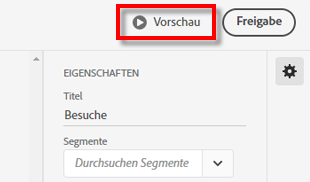
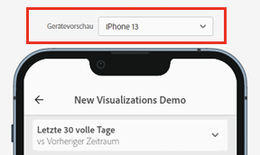

# Mobile-Scorecard erstellen

Die folgenden Informationen liefern Kuratoren von Adobe Analytics-Daten eine Anleitung dazu, wie sie Mobile-Scorecards für Führungskräfte konfigurieren und darstellen können. Beginnen Sie mit dem Video zum Scorecard Builder für Adobe Analytics-Dashboards:

>[!VIDEO](https://video.tv.adobe.com/v/34544)

Eine Adobe Analytics Scorecard stellt wie nachfolgend gezeigt wichtige Datenvisualisierungen für ausführende Benutzer in einem gekachelten Layout bereit:

Als Kurator dieser Scorecard können Sie mit dem Scorecard Builder konfigurieren, welche Kacheln auf der Scorecard für Ihren ausführenden Verbraucher angezeigt werden. Sie können auch konfigurieren, wie die detaillierten Ansichten bzw. Aufschlüsselungen angepasst werden können, nachdem auf die Kacheln getippt wird. Die Scorecard Builder-Oberfläche ist unten dargestellt:

Gehen Sie wie folgt vor, um die Scorecard zu erstellen:

1. Öffnen Sie die Vorlage für [!UICONTROL leere mobile Scorecards].
1. Konfigurieren Sie die Scorecard mit Daten und speichern Sie sie.

## Zugriff auf die Vorlage für [!UICONTROL leere mobile Scorecards] {#template}

Sie können die Vorlage [!UICONTROL Leere mobile Scorecard] öffnen, indem Sie entweder ein neues Projekt erstellen oder über das Menü „Tools“ zugreifen.

### Neues Projekt erstellen {#create}

1. Öffnen Sie Adobe Analytics und klicken Sie auf die Registerkarte **[!UICONTROL Arbeitsbereich]**.
1. Klicken **[!UICONTROL Projekt erstellen]** und wählen Sie die **[!UICONTROL Leere mobile Scorecard]** Projektvorlage.
1. Klicken Sie auf **[!UICONTROL Erstellen]**.

### Tools-Menü

1. Wählen Sie im Menü **[!UICONTROL Tools]** die Option **[!UICONTROL Analytics-Dashboards (Mobile App)]** aus.
1. Klicken Sie im nachfolgenden Bildschirm auf **[!UICONTROL Neue Scorecard erstellen]**.

## Scorecard mit Daten konfigurieren und speichern {#configure}

So implementieren Sie die Scorecard-Vorlage:

1. Geben Sie unter **[!UICONTROL Eigenschaften]** (in der rechten Leiste) eine **[!UICONTROL Report Suite des Projekts]** an, aus der Sie Daten verwenden möchten.

   

1. Um Ihrer Scorecard eine neue Kachel hinzuzufügen, ziehen Sie eine Metrik aus dem linken Bereich und legen Sie sie im **[!UICONTROL Metriken hierher ziehen und ablegen]** Zone. Sie können auch eine Metrik zwischen zwei Kacheln einfügen, indem Sie einen ähnlichen Workflow verwenden.

   

1. Von jeder Kachel aus können Sie auf eine Detailansicht zugreifen, die zusätzliche Informationen über die Metrik anzeigt, wie z. B. die obersten Elemente in einer Liste verwandter Dimensionen.

## Dimensionen oder Metriken hinzufügen {#dimsmetrics}

Um einer Metrik eine verwandte Dimension hinzuzufügen, ziehen Sie eine Dimension aus dem linken Bereich und legen Sie sie auf einer Kachel ab.

Sie können beispielsweise geeignete Dimensionen (wie **[!DNL Marketing Channel]** in diesem Beispiel) zur Metrik **[!UICONTROL Unique Visitors]** hinzufügen, indem Sie sie auf die Kachel ziehen und dort ablegen. Aufschlüsselungen von Dimensionen werden im Abschnitt [!UICONTROL Drill-ins] der folienspezifischen **[!UICONTROL Eigenschaften]** angezeigt. Sie können jeder Kachel mehrere Dimensionen hinzufügen.

## Segmente anwenden {#segments}

Um ein Segment auf einzelne Kacheln anzuwenden, ziehen Sie es aus dem linken Bereich und legen Sie es direkt auf der Kachel ab.

Wenn Sie das Segment auf alle Kacheln in der Scorecard anwenden möchten, legen Sie die Kachel auf der Scorecard ab. Sie können auch Segmente anwenden, indem Sie im Filtermenü unterhalb der Datumsbereiche Segmente auswählen. You [Konfigurieren und Anwenden von Filtern für Ihre Scorecards](https://experienceleague.adobe.com/docs/analytics-learn/tutorials/analysis-workspace/using-panels/using-drop-down-filters.html?lang=de) auf die gleiche Weise wie in Adobe Analytics Workspace.

## Datumsbereiche hinzufügen {#dates}

Um Datumsbereichskombinationen, die in Ihrer Wertungsliste ausgewählt werden können, hinzuzufügen oder zu entfernen, wählen Sie die Dropdown-Liste „Datumsbereich“ aus.

Jede neue Scorecard Beginn mit 6 Datumsbereichskombinationen, die sich auf den Datumsbereich von heute und gestern konzentrieren. Sie können unnötige Datumsbereiche entfernen, indem Sie auf das „x“ klicken, oder Sie können jede Datumsbereichskombination durch Klicken auf den Stift bearbeiten.

Um ein Primärdatum zu erstellen oder zu ändern, wählen Sie über die Dropdown-Liste aus den verfügbaren Datumsbereichen aus oder ziehen Sie eine Datumskomponente aus der rechten Leiste in den Ablagebereich.

Um ein Vergleichsdatum zu erstellen, können Sie im Dropdown-Menü aus praktischen Voreinstellungen für gängige Zeitvergleiche auswählen. Sie können auch eine Datumskomponente aus der rechten Leiste ziehen und ablegen.

Wenn der gewünschte Datumsbereich noch nicht erstellt wurde, können Sie durch Klicken auf das Kalendersymbol einen neuen erstellen.

Dadurch gelangen Sie zum Generator für den Datumsbereich, in dem Sie eine neue Komponente für den Datumsbereich erstellen und speichern können.

### Vergleichsdatumsbereiche anzeigen/ausblenden {#show-comparison-dates}

Um Vergleichsdatumsbereiche ein- oder auszublenden, schalten Sie die Einstellung **Vergleichsdaten einbeziehen** um.

Die Einstellung ist standardmäßig *an*. Deaktivieren Sie die Option, wenn Sie keine Vergleichsdaten anzeigen möchten.

## Visualisierungen anwenden {#viz}

Video zu Visualisierungen für Mobile-Scorecards ansehen:

>[!VIDEO](https://video.tv.adobe.com/v/337570/?quality=12&learn=on)

Analytics-Dashboards verfügen über vier Visualisierungen, die Ihnen einen nützlichen Einblick in Dimensionselemente und -metriken bieten. Wenn Sie eine andere Visualisierung anwenden möchten, ändern Sie den [!UICONTROL Diagrammtyp] in den [!UICONTROL Eigenschaften] einer Kachel. Wählen Sie einfach die rechte Kachel aus und ändern Sie dann den Diagrammtyp.

Oder klicken Sie auf das Symbol für [!UICONTROL Visualisierungen] in der linken Leiste und ziehen Sie die rechte Visualisierung per Drag &amp; Drop auf die Kachel:

### [!UICONTROL Zusammenfassungszahl]

Verwenden Sie die Visualisierung der Zusammenfassungsnummer, um eine große Zahl hervorzuheben, die in einem Projekt wichtig ist.

### [!UICONTROL Ringdiagramm]

Ähnlich einem Tortendiagramm zeigt diese Visualisierung die Daten als Teile oder Segmente eines Ganzen. Ein Ringdiagramm kann für den Vergleich der prozentualen Anteile eines Ganzen verwendet werden. Nehmen wir beispielsweise an, Sie möchten sehen, welche Anzeigenplattform zur Gesamtzahl der Unique Visitors beigetragen hat:

### [!UICONTROL Linie]

Die Linienvisualisierung stellt Metriken anhand einer Linie dar, die den Wertverlauf über einen bestimmten Zeitraum hinweg zeigt. Ein Liniendiagramm zeigt Dimensionen im Zeitverlauf an, funktioniert aber bei jeder Visualisierung. In diesem Beispiel visualisieren Sie die Dimension „Produktkategorie“.

### [!UICONTROL Horizontalbalken]

Diese Visualisierung zeigt Horizontalbalken, die verschiedene Werte aus einer oder mehreren Metriken darstellen. Verwenden Sie zum Beispiel [!UICONTROL Horizontalbalken] als bevorzugte Visualisierung, um ganz leicht zu erkennen, welches Ihre Top-Produkte sind.

### Entfernen Sie [!UICONTROL nicht angegebene] Dimensionselemente

Wenn Sie [!UICONTROL nicht angegebene] Dimensionselemente aus Ihren Daten entfernen möchten, gehen Sie wie folgt vor:

1. Wählen Sie die richtige Kachel aus.
1. Wählen Sie in der rechten Leiste unter **[!UICONTROL Drill-ins]** den Rechtspfeil neben dem Dimensionselement aus, für das Sie Elemente des Typs **[!UICONTROL Nicht angegeben]** entfernen möchten.

   

1. Klicken Sie auf das Symbol neben **[!UICONTROL Nicht angegeben]**, um nicht spezifizierte Daten aus Ihrem Reporting zu entfernen. (Sie können auch jedes andere Dimensionselement entfernen.)

## Anzeigen und Konfigurieren von Kacheleigenschaften {#tiles}

Wenn Sie im Scorecard Builder auf eine Kachel klicken, zeigt die rechte Leiste die Eigenschaften und Eigenschaften an, die dieser Kachel und der zugehörigen Detailfolie zugeordnet sind. In dieser Leiste können Sie einen neuen **Titel** für die Kachel erstellen und die Kachel konfigurieren, indem Sie Segmente anwenden.

## Anzeigen von Detailfolien {#view-detail-slides}

Wenn Sie auf Kacheln klicken, wird in einem dynamischen Popup-Fenster angezeigt, wie die Detailfolie für ausführende Benutzende in der Mobile App dargestellt wird. Sie können Dimensionen hinzufügen, um Ihre Daten für Ihre spezifischen Anforderungen aufzuschlüsseln. Wenn keine Dimension angewandt wurde, ist die Aufschlüsselungs-Dimension **Stunde** oder **Tage**, je nach dem standardmäßigen Datumsbereich.

Aufschlüsselungen verfeinern Ihre Analyse, indem sie die Metriken nach Dimensionselementen wie den folgenden aufschlüsseln:

* Metrik „Unique Visitors“ aufgeschlüsselt nach Anzeigenplattform (AMO-ID)
* Besuche aufgeschlüsselt nach Produktkategorie (Einzelhandel)
* Gesamtumsatz aufgeschlüsselt nach Produktnamen

Jede der Detailfolie hinzugefügte Dimension wird in einer Dropdown-Liste in der Ansicht der Detailfolie in der Mobile App angezeigt. Der ausführende Benutzer kann dann aus den in der Dropdown-Liste aufgelisteten Optionen eine Auwahl treffen.

## Anpassen von Detailfolien {#customize-detail-slide}

Benutzerdefinierte Detailansichten ermöglichen es Ihnen, Ihre Zielgruppe mit noch zielgerichteteren Informationen anzusprechen.

>[!VIDEO](https://video.tv.adobe.com/v/3410002)

Sie können das Layout für jede Detailfolie ändern und Text hinzufügen, um Endbenutzenden zu helfen, die Daten besser zu verstehen. Sie können auch über das Dropdown-Menü den Diagrammtyp ändern.

### Ändern des Folien-Layouts

Ändern Sie das Folien-Layout, um die Aufmerksamkeit der Betrachtenden zu fokussieren. Sie können beispielsweise das Layout so ändern, dass nur ein Diagramm oder nur eine Tabelle angezeigt wird. Um das Folien-Layout zu ändern, wählen Sie eines der vordefinierten Formate aus.

Sie können das Folien-Layout auch ändern, indem Sie Visualisierungskomponenten aus der linken Leiste auf die Arbeitsfläche ziehen und dort ablegen. Jede Detailfolie darf nur zwei Visualisierungen gleichzeitig enthalten.

### Hinzufügen von beschreibendem Text zu einer Folie

Sie können Text hinzufügen, um aussagekräftige Informationen über den Inhalt der Diagramme oder die Bedeutung von Daten bereitzustellen.

Um einer Detailfolie Text hinzuzufügen, wählen Sie ein Layout aus, für das das Symbol `T` angezeigt wird, oder ziehen Sie die Textvisualisierungskomponente aus der linken Leiste und legen Sie diese ab. Der Texteditor wird automatisch geöffnet, wenn eine neue Textvisualisierung hinzugefügt oder ein Folien-Layout mit Text ausgewählt wird. Der Texteditor bietet alle Standardoptionen zur Textformatierung, Sie können Textstile wie Absätze, Überschriften und Unterüberschriften anwenden und eine fett oder kursiv formatierte Schriftart auswählen. Sie können Text ausrichten sowie Listen mit Aufzählungszeichen, Nummerierungen und Links hinzufügen. Wenn Sie die Bearbeitung abgeschlossen haben, klicken Sie oben rechts im Texteditor auf die Schaltfläche „Minimieren“, um den Texteditor zu schließen. Um bereits hinzugefügten Text zu bearbeiten, wählen Sie zum erneuten Öffnen des Texteditors das Stiftsymbol aus.

## Entfernen von Komponenten {#remove}

Um eine Komponente zu entfernen, die auf die gesamte Scorecard angewendet wird, klicken Sie auf eine beliebige Stelle außerhalb der Kacheln auf die Scorecard und entfernen Sie sie, indem Sie auf die **x** wird angezeigt, wenn Sie den Mauszeiger über die Komponente bewegen, wie unten für die **Erstbesuche** Segment:

## Erstellen von Daten-Storys {#create-data-story}

Eine Daten-Story ist eine Sammlung unterstützender Datenpunkte, Geschäftskontexte und verwandter Metriken, die auf einem zentralen Thema oder einer zentralen Metrik basieren.

Wenn Sie sich beispielsweise auf den Webtraffic konzentrieren, können Besuche Ihre wichtigste Metrik sein. Neue Visitors oder Unique Visitors sind für Sie aber möglicherweise ebenfalls interessant. Vielleicht möchten Sie auch Daten sehen, die nach Web-Seite oder dem Gerätetyp aufgeschlüsselt sind, von dem der Traffic stammt. Daten-Storys in mobilen Scorecard-Projekten ermöglichen es Ihnen, die wichtigsten Metriken in den Vordergrund zu stellen und gleichzeitig die gesamte Story hinter den Metriken mithilfe mehrerer Detailfolien zu erzählen.

Sehen Sie sich das Video an, um mehr über das Erstellen von Daten-Storys in Mobile-Scorecard-Projekten in Analysis Workspace zu erfahren.

>[!VIDEO](https://video.tv.adobe.com/v/3416392/?quality=12&learn=on)

**Erstellen einer Daten-Story**

Erstellen Sie Ihre Daten-Story, indem Sie einer Kachel mehrere Detailfolien hinzufügen.

1. Beginnen Sie mit einem Mobile-Scorecard-Projekt.
1. Wählen Sie eine Kachel aus, anhand der Sie eine Story erstellen möchten.

   

   {width=".50%"}

1. Fügen Sie Folien hinzu, um Ihre Daten-Story zu erstellen. Die erste Folie wird standardmäßig generiert.

   Um neue Folien hinzuzufügen, bewegen Sie den Mauszeiger über eine Folie oder klicken Sie auf sie. Wählen Sie dann eine der verfügbaren Optionen aus:

   * Tippen Sie auf das Pluszeichen ([!UICONTROL +]), um eine neue Folie zu erstellen.

   * Tippen Sie auf das Duplizieren-Symbol, um die vorhandene Folie zu duplizieren.

1. Wenn Sie eine leere Folie erstellen, ziehen Sie Komponenten per Drag-and-Drop aus der linken Leiste oder wählen Sie ein Layout aus, um die Folie automatisch mit den Daten aus der Kachel aufzufüllen.

   

Um eine Folie zu löschen, tippen Sie auf das Papierkorbsymbol.

### Anpassen einer Daten-Story {#customize-data-story}

Mit Daten-Storys können Sie alles anpassen, sodass Sie Informationen, die Sie weitergeben möchten, freigeben und alles ausschließen können, was Sie nicht benötigen. Sie können Kacheln und einzelne Folien anpassen, um Filter hinzuzufügen, Aufschlüsselungen anzuzeigen, das Layout zu ändern und die Visualisierungen zu ändern.

**Anpassen von Kacheln**

1. Tippen Sie auf eine Kachel. Die ausgewählte Kachel wird blau dargestellt, und im rechten Bereich werden die Kacheleigenschaften angezeigt.
1. Ändern Sie den Titel, den Diagrammtyp und andere Kacheloptionen.
1. Ziehen Sie eine Komponente auf die Kachel.

   

   Wenn Sie eine Komponente, z. B. eine Visualisierung, per Drag-and-Drop auf eine Kachel ziehen, wird die Komponente auf alle Daten-Story-Folien angewendet.

1. Für eine reine Titeländerung halten Sie die Umschalttaste gedrückt, um die Änderung anzuwenden.

   

>[!NOTE]
>Folien übernehmen Komponenten von der Kachel, Kacheln übernehmen jedoch keine Komponenten von Folien.

**Anpassen einzelner Folien**

Sie können die Visualisierung für einzelne Folien in einer Daten-Story ändern. Sie können beispielsweise einen horizontalen Balken für eine bestimmte Folie in ein Ringdiagramm ändern. Sie können auch das Layout ändern. Siehe [Anpassen von Detailfolien](#customize-detail-slide).

### Vorschau einer Daten-Story {#preview-data-story}

Nachdem Sie eine Daten-Story erstellt haben, verwenden Sie die Schaltfläche **Vorschau**, um eine Daten-Story so anzuzeigen und mit ihr zu interagieren, als würden Sie eine App nutzen. Informationen zur Vorschau Ihrer Daten-Story finden Sie unter [Vorschau einer Scorecard](#preview).

### Navigieren zwischen Kacheln und Folien {#navigate-tiles-slides}

In der Navigationsleiste werden Symbole angezeigt, die für den Inhalt der einzelnen Folien stehen. Die Navigationsleiste erleichtert die Navigation zu einer bestimmten Folie, wenn viele Folien vorhanden sind.

Um zwischen der Kachel und den Folien zu wechseln, tippen Sie auf die Navigationsleiste.

{width="25%"}

Sie können auch hin und her navigieren, indem Sie die Pfeile auf der Tastatur verwenden oder eine Komponente auswählen und links bzw. rechts auf dem Bildschirm gedrückt halten, um einen Bildlauf durchzuführen.

## Vorschau der Scorecard {#preview}

Sie können eine Vorschau davon anzeigen, wie die Scorecard nach ihrer Veröffentlichung in der Analytics-Dashboards-App aussieht und funktioniert.

1. Klicken Sie auf **[!UICONTROL Vorschau]** in der rechten oberen Ecke des Bildschirms.

   

1. Um anzuzeigen, wie die Scorecard auf verschiedenen Geräten aussehen wird, wählen Sie ein Gerät aus dem Dropdown-Menü [!UICONTROL Gerätevorschau].

   

1. Um mit der Vorschau zu interagieren, haben Sie folgende Möglichkeiten:

   * Klicken Sie mit der linken Maustaste, um das Tippen auf den Bildschirm des Smartphones zu simulieren.

   * Verwenden Sie die Bildlauffunktion Ihres Computers, um das Scrollen auf dem Bildschirm des Smartphones mit Ihrem Finger zu simulieren.

   * Klicken und halten Sie, um das Drücken und Halten des Fingers auf dem Bildschirm des Smartphones zu simulieren. Dies ist für die Interaktion mit den Visualisierungen in der Detailansicht nützlich.

## Scorecard benennen {#name}

Um die Scorecard zu benennen, klicken Sie auf den Namespace oben links im Bildschirm und geben Sie den neuen Namen ein.

## Scorecard freigeben {#share}

So geben Sie die Scorecard für einen ausführenden Benutzer frei:

1. Klicken Sie auf das Menü **[!UICONTROL Freigeben]** und wählen Sie **[!UICONTROL Scorecard freigeben]**.

1. Füllen Sie die Felder im Formular **[!UICONTROL Mobile Scorecard freigeben]** aus, indem Sie:

   * den Namen der Scorecard angeben
   * eine Beschreibung der Scorecard angeben
   * relevante Tags hinzufügen
   * die Empfänger der Scorecard angeben

1. Klicken Sie auf **[!UICONTROL Freigabe]**.

Nachdem Sie eine Scorecard freigegeben haben, können die Empfänger in den Analytics-Dashboards darauf zugreifen. Wenn Sie nachfolgende Änderungen an der Scorecard im Scorecard Builder vornehmen, werden diese automatisch in der freigegebenen Scorecard aktualisiert. Ausführende Benutzer sehen dann die Änderungen, nachdem sie die Scorecard in ihrer App aktualisiert haben.

Wenn Sie die Scorecard durch Hinzufügen neuer Komponenten aktualisieren, sollten Sie die Scorecard erneut freigeben (und die Option zum **[!UICONTROL Freigeben eingebetteter Komponenten]** aktivieren), um sicherzustellen, dass die ausführenden Benutzer Zugriff auf diese Änderungen haben.

### Scorecards über einen freigebbaren Link freigeben {#shareable-link}

Durch die Verwendung eines freigebbaren Links wird es einfach, eine Scorecard in einer E-Mail, einem Dokument oder einer Textnachrichten-App freizugeben. Über den freigebbaren Link können Empfänger die Scorecard auf ihrem Desktop oder in der mobilen Dashboards-App öffnen. Durch die gemeinsame Nutzung von Deep Linking können Sie Projekte einfacher freigeben und die Interaktion mit Ihren Stakeholdern steigern.

So geben Sie eine Scorecard über einen freigebbaren Link frei

1. Klicken Sie auf das Menü **[!UICONTROL Freigeben]** und wählen Sie **[!UICONTROL Scorecard freigeben]**.

   

1. Kopieren Sie den Link und fügen Sie ihn in eine E-Mail, ein Dokument oder eine IM-App ein.

   Wenn ein Empfänger ein Desktop-Programm oder einen Browser verwendet, um den Link zu öffnen, wird das mobile Scorecard-Projekt in Workspace geöffnet.

   Wenn ein Empfänger den Link auf einem Mobilgerät öffnet, wird die Scorecard direkt in der Analytics-Dashboards-App geöffnet.

   Wenn ein Empfänger die App nicht heruntergeladen hat, wird er zur App-Liste im App Store- oder Google Play-Store weitergeleitet, wo er sie herunterladen kann.

