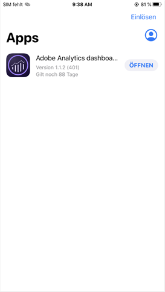
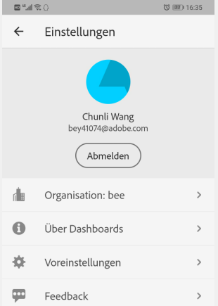
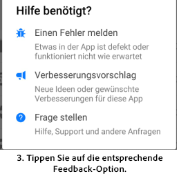

# Leitfaden des Kurators für Adobe Analytics-Dashboard

>[!IMPORTANT]
>
>Adobe Analytics-Dashboard werden nicht veröffentlicht und stehen nur eingeladenen Kunden zum Betatest zur Verfügung. Diese Dokumentation ist nur für Betabenutzer gedacht und stellt keine vollständige Funktionalität der Funktion dar. Wenn Sie Interesse haben, Betabenutzer für diese >Funktion zu werden, wenden Sie sich bitte an Ashok Gorrepati (gorrepati@adobe.com).

## Einführung

Adobe Analytics-Dashboard bieten jederzeit und überall Einblicke aus Adobe Analytics. Die App bietet Benutzern auf Mobilgeräten Zugriff auf intuitive Scorecards, die Sie über die Desktop-Benutzeroberfläche von Adobe Analytics erstellen und freigeben. Scorecards sind eine Sammlung von Schlüsselmetriken und anderen Komponenten, die in einem gekachelten Layout dargestellt werden. Sie können auf eine Scorecard tippen, um detailliertere Aufschlüsselungen und Trendberichte zu erhalten. Sie können Scorecards entsprechend den für Sie wichtigsten Daten anpassen. Analytics-Dashboard werden auf iOS- und Android-Betriebssystemen unterstützt.

## Informationen zu diesem Handbuch

Dieses Handbuch soll Kuratoren von Adobe Analytics-Daten bei der Konfiguration von Scorecards für ihre leitenden Benutzer auf den Analytics-Dashboards unterstützen. Kuratoren können organisatorische Administratoren oder Personen in anderen Rollen sein, die für die Einrichtung von App-Scorecards zuständig sind. Diese ermöglichen es ausführenden Benutzern, eine umfassende Darstellung wichtiger Zusammenfassungsdaten schnell und einfach auf ihren eigenen Mobilgeräten anzuzeigen. Obwohl geschäftsführende Benutzer Endbenutzer von Analytics-Dashboards sind, hilft dieses Handbuch Datenkuratoren bei der effektiven Einrichtung der App für diese Benutzer.

## Glossar

Die folgende Tabelle beschreibt die Begriffe zum Verständnis der Audience, der Funktionen und des Betriebs der Analytics-Dashboard.

| Begriff | Definition |
|--- |--- |
| Verbraucher | Ausführende Person, die wichtige Metriken und Einblicke aus Analytics auf einem Mobilgerät anzeigt |
| Kurator | Person, die mit der Datenerfassung und -auswertung vertraut ist, Einblicke in Analytics erkennt und verteilt und die Scorecards konfiguriert, die von Verbrauchern angezeigt werden |
| Kuratierung | Erstellung oder Bearbeitung einer mobilen Scorecard mit relevanten Metriken, Dimensionen und anderen Komponenten für den Verbraucher |
| Scorecard | Eine Dashboard-Ansicht, die eine oder mehrere Kacheln enthält |
| Kachel | Wiedergabe einer Metrik in einer Scorecard-Ansicht |
| Aufschlüsselung | Eine sekundäre Ansicht, die durch Tippen auf eine Kachel in der Scorecard zugänglich ist. Diese Ansicht erweitert die auf der Kachel dargestellte Metrik und zeigt optional Informationen über zusätzliche Aufschlüsselungsdimensionen an. |
| Datumsbereich | Der primäre Datumsbereich für den Dashboard-Berichte |
| Vergleichsdatumsbereich | Der Datumsbereich, der mit dem primären Datumsbereich verglichen wird |

 
## Scorecard für ausführende Benutzer erstellen

Eine Scorecard stellt wichtige Datenvisualisierungen für ausführende Benutzer in einem gekachelten Layout bereit, wie nachfolgend gezeigt:

Als Kurator dieser Scorecard können Sie mit dem Scorecard Builder konfigurieren, welche Kacheln auf der Scorecard für den Verbraucher angezeigt werden. Sie können auch konfigurieren, wie die detaillierten Ansichten oder Aufschlüsselungen angepasst werden können, sobald auf die Kacheln getippt wird. Hier sehen Sie die Scorecard Builder-Oberfläche:

Zur Erstellung der Scorecard führen Sie folgende Schritte aus:

1. Greifen Sie auf die Vorlage für leere mobile Scorecards zu.
2. Konfigurieren Sie die Scorecard mit Daten und speichern Sie sie.

### Auf die Vorlage für leere mobile Scorecards zugreifen

Sie haben folgende Möglichkeiten, auf die Vorlage für leere mobile Scorecards zuzugreifen:

**Neues Projekt erstellen**

1. Öffnen Sie Adobe Analytics und klicken Sie auf die Registerkarte **Arbeitsbereich**.
2. Klicken Sie auf die Schaltfläche **Neues Projekt erstellen** und wählen Sie die Projektvorlage **Leere mobile Scorecard** aus.
3. Klicken Sie auf die Schaltfläche **Erstellen**.

*Hinweis: Wenn Sie die unten gezeigte Vorlage für leere mobile Scorecards nicht sehen, wurde Ihr Unternehmen noch nicht für die Beta-Version aktiviert. Wenden Sie sich an Ihren Kundenbetreuer.*

**Projekt hinzufügen**

Klicken Sie im Bildschirm **Projekte** auf der Registerkarte **Komponenten** auf die Schaltfläche **Hinzufügen** und wählen Sie **Mobile Scorecard** aus.

**Analytics-Tools verwenden**

In Analytics, click the **Tools** menu and select **dashboards**. Klicken Sie im nachfolgenden Bildschirm auf die Schaltfläche **Scorecard erstellen**.

### Scorecard mit Daten konfigurieren und speichern

So implementieren Sie die Scorecard-Vorlage:

1. Geben Sie unter **Eigenschaften** (in der rechten Leiste) eine **Projekt-Report Suite** an, aus der Sie Daten verwenden möchten.

   

2. Um Ihrer Scorecard eine neue Kachel hinzuzufügen, ziehen Sie eine Metrik aus dem linken Bereich und legen Sie sie in den Bereich **Metriken hierher ziehen und ablegen**. Sie können auch eine Metrik zwischen zwei Kacheln einfügen, indem Sie einen ähnlichen Workflow verwenden.

   

   *Von jeder Kachel aus können Sie auf eine Detailansicht zugreifen, die zusätzliche Informationen über die Metrik anzeigt, wie z. B. die obersten Elemente in einer Liste verwandter Dimensionen.*

3. Um einer Metrik eine verwandte Dimension hinzuzufügen, ziehen Sie eine Dimension aus dem linken Bereich und legen Sie sie auf einer Kachel ab. Sie können beispielsweise geeignete Dimensionen (wie **DMA Region** in diesem Beispiel) zur Metrik **Unique Visitors** hinzufügen, indem Sie sie auf die Kachel ziehen und dort ablegen. Dimensionen, die Sie hinzufügen, werden im Aufschlüsselungsabschnitt der kachelspezifischen **Eigenschaften** angezeigt. Sie können jeder Kachel mehrere Dimensionen hinzufügen.

   

   *Hinweis: Sie können auch allen Kacheln eine Dimension hinzufügen, indem Sie diese auf der Scorecard-Arbeitsfläche ablegen.*

   Wenn Sie im Scorecard Builder auf eine Kachel klicken, zeigt die rechte Leiste die Eigenschaften und Merkmale an, die mit dieser Kachel verbunden sind. In dieser Leiste können Sie einen neuen **Titel** für die Kachel angeben und alternativ die Kachel konfigurieren, indem Sie Komponenten angeben, anstatt sie aus der linken Leiste zu ziehen und abzulegen.

   Wenn Sie auf Kacheln klicken, wird in einem dynamischen Popup angezeigt, wie die Aufschlüsselungsansicht für ausführende Benutzer in der App dargestellt wird. Wenn keine Dimension auf die Kachel angewendet wurde, werden je nach Standarddatumsbereich entweder **Stunden** oder **Tage** als Aufschlüsselungsdimension verwendet.

   

   *Beachten Sie, dass jede der Kachel hinzugefügte Dimension in einer Dropdown-Liste in der Detailansicht der App angezeigt wird. Der ausführende Benutzer kann dann aus den in der Dropdown-Liste aufgelisteten Optionen auswählen.*

4. Um ein Segment auf einzelne Kacheln anzuwenden, ziehen Sie es aus dem linken Bereich und legen Sie es direkt auf der Kachel ab. Wenn Sie das Segment auf alle Kacheln in der Scorecard anwenden möchten, legen Sie die Kachel oben auf der Scorecard ab.

5. Um eine Komponente zu entfernen, die auf die gesamte Scorecard angewendet wird, klicken Sie auf eine beliebige Stelle außerhalb der Kacheln auf die Scorecard. Entfernen Sie die Komponente, indem Sie auf das **x** klicken, das angezeigt wird, wenn Sie den Mauszeiger über die Komponente bewegen, wie unten für das Segment **Mobile Customers** dargestellt:

   

6. In den **Eigenschaften** der Scorecard können Sie optional auch Folgendes angeben:

   * Einen **Standarddatumsbereich**. Die Bereiche, die Sie hier angeben, sind die gleichen, die beim ersten Zugriff des ausführenden Benutzers auf die Scorecard in der App angewendet werden.

   * Einen **Vergleichsdatumsbereich**

   * Alle **Segmente**, die auf die gesamte Scorecard angewendet werden sollen

7. Um die Scorecard zu benennen, klicken Sie auf den Namensbereich in der oberen linken Ecke des Bildschirms und geben Sie den neuen Namen ein.

   

## Scorecard freigeben

So geben Sie die Scorecard für einen ausführenden Benutzer frei:

1. Klicken Sie auf das Menü **Freigeben** und wählen Sie **Scorecard freigeben**.

2. Füllen Sie die Felder im **Freigabeformular** aus, indem Sie:

   * den Namen der Scorecard angeben
   * eine Beschreibung der Scorecard angeben
   * relevante Tags hinzufügen
   * die Empfänger der Scorecard angeben
   * die Option zum **Freigeben eingebetteter Komponenten für Empfänger** auswählen, um sicherzustellen, dass der ausführende Benutzer Zugriff auf alle Komponenten in der Scorecard hat.

3. Klicken Sie auf **Freigabe**.

Nachdem Sie eine Scorecard freigegeben haben, können Ihre Empfänger auf ihre Analytics-Dashboard zugreifen. Wenn Sie in Scorecard Builder nachträgliche Änderungen an der Scorecard vornehmen, werden diese automatisch in der freigegebenen Scorecard aktualisiert. Ausführende Benutzer sehen die Änderungen, nachdem sie die Scorecard in ihrer App aktualisiert haben.

*Hinweis: Wenn Sie die Scorecard durch Hinzufügen neuer Komponenten aktualisieren, sollten Sie die Scorecard erneut freigeben (und die Option zum **automatischen Freigeben eingebetteter Komponenten für Empfänger**aktivieren), um sicherzustellen, dass die ausführenden Benutzer Zugriff auf diese Änderungen haben.*

## App für ausführende Benutzer einrichten

In einigen Fällen benötigen die ausführenden Benutzer möglicherweise zusätzliche Hilfe, um auf die App zuzugreifen und sie zu verwenden. Dieser Abschnitt enthält Informationen, die Sie bei der Bereitstellung dieser Hilfe unterstützen.

### Ausführenden Benutzern beim Zugriff helfen

Um ausführenden Benutzern zu helfen, auf Ihre Scorecards in der App zuzugreifen, stellen Sie Folgendes sicher:

* Auf den Geräten Ihrer Benutzer muss mindestens iOS-Version 10 oder Android-Version 4.4 (KitKat) installiert sein.
* Die Anmeldeinformationen Ihrer Benutzer müssen gültig sein.
* Sie müssen die mobilen Scorecards für Ihre Benutzer korrekt erstellt und freigegeben haben.
* Ihre Benutzer benötigen Zugriff auf Analysis Workspace und die Report Suite, auf der die Scorecard basiert.
* Ihre Benutzer müssen Zugriff auf die Komponenten haben, die die Scorecard enthält. Hinweis: Sie können bei der Freigabe Ihrer Scorecards eine Option auswählen, um **eingebettete Komponenten automatisch für die Empfänger freizugeben**.

### Ausführenden Benutzern bei der Verwendung der App helfen

Während der Beta-Phase und bevor die App der Öffentlichkeit vorgestellt wird, können Sie steuern, wer Zugriff auf die App hat.

1. Helfen Sie ausführenden Benutzern, die App herunterzuladen und zu installieren. Führen Sie zu diesem Zweck die folgenden Schritte aus, um den Zugriff auf Ihre ausführenden Benutzer zu erweitern, je nachdem, ob sie ein iOS- oder ein Android-Gerät verwenden.

   **Für ausführende Benutzer mit iOS-Geräten:**

   1. Click the following public link (it is also available in Analytics under **Tools** > **dashboards**):

      [iOS-Link](https://testflight.apple.com/join/WtXMQxlI): `https://testflight.apple.com/join/WtXMQxlI`

      Nachdem Sie auf den Link geklickt haben, wird der folgende Testflight-Bildschirm angezeigt:

      

   2. Tippen Sie auf den Link **Im App Store anzeigen** auf dem Bildschirm, um die Testflight-App herunterzuladen.

   3. Suchen und installieren Sie nach der Installation der Testflight-App die Adobe Analytics-Dashboard wie folgt in Testflight:

      
   **Für ausführende Benutzer mit Android-Geräten:**

   1. Tap the following Play Store link on the user&#39;s device (It is also available in Analytics under **Tools** > **dashboards**):
      [Android](https://play.google.com/apps/testing/com.adobe.analyticsmobileapp): `https://play.google.com/apps/testing/com.adobe.analyticsmobileapp`

      Nachdem Sie auf den Link getippt haben, tippen Sie auf dem folgenden Bildschirm auf den Link „Tester werden“:

      

   2. Tippen Sie im folgenden Bildschirm auf den Link, damit Sie die App **bei Google Play herunterladen** können:

      

   3. Laden Sie die App herunter und installieren Sie sie.
Nach dem Herunterladen und der Installation können sich ausführende Benutzer mit ihren vorhandenen Adobe Analytics-Anmeldeinformationen bei der App anmelden. Adobe und Enterprise/Federated IDs werden unterstützt.
   

2. Helfen Sie Benutzern beim Zugriff auf Ihre Scorecard. Nach der Anmeldung bei der App wird ausführenden Benutzern der Bildschirm **Unternehmen auswählen** angezeigt. Auf diesem Bildschirm werden die Unternehmensanmeldungen angezeigt, die der ausführende Benutzer verwenden kann. So helfen Sie Benutzern, eine Scorecard anzuzeigen:

   * Tippen Sie auf den Namen der Unternehmensanmeldung oder der Experience Cloud-Organisation, der für die von Ihnen freigegebene Scorecard gilt. Die Scorecard-Liste zeigt alle Scorecards an, die mit dem ausführenden Benutzer mit dieser Unternehmensanmeldung freigegeben wurden.
   * Helfen Sie Benutzern, diese Liste ggf. nach der zuletzt geänderten Scorecard zu sortieren.****
   * Tippen Sie auf den Namen der Scorecard, um sie anzuzeigen.
   

   Hinweis: Wenn sich der ausführende Benutzer anmeldet und eine Meldung angezeigt wird, dass nichts freigegeben wurde, kann das folgende Gründe haben:

   * Der ausführende Benutzer hat möglicherweise die falsche Analytics-Instanz ausgewählt.
   * Eventuell wurde die Scorecard nicht für den ausführenden Benutzer freigegeben.

      
   Vergewissern Sie sich, dass sich der ausführende Benutzer bei der richtigen Analytics-Instanz anmelden kann und dass die Scorecard freigegeben wurde.

3. Erklären Sie dem ausführenden Benutzer, wie die Kacheln in den von Ihnen freigegebenen Scorecards angezeigt werden.

   

   Zusätzliche Informationen zu Kacheln:

   * Die Granularität der Sparklines hängt von der Länge des Datumsbereichs ab:
      * Für einen Tag wird ein stündlicher Trend angezeigt.
      * Für mehr als einen Tag und weniger als ein Jahr wird ein täglicher Trend angezeigt.
      * Für ein Jahr oder mehr wird ein wöchentlicher Trend angezeigt.
   * Die Formel für die Änderung des Prozentwerts ist: Gesamtwert der Metrik (aktueller Datumsbereich) – Gesamtwert der Metrik (Vergleichsdatumsbereich) / Gesamtwert der Metrik (Vergleichsdatumsbereich).
   * Sie können den Anzeigebereich nach unten ziehen, um die Scorecard zu aktualisieren.

4. Tippen Sie auf eine Kachel, um zu zeigen, wie eine detaillierte Aufschlüsselung für die Kachel funktioniert.

   

5. So ändern Sie Datumsbereiche für Ihre Scorecard:

   

   *Hinweis: Sie können die Datumsbereiche auch in der oben gezeigten Aufschlüsselungsansicht auf dieselbe Weise ändern.*

   Je nachdem, auf welches Intervall Sie tippen (**Tag**, **Woche**, **Monat** oder **Jahr**), sehen Sie zwei Optionen für Datumsbereiche – entweder den aktuellen oder den unmittelbar vorhergehenden Zeitraum. Tippen Sie auf eine dieser beiden Optionen, um den ersten Bereich auszuwählen. Tippen Sie in der Liste unter **VERGLEICHEN MIT** auf eine der angezeigten Optionen, um die Daten in diesem Zeitraum mit dem ersten von Ihnen ausgewählten Datumsbereich zu vergleichen. Tippen Sie oben rechts im Bildschirm auf **Fertig**. Das Feld **Datumsbereiche** und die Scorecard-Kacheln werden mit den neuen Vergleichsdaten aus den von Ihnen ausgewählten neuen Bereichen aktualisiert.

6. So hinterlassen Sie Feedback zu dieser App:

   1. Tippen Sie auf das Benutzersymbol in der oberen rechten Ecke des App-Bildschirms.
   2. Tippen Sie auf dem Bildschirm **Mein Konto** auf die Option **Feedback**.
   3. Tippen Sie, um die Optionen zum Hinterlassen von Feedback anzuzeigen.
   
   

**So melden Sie einen Fehler:**

Tippen Sie auf die Option und wählen Sie eine Unterkategorie für den Fehler aus. Geben Sie im Formular zur Meldung eines Fehlers im obersten Feld Ihre E-Mail-Adresse und im Feld darunter eine Beschreibung des Fehlers an. Ein Screenshot Ihrer Kontoinformationen wird automatisch an die Nachricht angehängt. Sie können den Screenshot jedoch löschen, indem Sie auf das **X** im Bild des Anhangs tippen. Außerdem können Sie eine Bildschirmaufzeichnung erstellen, weitere Screenshots hinzufügen oder Dateien anhängen. Um den Bericht zu senden, tippen Sie auf das Papierfliegersymbol oben rechts im Formular.

**So schlagen Sie eine Verbesserung vor**:

Tippen Sie auf die Option und wählen Sie eine Unterkategorie für den Vorschlag aus. Geben Sie im Vorschlagsformular im obersten Feld Ihre E-Mail-Adresse und im Feld darunter eine Beschreibung des Vorschlags an. Ein Screenshot Ihrer Kontoinformationen wird automatisch an die Nachricht angehängt. Sie können den Screenshot jedoch löschen, indem Sie auf das **X** im Bild des Anhangs tippen. Außerdem können Sie eine Bildschirmaufzeichnung erstellen, weitere Screenshots hinzufügen oder Dateien anhängen. Um den Vorschlag zu senden, tippen Sie auf das Papierfliegersymbol oben rechts im Formular.

**So stellen Sie eine Frage:**

Tippen Sie auf die Option und geben Sie im obersten Feld Ihre E-Mail-Adresse und im Feld darunter Ihre Frage an. Ein Screenshot wird automatisch an die Nachricht angehängt. Sie können den Screenshot jedoch löschen, indem Sie auf das **X** im Bild des Anhangs tippen. Außerdem können Sie eine Bildschirmaufzeichnung erstellen, weitere Screenshots hinzufügen oder Dateien anhängen. Um die Frage zu senden, tippen Sie auf das Papierfliegersymbol oben rechts im Formular.
