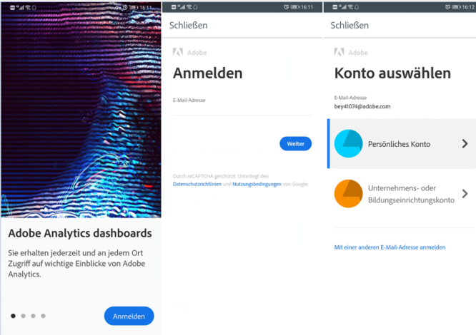
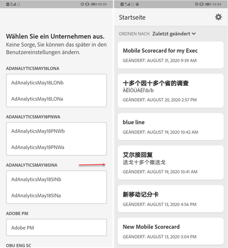
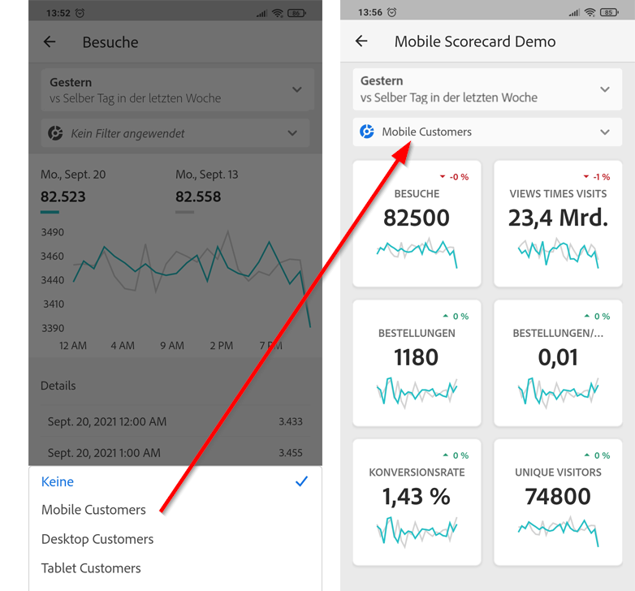

# Adobe Analytics-Dashboards: Schnellstarthandbuch für ausführende Benutzer

Im Folgenden finden Sie Informationen zu Best Practices für die Verwendung und Anzeige von Adobe Analytics-Dashboards. Ein Video mit diesen Informationen finden Sie unter [Adobe Analytics-Dashboards – In-App-Erlebnis](https://youtu.be/QXqQ_PkArbA).

## Einführung

Adobe Analytics-Dashboards bieten jederzeit und überall Erkenntnisse aus Adobe Analytics.  Die App ermöglicht Benutzern mobilen Zugriff auf intuitive Scorecards. Scorecards sind eine Sammlung von Schlüsselmetriken und anderen Komponenten, die in einem gekachelten Layout dargestellt werden. Sie können auf eine Scorecard tippen, um detailliertere Aufschlüsselungen und Trendberichte zu erhalten. Dashboards werden sowohl unter iOS- als auch Android-Betriebssystemen unterstützt.

## Weitere Informationen zu diesem Handbuch

Dieses Handbuch soll ausführenden Benutzern helfen, die Scorecards in den Analytics-Dashboards zu lesen und zu interpretieren. Das Programm ermöglicht es ausführenden Benutzern, eine umfassende Darstellung wichtiger Zusammenfassungsdaten schnell und einfach auf ihren eigenen Mobilgeräten anzuzeigen.

## Glossar

| Begriff | Definition |
|--- |--- |
| Verbraucher | Ausführende Person, die wichtige Schlüsselmetriken und Einblicke aus Analytics auf einem Mobilgerät anzeigt |
| Kurator | Person, die mit der Datenerfassung und -auswertung vertraut ist, Einblicke in Analytics erkennt und verteilt und die Scorecards konfiguriert, die von Verbrauchern angezeigt werden |
| Kuratierung | Der Vorgang der Erstellung oder Bearbeitung einer mobilen Scorecard mit relevanten Metriken, Dimensionen und anderen Komponenten für den Verbraucher |
| Scorecard | Eine Ansicht der Dashboards mit einer oder mehreren Kacheln |
| Kachel | Wiedergabe einer Metrik in einer Scorecard-Ansicht |
| Aufschlüsselung | Eine sekundäre Ansicht, die durch Tippen auf eine Kachel in der Scorecard zugänglich ist. Diese Ansicht erweitert die auf der Kachel dargestellte Metrik und zeigt optional Informationen über zusätzliche Aufschlüsselungsdimensionen an |
| Datumsbereich | Der primäre Datumsbereich für die Berichterstellung über die Dashboards |
| Vergleichsdatumsbereich | Der Datumsbereich, der mit dem primären Datumsbereich verglichen wird |

## Dashboards auf Ihrem Gerät einrichten

Um die Dashboards effektiv zu nutzen, bitten Sie Ihren Scorecard-Kurator bei der Einrichtung der App um Hilfe. Dieser Abschnitt enthält Informationen, die Ihnen helfen, die App zusammen mit Ihrem Kurator einzurichten.

### Zugriff erhalten

Um auf Scorecards in Dashboards zuzugreifen, stellen Sie Folgendes sicher:

* Sie haben gültige Anmeldeinformationen für Adobe Analytics.
* Ihr Kurator hat mobile Scorecards korrekt erstellt und für Sie freigegeben.

### Herunterladen und Installieren von Dashboards

Um die App herunterzuladen und zu installieren, führen Sie die Schritte entsprechend dem Betriebssystem auf Ihrem Gerät aus.

**Für ausführende Benutzer mit iOS-Geräten:**

Klicken Sie auf den folgenden Link (auch in Analytics unter **[!UICONTROL Tools]** > **[!UICONTROL Analytics-Dashboards (mobile App)]** verfügbar) und befolgen Sie die Anweisungen zum Herunterladen, Installieren und Öffnen der Applikation:

[iOS-Link](https://apple.co/2zXq0aN)

**Für ausführende Benutzer mit Android-Geräten:**

Klicken Sie auf den folgenden Link (auch in Analytics unter **[!UICONTROL Tools]** > **[!UICONTROL Analytics-Dashboards (mobile App)]** verfügbar) und befolgen Sie die Anweisungen zum Herunterladen, Installieren und Öffnen der Applikation:

[Android-Link](https://bit.ly/2LM38Oo)

Nach dem Herunterladen und Installieren können sich ausführende Benutzer mit ihren vorhandenen Adobe Analytics-Zugangsdaten bei der App anmelden.

## Verwenden von Dashboards

So verwenden Sie Dashboards:

1. Melden Sie sich bei der App an. Der Anmeldebildschirm wird beim Start der Dashboards angezeigt. Folgen Sie den Anweisungen und melden Sie sich mit Ihren bestehenden Adobe Analytics-Anmeldeinformationen an. Adobe und Enterprise/Federated IDs werden unterstützt.

   

2. Wählen Sie ein Unternehmen aus. Nach der Anmeldung bei den Dashboards wird der Bildschirm **[!UICONTROL Unternehmen auswählen]** angezeigt. Auf diesem Bildschirm werden die Unternehmensanmeldungen angezeigt, die Sie verwenden können. Tippen Sie auf den Unternehmensnamen, der mit der für Sie freigegebenen Scorecard verknüpft ist.

3. Anschließend wird die Scorecard-Liste mit allen für Sie freigegebenen Scorecards angezeigt. Tippen Sie auf die Scorecard, die Sie anzeigen möchten.

   

   Wenn Sie sich anmelden und eine Meldung darüber erhalten, dass nichts freigegeben wurde, überprüfen Sie Folgendes zusammen mit Ihrem Kurator:

   * Sie können sich bei der richtigen Analytics-Instanz anmelden.
   * Die Scorecard wurde für Sie freigegeben.

   

4. Untersuchen Sie, wie die Kacheln in der Scorecard angezeigt werden. (Die erste Scorecard wird im Dunkelmodus angezeigt. Weitere Informationen finden Sie unter **[!UICONTROL Voreinstellungen]** weiter unten).

   

   Zusätzliche Informationen zu Kacheln:

   * Die Granularität der Sparklines hängt von der Länge des Datumsbereichs ab:

      * Für einen Tag wird ein stündlicher Trend angezeigt.
      * Für mehr als einen Tag und weniger als ein Jahr wird ein täglicher Trend angezeigt.
      * Für ein Jahr oder mehr wird ein wöchentlicher Trend angezeigt.
   * Die Formel für die Änderung des Prozentwerts ist: Gesamtwert der Metrik (aktueller Datumsbereich) – Gesamtwert der Metrik (Vergleichsdatumsbereich) / Gesamtwert der Metrik (Vergleichsdatumsbereich).

   * Sie können den Anzeigebereich nach unten ziehen, um die Scorecard zu aktualisieren.

   Das folgende Beispiel einer Scorecard wird im normalen Modus angezeigt:

   

5. Tippen Sie auf eine Kachel, um zu sehen, wie eine detaillierte Aufschlüsselung für die Kachel funktioniert.

   

6. So ändern Sie Datumsbereiche für Ihre Scorecard:

   

   * Sie können die Datumsbereiche auch in der oben gezeigten Aufschlüsselungsansicht auf dieselbe Weise ändern.

   * Je nachdem, auf welches Intervall Sie tippen (**Tag**, **Woche**, **Monat** oder **Jahr**), sehen Sie zwei Optionen für Datumsbereiche – entweder den aktuellen oder den unmittelbar vorhergehenden Zeitraum. Tippen Sie auf eine dieser beiden Optionen, um den ersten Bereich auszuwählen. Tippen Sie in der Liste unter **[!UICONTROL VERGLEICHEN MIT]** auf eine der angezeigten Optionen, um die Daten in diesem Zeitraum mit dem ersten von Ihnen ausgewählten Datumsbereich zu vergleichen. Tippen Sie oben rechts im Bildschirm auf **[!UICONTROL Fertig]**. Das Feld **[!UICONTROL Datumsbereiche]** und die Scorecard-Kacheln werden mit den neuen Vergleichsdaten aus den von Ihnen ausgewählten neuen Bereichen aktualisiert.

7. Um einen Segmentfilter auf Ihre Scorecard anzuwenden, tippen Sie auf die Filter-Dropdown-Liste und wählen Sie ein Segment aus, das von Ihrem Kurator konfiguriert wurde. [Filter](https://docs.adobe.com/content/help/de-DE/analytics-learn/tutorials/analysis-workspace/using-panels/using-drop-down-filters.html) in der App funktionieren auf dieselbe Weise wie in Analytics Workspace.

   

8. Fordern Sie eine Scorecard-Aktualisierung an. Wenn eine Scorecard nicht alle Metriken oder Aufschlüsselungen enthält, die für Sie von Interesse sein könnten, wenden Sie sich an Ihr Analytics-Team, um die Scorecard zu aktualisieren. Nach der Aktualisierung können Sie die Karte auf dem Bildschirm nach unten ziehen, um sie zu aktualisieren und die kürzlich hinzugefügten Daten zu laden.

9. So hinterlassen Sie Feedback zu dieser App:

   1. Tippen Sie auf das Einstellungssymbol oben recht im App-Bildschirm.
   2. Tippen Sie auf dem Bildschirm **[!UICONTROL Einstellungen]** auf die Option **[!UICONTROL Feedback]**.
   3. Tippen Sie, um die Optionen zum Hinterlassen von Feedback anzuzeigen.

      

10. Um die Voreinstellungen zu ändern, tippen Sie auf die Option **[!UICONTROL Voreinstellungen]** oben. In den Voreinstellungen können Sie die biometrische Anmeldung aktivieren oder Sie können die App wie folgt für den Dunkelmodus einstellen:

   

**So melden Sie einen Fehler:**

Tippen Sie auf die Option und wählen Sie eine Unterkategorie für den Fehler aus. Geben Sie im Formular zur Meldung eines Fehlers im obersten Feld Ihre E-Mail-Adresse und im Feld darunter eine Beschreibung des Fehlers an. Ein Screenshot Ihrer Kontoinformationen wird automatisch an die Nachricht angehängt. Sie können den Screenshot jedoch löschen, indem Sie auf das **X** im Bild des Anhangs tippen. Außerdem können Sie eine Bildschirmaufzeichnung erstellen, weitere Screenshots hinzufügen oder Dateien anhängen. Um den Bericht zu senden, tippen Sie auf das Papierfliegersymbol oben rechts im Formular.

**So schlagen Sie eine Verbesserung vor**:

Tippen Sie auf die Option und wählen Sie eine Unterkategorie für den Vorschlag aus. Geben Sie im Vorschlagsformular im obersten Feld Ihre E-Mail-Adresse und im Feld darunter eine Beschreibung des Vorschlags an. Ein Screenshot Ihrer Kontoinformationen wird automatisch an die Nachricht angehängt. Sie können den Screenshot jedoch löschen, indem Sie auf das **X** im Bild des Anhangs tippen. Außerdem können Sie eine Bildschirmaufzeichnung erstellen, weitere Screenshots hinzufügen oder Dateien anhängen. Um den Vorschlag zu senden, tippen Sie auf das Papierfliegersymbol oben rechts im Formular.

**So stellen Sie eine Frage:**

Tippen Sie auf die Option und geben Sie im obersten Feld Ihre E-Mail-Adresse und im Feld darunter Ihre Frage an. Ein Screenshot wird automatisch an die Nachricht angehängt. Sie können den Screenshot jedoch löschen, indem Sie auf das **X** im Bild des Anhangs tippen. Außerdem können Sie eine Bildschirmaufzeichnung erstellen, weitere Screenshots hinzufügen oder Dateien anhängen. Um die Frage zu senden, tippen Sie auf das Papierfliegersymbol oben rechts im Formular.
