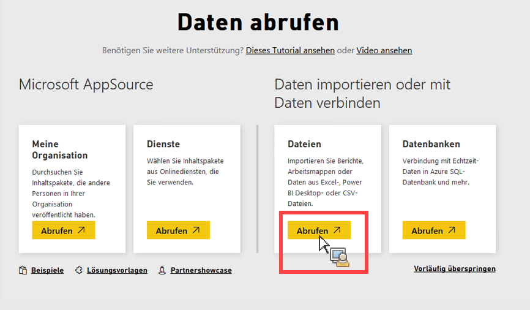

# Daten manuell in Power BI importieren

Wenn Sie Analytics-Daten manuell über Power BI importieren möchten, befolgen Sie diese Anweisungen.

1. Klicken Sie in Power BI auf **[!UICONTROL Daten abrufen]** im unteren linken Bildschirm.
1. Klicken Sie unter **[!UICONTROL Daten importieren oder mit Daten verbinden]** > **[!UICONTROL Dateien]** auf **[!UICONTROL Abrufen]**.

   

1. Klicken Sie auf „Lokale Datei“.

   

1. Wählen Sie die hochzuladende Datei aus und klicken Sie auf **[!UICONTROL Öffnen]**.
1. Klicken Sie unter **[!UICONTROL Excel-Datei nach Power BI hochladen]** auf **[!UICONTROL Hochladen]**.

   

1. Dann sollte eine Meldung angezeigt werden, die bestätigt, dass Ihre Datei hochgeladen wurde.

