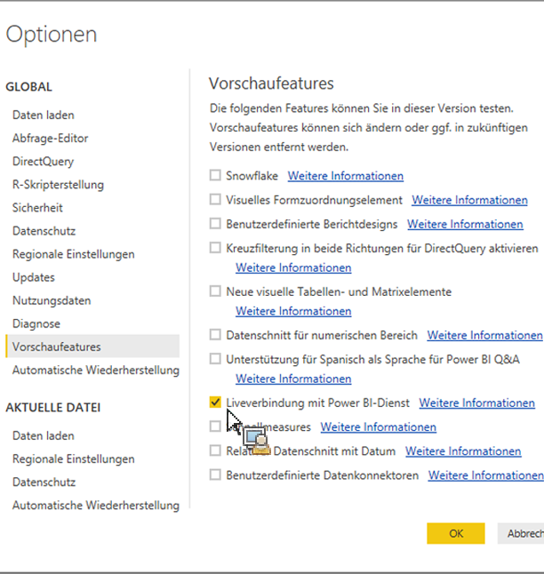

# Veröffentlichen veröffentlichte Assets in Power BI Desktop

Erläutert, wie in ReportBuilder veröffentlichte Assets in Power BI Desktop abgerufen werden

## Voraussetzungen {#section_BDFDAE1E300B429FB6EBCB21AD1383A0}

* Sie müssen die neueste Power BI Desktop-Version installiert haben (Version von April 2017)
* In dieser Vorgehensweise wird davon ausgegangen, dass Sie bereits formatierte ReportBuilder-Tabellen oder Anforderungen für den Power BI-Dienst veröffentlicht haben.

## Verarbeitung {#section_CB03E6E1B066457EA0F6FC08FFF5EFDD}

In der Power BI Desktop-Aktualisierung vom April 2017 ermöglicht Microsoft, mit dem Power BI-Dienst eine Verbindung zu Datensätzen herzustellen. Mit dieser Funktion können Sie aus vorhandenen Datensätzen, die Sie bereits in der Cloud veröffentlicht haben, neue Berichte erstellen. Sie können diese Funktion nutzen, um die Zusammenarbeit zu verbessern und doppelte Arbeit in Ihrem Team zu vermeiden.

1. In Power BI Desktop, go to **[!UICONTROL File]** &gt; **[!UICONTROL Options and settings]** &gt; **[!UICONTROL Options]** &gt; **[!UICONTROL Preview features.]**
1. Aktivieren Sie **[!UICONTROL Liveverbindung mit Power BI-Dienst]** und klicken Sie auf **[!UICONTROL OK]**. 

1. Starten Sie Power BI Desktop neu.
1. Once you have restarted the desktop, go to **[!UICONTROL Home]** &gt; **[!UICONTROL Get Data]** &gt; **[!UICONTROL More...]**.
1. Suchen Sie nach **[!UICONTROL Power BI-Dienst und wählen Sie ihn aus]**.
1. Under **[!UICONTROL Microsoft Power BI service]** &gt; **[!UICONTROL My Workspace]**, select the dataset that you had previously published from Report Builder.

Weitere Informationen finden Sie in diesem [Microsoft-Blog-Beitrag](https://powerbi.microsoft.com/en-us/blog/connecting-to-datasets-in-the-power-bi-service-from-desktop/).
