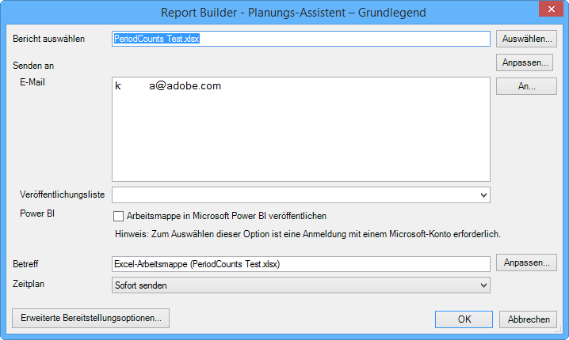
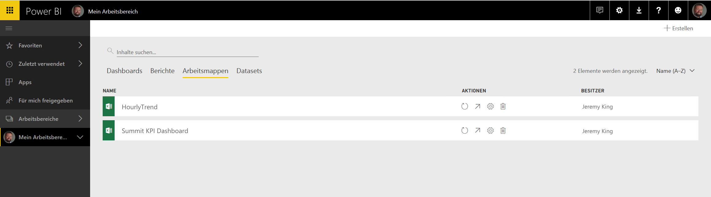
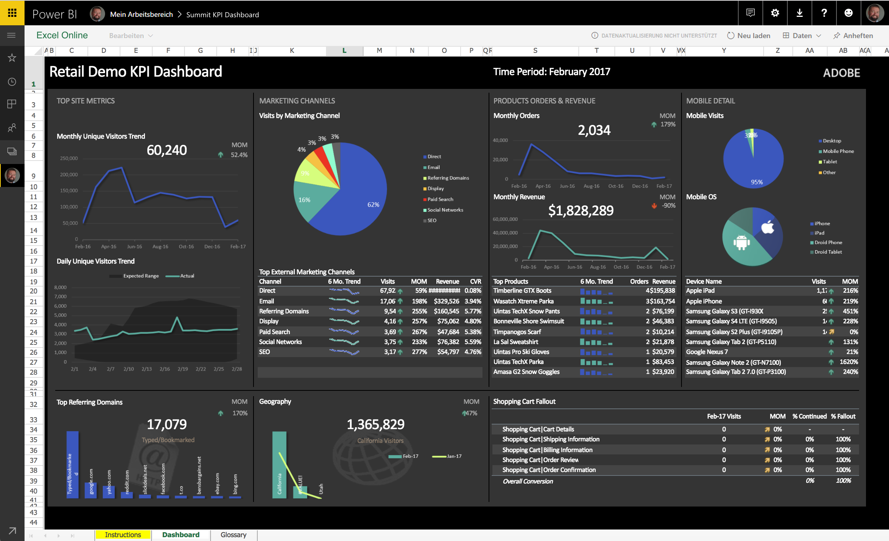
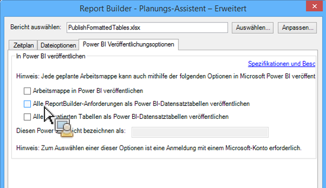
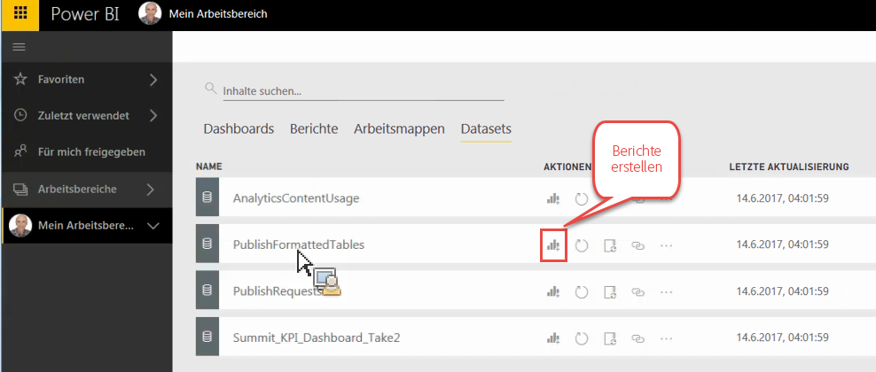
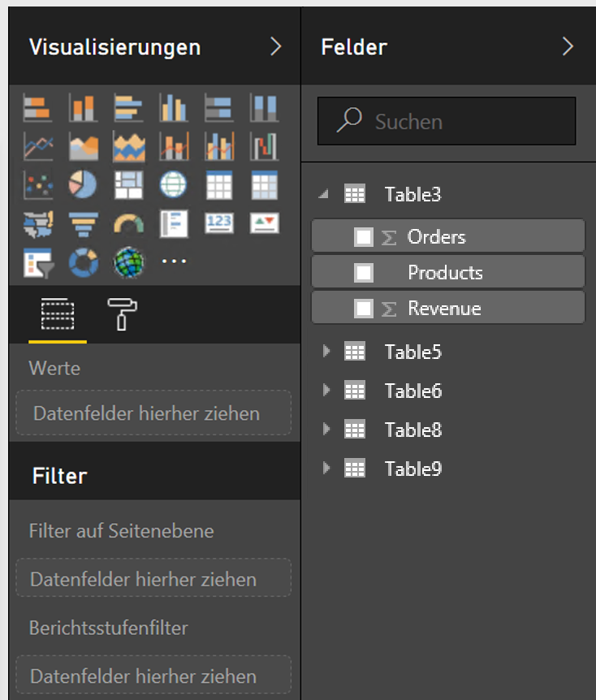
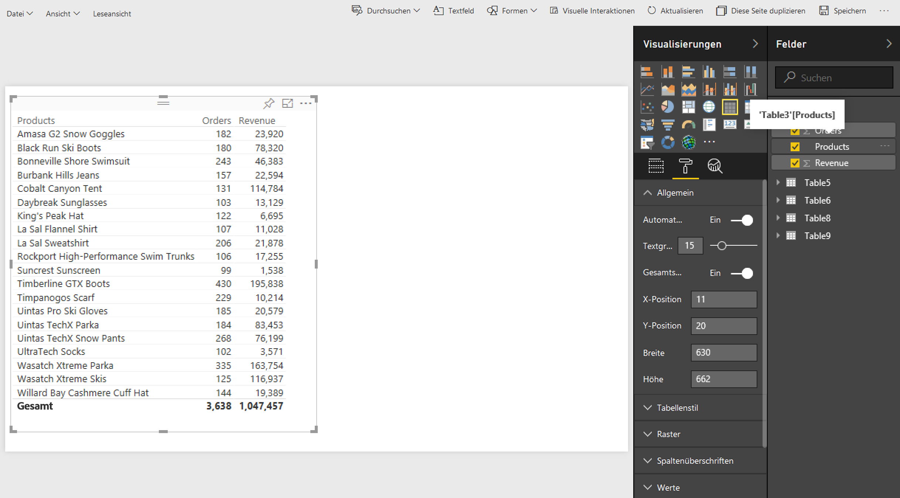
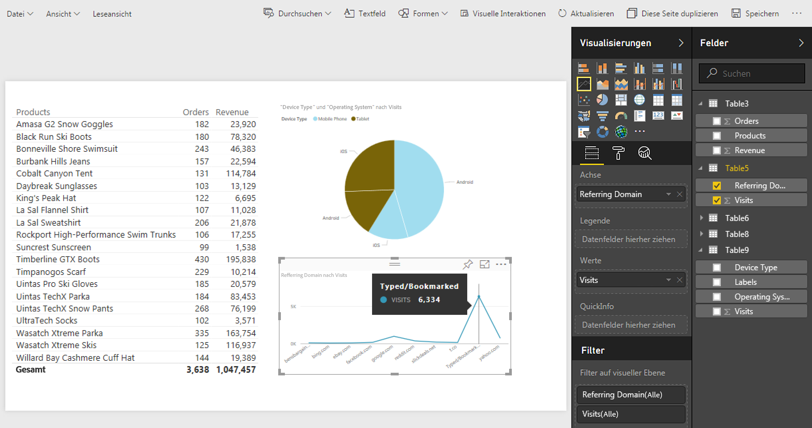
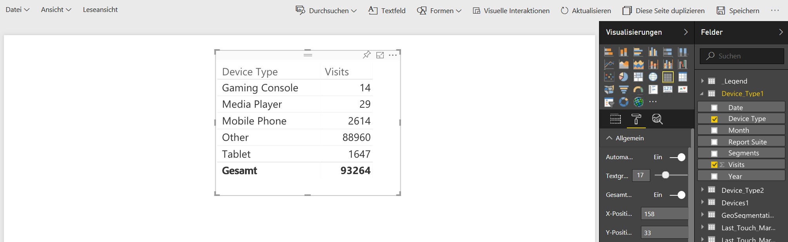
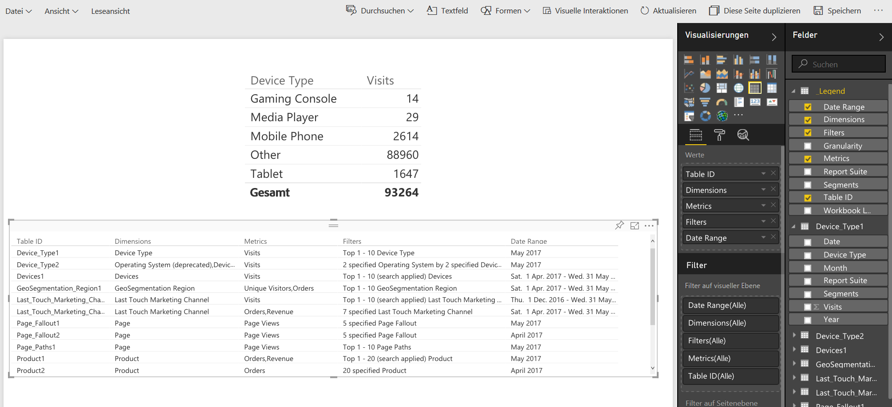

# In Power BI veröffentlichen – Übersicht

Bei Microsoft Power BI handelt es sich um eine Suite von Business Analytics-Dashboards, die zur Analyse von Daten und zur Weitergabe von Erkenntnissen genutzt werden können. Die Adobe Analytics-Integration mit Power BI ermöglicht Ihnen, Report Builder-Analysedaten in Microsoft Power BI zu visualisieren und in Ihrem Unternehmen bequem gemeinsam zu verwenden.

Als Analytiker mussten Sie zuvor eine Verteilung von Report Builder-Arbeitsmappen per E-Mail (oder ftp) planen. Jetzt können Sie den Entscheidungsträgern in Ihrem Unternehmen Zugriff (über ihre Power BI-Konten) gewähren, um Daten in einer webbasierten Umgebung zu korrigieren und zu aktualisieren, die unabhängig von der Plattform und vom Gerät zugänglich ist.

Durch Kombination der Berichterstellungsfunktion von Report Builder mit den Visualisierungsfunktionen von Power BI sind Informationen für alle Mitglieder Ihres Unternehmens leichter zugänglich. Mithilfe von Power BI können Sie Adobe Analytics auch mit anderen Datenquellen verbinden (z. B. Verkaufsstellendaten, CRM), um einzigartige Erkenntnisse über Kunden, Zusammenhänge und Opportunities abzuleiten.

Die Integration mit Adobe Report Builder ermöglicht Ihnen Folgendes

* [Terminierte Report Builder-Arbeitsmappen in Power BI veröffentlichen](/help/analyze/report-builder/whats-new-arb.md#rb-5-5-section)
* [Alle formatierten Tabellen in der Arbeitsmappe als Power BI-Datensatztabellen veröffentlichen](/help/analyze/report-builder/whats-new-arb.md#rb-5-5-section)
* [Alle Report Builder-Anforderungen als Power BI-Datensatztabellen veröffentlichen](/help/analyze/report-builder/whats-new-arb.md#rb-5-5-section)

## Systemanforderungen {#section_0B71092D853446F38FA36447DAC0D32B}

* Adobe Report Builder 5.5 [installiert](/help/analyze/report-builder/setup/t-install-arb.md)
* Aktives Microsoft-Konto für die Anmeldung bei Power BI

## Arbeitsmappe in Power BI veröffentlichen {#section_21CA66229EC240D49594A9A7D3FBA687}

Geplante Arbeitsmappen sind Excel-Arbeitsblätter, die mit Daten aus Adobe Analytics gefüllt sind und regelmäßig nach einem festen Zeitplan gesendet werden.

**Arbeitsmappe in Report Builder veröffentlichen**

1. Generieren Sie eine Arbeitsmappe in Report Builder und speichern Sie sie.
1. On the Report Builder Toolbar, click **[!UICONTROL Schedule]** > **[!UICONTROL New]**.

1. Aktivieren Sie im einfachen Planungsassistenten das Kontrollkästchen neben **[!UICONTROL Publish Workbook to Microsoft Power BI]**.

   

1. Geben Sie Ihre E-Mail-Adresse an, um die Arbeitsmappe sofort zu senden, oder geben Sie die Planungshäufigkeit (stündlich, täglich usw.) an.
1. Click **[!UICONTROL OK]** to publish.
1. Jetzt werden Sie aufgefordert, sich bei Ihrem Microsoft-Konto anzumelden. Geben Sie Ihre Anmeldedaten an.
1. Die Report Builder-Arbeitsmappe wird in die Planung aufgenommen und in Power BI veröffentlicht.

   Durch jede geplante Instanz und nachdem der Report Builder-Prozess die Arbeitsmappe mit den neuesten Analytics-Daten aktualisiert hat, wird die Arbeitsmappe in Microsoft Power BI veröffentlicht.

**Report Builder-Arbeitsmappendaten in Power BI anzeigen**

1. In Power BI, double click the workbook under the [!UICONTROL Workbooks] menu.

   

1. Jetzt können Sie die Dashboard-Daten der Arbeitsmappe anzeigen.  

1. Sie können dann einen Bereich dieser Arbeitsmappe anheften, um sie in ein beliebiges Power BI-Dashboard einzuschließen.

## Alle formatierten Tabellen in der Arbeitsmappe als Power BI-Datensatztabellen veröffentlichen {#section_7C54A54E75184DD6BAEF4ACCE241239A}

>[!NOTE] Wenn die Arbeitsmappe ein Makro enthält, wird „Alle formatierten Tabellen in der Arbeitsmappe als Power BI-Datensatztabellen veröffentlichen“ deaktiviert.

Statt die gesamte Arbeitsmappe zu importieren, können Sie nur den Inhalt aller formatierten Tabellen innerhalb der Arbeitsmappe importieren.

**Verwendungsfall**: Sie besitzen eine Excel-Arbeitsmappe, die Daten aus mehreren Report Builder-Anforderungen abruft und eine Zusammenfassungstabelle mit zahlreichen Formeln erstellt. Sie können nur die Zusammenfassungstabelle in Power BI importieren und eine Visualisierung dafür erstellen.

**Formatierte Tabelle in Report Builder veröffentlichen**

1. Generieren Sie in Report Builder eine Datentabelle, die eine Kopfzeile gefolgt von einer Datenzeile enthält.
1. Wählen Sie die Tabelle und dann **[!UICONTROL Format as Table]** im [!UICONTROL Home] Menü aus. Die Tabelle erhält einen Standardnamen (Tabelle 1, Tabelle 2 usw.), den Sie jedoch im Menü [!UICONTROL Design] ändern können.

1. On the Report Builder Toolbar, click **[!UICONTROL Schedule]** > **[!UICONTROL New]**.

1. Klicken Sie im einfachen Planungsassistenten auf **[!UICONTROL Advanced Scheduling Options]**.
1. Markieren Sie [!UICONTROL Scheduling Wizard - Advanced]auf der **[!UICONTROL Publishing Options]** Registerkarte das Kontrollkästchen neben **[!UICONTROL Publish all Formatted Tables as Power BI dataset tables]**.

   

1. (Optional) Sie können den Namen des veröffentlichten Assets in Power BI anpassen. Dies kann nützlich sein, wenn Sie eine Versionsnummer als Teil des Arbeitsmappennamens verwenden (z. B. meineArbeitsmappe_v1.1.xlsx) und nicht möchten, dass die Versionsnummer im Namen des veröffentlichten Power BI-Assets angezeigt wird. Dies hat den zusätzlichen Vorteil, dass sich das veröffentlichte Asset nicht ändert, wenn sich die Versionsnummer ändert. ([Angaben](/help/analyze/report-builder/c-publish-power-bi/specifications-limits.md) dazu finden Sie hier.)

**Tabellendaten in Power BI anzeigen**

1. In Power BI, go to the **[!UICONTROL Workspaces]** > **[!UICONTROL Datasets]** menu.

   

1. Select the dataset that you published and click the [!UICONTROL Create report] icon next to it. Beachten Sie, dass die Tabellen als Felder angezeigt werden.

   

1. Wählen Sie eine Tabelle und die dazugehörigen Spalten aus.

   

1. From the [!UICONTROL Visualizations] menu, you can select how to visualize a table in Power BI. Beispielsweise können Sie festlegen, dass Ihre Daten als Kantengraph dargestellt werden:

   

1. Hier können Sie Visualisierungen aus dieser Datensatztabelle erstellen.

## Veröffentlichen Sie alle Report Builder-Anforderungen als Power BI-Datensatztabellen {#section_0C26057C7DBB4068A643FDD688F6E463}

Sie können alle Ihre Anforderungen in Datensatztabellen umwandeln und daraus Visualisierungen erstellen.

>[!IMPORTANT]
>
>Wenn die Arbeitsmappe mehr als 100 Anforderungen enthält, werden nur die ersten 100 Anforderungen in Power BI veröffentlicht. Außerdem werden nur die ersten 10.000 Datenzeilen jeder an Power BI gesendeten Anforderung veröffentlicht. Während diese Anforderungen also erfolgreich von der Planungsfunktion bereitgestellt werden, ist der Umfang der Veröffentlichungen in Power BI eingeschränkt.

1. Öffnen oder erstellen Sie in Report Builder eine Arbeitsmappe mit Report Builder-Anforderungen.
1. On the Report Builder Toolbar, click **[!UICONTROL Schedule]** > **[!UICONTROL New]**.

1. Klicken Sie im einfachen Planungsassistenten auf **[!UICONTROL Advanced Scheduling Options]**.
1. Aktivieren Sie auf der [!UICONTROL Scheduling Wizard - Advanced]Registerkarte **[!UICONTROL Publishing Options]** das Kontrollkästchen neben **[!UICONTROL Publish all Report Builder Requests as Power BI Dataset Tables]**

1. Klicken Sie auf **[!UICONTROL OK]**.

**Anforderungsdaten in Power BI anzeigen**

Jede terminierte Report Builder-Anforderung wird als Tabelle im Datensatz veröffentlicht. Each request table is named after the primary dimension in the request and it has a [!UICONTROL Report Suite] and a [!UICONTROL Segments] column.

1. In Power BI, go to the **[!UICONTROL Workspaces]** > **[!UICONTROL Datasets]** menu.

1. Select the request that you published and click the [!UICONTROL Create report] icon next to it.

   Notice that the requests appear as tables in the [!UICONTROL Fields] menu.

   

   >[!NOTE]
   >
   >Unabhängig davon, welches Layout Sie für Ihre Report Builder-Anforderung auf dem Arbeitsblatt konfiguriert haben (Pivot-Layout, benutzerdefiniertes Layout, Layout mit nicht sichtbaren Spalten), veröffentlicht Report Builder Ihre Anforderung immer in dem gleichen zweidimensionalen Format mit einer Kopfzeile: Datum, Dimensionen, Metriken, Report Suites, Segmente.

1. Also notice that there is an additional table called **[!UICONTROL Legend]**. Wenn Sie eine Anforderung aus dem Report Builder-Kontext herausnehmen, können Sie sich möglicherweise nicht mehr an die Bedeutung jeder einzelnen Anforderung erinnern. Der Zweck der Tabelle „Legende“ besteht darin, beispielsweise den Namen der einzelnen Anforderungen unter „Tabellen-ID“ anzuzeigen. Sie können die anderen Legendenspalten hinzufügen, um eine vollständige Ansicht der Anforderung zu erhalten.

   

