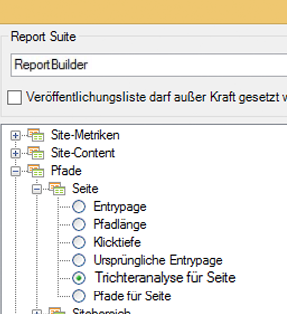
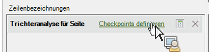

# Fallout-Bericht mit dem Anforderungs-Assistenten filtern

Beschreibt die Schritte, die beim Anwenden von Filtern bei Fallout-Berichten durchgeführt werden müssen.

Dieses Beispiel zeigt einen Fallout-Bericht für Seiten.

1. Klicken Sie in Adobe Report Builder auf **[!UICONTROL Erstellen]**, um den Anforderungs-Assistenten zu öffnen.
1. Wählen Sie die richtige Report Suite aus.
1. Wählen Sie links in der Baumansicht **[!UICONTROL Pfade]** > **[!UICONTROL Seite]** > **[!UICONTROL Trichteranalyse für Seite]** aus.

   

1. Konfigurieren Sie die entsprechenden [Datumsbereiche](/help/analyze/report-builder/data-requests/configuring-report-dates/custom-calendar.md).
1. Klicken Sie auf **[!UICONTROL Weiter]**.
1. Klicken Sie in Schritt 2 des Assistenten unter **[!UICONTROL Zeilenbezeichnungen]** auf den Link **[!UICONTROL Checkpoints definieren]**. (Im Gegensatz zu Pfadberichten, bei denen ein Muster bereits angewendet wird, müssen Sie bei einem Fallout-Bericht stets Pfadelemente definieren.)

   

1. Wählen Sie die **[!UICONTROL Filter]**-Option.

1. Definieren Sie im Dialogfeld **[!UICONTROL Trichteranalysen-Checkpoints für Sitebereich definieren]** Checkpoints aus einem Zellenbereich oder einer Liste. Klicken Sie anschließend auf **[!UICONTROL OK]**.
1. Entscheiden Sie, ob Sie aus einem Zellenbereich oder einer Liste auswählen möchten.
1. Wenn Sie aus einer Liste auswählen, klicken Sie auf **[!UICONTROL Hinzufügen]**, um Checkpoints auszuwählen und Sie dem Trichteranalysenpfad hinzuzufügen. Sie können zwischen 3 und 8 Checkpoints definieren. (Suchen Sie nach verfügbaren Elementen, indem Sie auf **[!UICONTROL Weitere Informationen]** klicken.)

   Weitere Informationen zum Anpassen von Filtern finden Sie unter [Filterdimensionen](/help/analyze/report-builder/layout/c-filter-dimensions/filter-dimensions.md). 1. Verschieben Sie **[!UICONTROL Verfügbare Elemente]** von der linken Spalte in die rechte, indem Sie sie auswählen und auf den orangefarbenen Pfeil klicken.
1. Klicken Sie dreimal auf **[!UICONTROL OK]** und anschließend auf **[!UICONTROL Fertigstellen]**.

   Der Bericht sollte jetzt aktualisiert werden.
