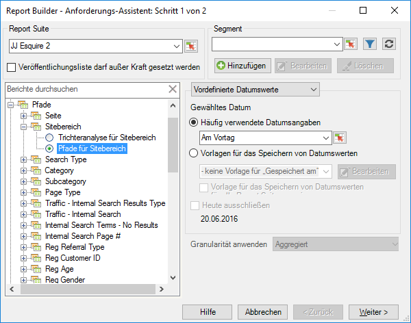
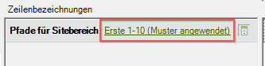
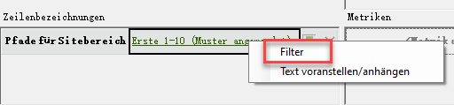
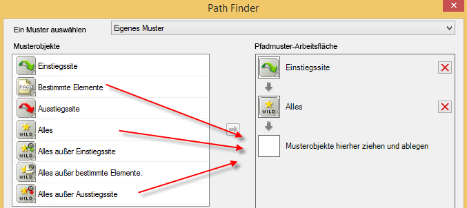
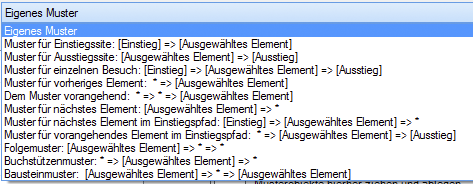
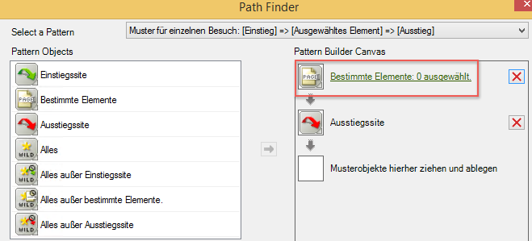
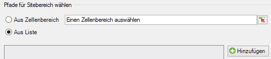
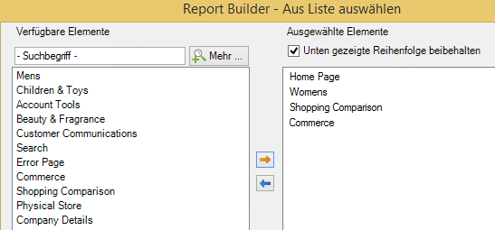

# Pfadbericht mit dem Anforderungs-Assistenten filtern

Beschreibt die Schritte, die beim Anwenden von Filtern bei Pfadsetzungsberichten durchgeführt werden müssen.

In diesem Beispiel werden Pfade für Sitebereiche verwendet.

1. Klicken Sie in Adobe Report Builder auf **[!UICONTROL Erstellen]**, um den Anforderungs-Assistenten zu öffnen.
1. Wählen Sie die richtige Report Suite aus.
1. Wählen Sie in der Baumansicht auf der linken Seite **[!UICONTROL Pfade]** > **[!UICONTROL Sitebereich]** > **[!UICONTROL Pfade für Sitebereich]** aus.

   

1. Legen Sie die entsprechenden Werte für das Datum fest.
1. Klicken Sie auf **[!UICONTROL Weiter]**.
1. Klicken Sie in Schritt 2 des Assistenten unter **[!UICONTROL Zeilenbezeichnungen]** auf den Link **[!UICONTROL Erste 1-10 (Muster angewendet)]**. In einem Pfadbericht wird ein Muster standardmäßig angewendet.

   

1. Wählen Sie die **[!UICONTROL Filter]**-Option.

   

1. Im Dialogfeld **[!UICONTROL Pfadmuster für „Pfade für Sitebereiche“ definieren]**, können Sie Folgendes festlegen:
   1. den Startrang des ersten Berichts
   1. die Anzahl der Einträge, die in diesem Bericht angezeigt werden sollen
1. Klicken Sie auf **[!UICONTROL Bearbeiten]**, um ein Pfadmuster zu definieren.
1. Für ein benutzerdefiniertes Muster verschieben Sie beliebige **[!UICONTROL Musterobjekte]** per Drag-and-drop aus der Liste auf der linken Seite in die **[!UICONTROL Pfadmuster-Arbeitsfläche]** auf der rechten Seite.

   

1. Sie können auch aus der Dropdown-Liste **[!UICONTROL Ein Muster auswählen]** ein vordefiniertes Muster auswählen und es anpassen. Folgende Muster stehen zur Verfügung:

   

   Einige dieser Muster sind Report Builder-spezifisch: Einstiegspfadmuster für nächstes Element, Einstiegspfadmuster für vorheriges Element, Muster für nächstes Element.
1. So bearbeiten Sie ein vordefiniertes Muster:
   1. Wählen Sie es aus. Wählen Sie zum Beispiel das **[!UICONTROL Muster für Ausstiegssite]** aus: 

   1. Nun definieren Sie den Sitebereichspfad, dem der Benutzer vor dem Ausstieg folgt. Klicken Sie auf **[!UICONTROL Bestimmte Elemente: 0 ausgewählt]**. Sie können diesen Pfad durch Auswahl aus einem Zellenbereich (wenn Sie eine vorhandene Anforderung bearbeiten) oder durch Auswahl aus einer Bereichsliste definieren.
   1. Um aus einem Zellenbereich einer vorherigen Anforderung auszuwählen, wählen Sie **[!UICONTROL Aus Zellenbereich]** und klicken Sie auf das Symbol für die Zellenauswahl. Wählen Sie dann aus dem Bericht die Zellen aus. 

   1. Um aus einer Liste mit Sitebereichen auszuwählen, wählen Sie **[!UICONTROL Aus Liste]** aus und klicken Sie auf **[!UICONTROL Hinzufügen]**.
   1. Verschieben Sie Elemente aus der Spalte **[!UICONTROL Verfügbare Elemente]** in die Spalte **[!UICONTROL Ausgewählte Elemente]**, indem Sie sie auswählen und auf den orangefarbenen Pfeil klicken. Klicken Sie anschließend auf **[!UICONTROL OK]**. 

   1. Um das eben erstellte Muster zu speichern, klicken Sie auf **[!UICONTROL Speichern]**.
   1. Klicken Sie dreimal auf **[!UICONTROL OK]** und anschließend auf **[!UICONTROL Fertigstellen]**. Die gefilterte Pfadanforderung wird nun generiert.
