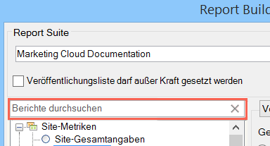

# Übersicht über Berichtstypen

Sie können auch den Basisberichtstyp für Ihre Datenanforderung auswählen, z. B. Site-Metriken, Site-Content und Video.

Sie können für einen Bereich von Arbeitsblattzellen nur jeweils einen Basisberichtstyp wählen. Wenn Sie eine bereits erstellte Anforderung bearbeiten, können Sie den Berichtstyp im Dialogfeld [!UICONTROL Anforderungs-Assistent: Schritt 1] ändern, ohne die anderen Einstellungen der Anforderung neu konfigurieren zu müssen.

Sie können über die Suchleiste „Automatisch auffüllen“ nach Berichten suchen. Sobald Sie über diese Steuerung einen Bericht ausgewählt haben, wählt die Baumansicht automatisch den passenden Knoten aus.

