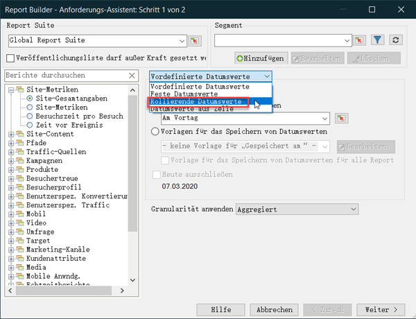
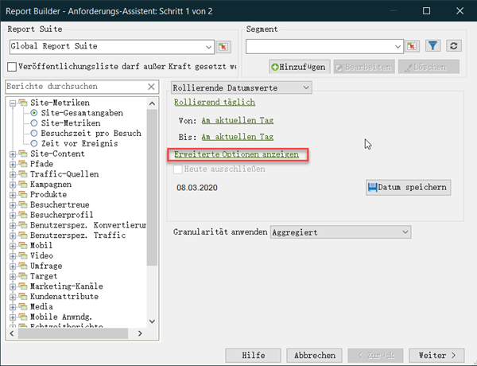
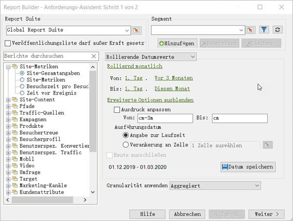
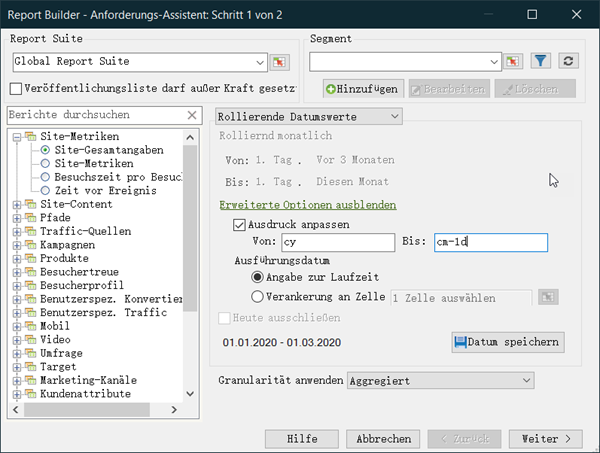

# Benutzerdefinierte Datumsausdrücke – Übersicht

Sie können einen komplexen Datumsbereich festlegen, indem Sie einen benutzerdefinierten Ausdruck verwenden.

Es wird empfohlen, beim Erstellen von Ausdrücken auf einen Kalender zu verweisen, um die Anzahl der Wochen und Tage korrekt anzugeben. Excel bietet verschiedene integrierte Funktionen für die Berechnung von Tagen, Werktagen, Monaten und Jahren, die zwischen zwei Datumswerten liegen. Sie können diese Funktionen in Formeln verwenden, um andere Intervalle zu berechnen, etwa Wochen oder Quartale.

**So aktivieren Sie benutzerdefinierte Ausdrücke**

Dies ist ein Beispiel für die Verwendung **[!UICONTROL Rolling Dates]**.

1. Wählen Sie im [!UICONTROL Request Wizard: Step 1]Menü statt **[!UICONTROL Preset Dates]** die Option **[!UICONTROL Rolling Dates]**.

   

1. Wechseln Sie zu Rollierend wöchentlich, monatlich, vierteljährlich oder jährlich. Beachten Sie, wie sich die Optionen unten ändern.
1. Klicken Sie für weitere Anpassungsoptionen auf **[!UICONTROL Show Advanced Options]**.

   

1. Wenn Sie beispielsweise die oben genannten Daten in &quot;Monatlich rollierend&quot;ändern, vom ersten Tag vor drei Monaten bis zum ersten Tag dieses Monats, werden die Daten in den erweiterten Optionen aktualisiert, um Folgendes widerzuspiegeln:

   

1. Aktivieren **[!UICONTROL Customize Expression]**. Durch Auswahl der Optionen unter **[!UICONTROL Rolling Dates]** können Sie die Syntax für benutzerdefinierte Ausdruck leicht erkennen.

   

   Sie können erweiterte Optionen verwenden, um benutzerdefinierte Ausdruck zu kombinieren und zuzuordnen. Wenn Sie z. B. Daten vom ersten Jahr bis zum Ende des letzten vollen Monats anzeigen möchten, können Sie Folgendes eingeben: `From: cy``To: cm-1d`. Im Assistenten werden diese Daten als 1/1/2020-1/31/2020 angezeigt.
