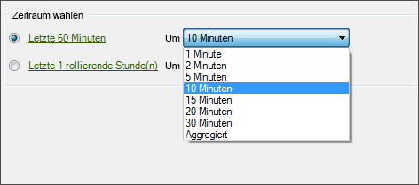

# Konfigurieren einer Echtzeitanforderung

Schritte zum Konfigurieren von Datumsangaben für Echtzeitanforderungen.

1. Stellen Sie sicher, dass in den [Admin Tools](https://docs.adobe.com/content/help/de-DE/analytics/admin/admin-tools/real-time-reports/t-realtime-admin.html) in Marketing Reports &amp; Analysen Echtzeitberichte aktiviert sind.
1. Klicken Sie im [!UICONTROL Anforderungs-Assistenten, Schritt 1] auf **[!UICONTROL Echtzeitbericht]** > **[!UICONTROL `<report type>`]**

   Wählen Sie beispielsweise einen Traffic-Bericht. Wenn Sie einen Echtzeitberichtstyp auswählen, werden die Optionen für die [!UICONTROL Auswahl des Zeitraums] angezeigt.

1. Wählen Sie einen Zeitraum in Minuten oder Stunden.

   

   Echtzeitberichte sind nur für die letzten 20 Stunden verfügbar. Für die Granularität sind Optionen von 1 Minute bis 30 Minuten verfügbar.
1. Klicken Sie auf **[!UICONTROL Weiter]** und [konfigurieren Sie das Anforderungslayout](/help/analyze/report-builder/layout/layout.md) weiter.
