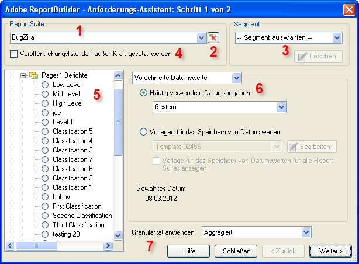

# Datenanforderungen – Anforderungs-Assistent: Schritt 1

Im Dialogfeld „Anforderungs-Assistent: Schritt 1“ wählen Sie die Report Suite, den Berichtstyp sowie die Segmente aus und konfigurieren Datumswerte.

1. **[!UICONTROL Report Suite:]** Die Liste der für Sie aufgrund Ihrer Anmeldedaten verfügbaren Report Suites. Siehe [Report Suites auswählen](/help/analyze/report-builder/data-requests/selecting-report-suites/t-select-report-suites.md).

1. **Bereichsauswahl:** Hier können Sie eine Report Suite-ID aus einer Zelle in Excel auswählen. Siehe [Report Suites auswählen](/help/analyze/report-builder/data-requests/selecting-report-suites/t-select-report-suites.md).

1. **Segment**: Segmente sind benutzerspezifische Teildatensätze oder Daten, die durch eigens erstellte Regeln gefiltert wurden. Segmente basieren auf Treffern, Besuchen und Besuchern. Weitere Informationen zu Segmenten finden Sie im [Analytics-Segmentierungsleitfaden](https://docs.adobe.com/content/help/de-DE/analytics/components/segmentation/seg-home.html).

   Beispiel: Sie führen einen [!UICONTROL Seitenbericht] aus und wenden dann ein Segment „Erstbesuche“ an.

1. **Veröffentlichungsliste darf außer Kraft gesetzt werden:** Wenn Sie einen Bericht planen, können Sie eine Veröffentlichungsliste auswählen, die für die Verteilung verwendet werden soll. Veröffentlichungslisten werden unter **[!UICONTROL Analytics]** > **[!UICONTROL Admin Tools]** eingerichtet. Die Report Suite für diese Anforderung wird durch die Report Suite mit der ID ersetzt, die den einzelnen Empfängern in der Veröffentlichungsliste zugeordnet ist. Siehe  [Veröffentlichungsliste darf außer Kraft gesetzt werden](/help/analyze/report-builder/data-requests/allow-publishing-list-overrides.md).

1. **Berichtstyp**: Hier wird der Basisbericht festgelegt, der in der Datenanforderung ausgeführt werden soll. Es wird ein Bericht pro Anforderung ausgeführt, und dieser Bericht kann 1:n Dimensionen und 1:n Metriken enthalten. Metriken und Dimensionen für einen Berichtstyp werden im Dialogfeld [!UICONTROL Anforderungs-Assistent: Schritt 2] angezeigt. Siehe [Berichtstypen auswählen](/help/analyze/report-builder/data-requests/c-report-types/select-report-types.md).

1. **Datumsbereiche**: Hier wird die von der Anforderung abgedeckte Zeitspanne festgelegt. Es sind verschiedene Arten von Zeiträumen verfügbar, z. B. vordefinierte, feste und rollierende. Es sind maximal 366 Zeiträume erlaubt. Sie können außerdem einen Datumsbereich wählen, der durch eine Zelle festgelegt wird, und Datumsbereiche als Vorlagen zur späteren Verwendung speichern.  Siehe [Berichtsdaten konfigurieren](/help/analyze/report-builder/data-requests/configuring-report-dates/custom-calendar.md).

1. **Granularität anwenden**: Hier wird der Detailgrad für die zeitliche Auflösung des Berichts angegeben. Siehe [Granularität](/help/analyze/report-builder/data-requests/configuring-report-dates/granularity.md).

## Fehlerbehebung

Manchmal wird der Anforderungs-Assistent außerhalb des Bildschirms angezeigt, insbesondere für Benutzer, die zwischen den Monitorinstallationen wechseln. Sie verwenden beispielsweise eine Dockingstation am Arbeitsplatz und Ihren Laptop-Bildschirm zu Hause. Wenn Sie erneut auf „Erstellen“ klicken, während ein Anforderungs-Assistent bereits geöffnet ist, erhalten Sie folgende Fehlermeldung:

„Sie müssen zunächst den Vorgang für den Anforderungs-Assistenten abschließen, bevor Sie einen neuen Anforderungs-Assistenten starten.“

Dieses Problem wird behoben, wenn Sie den Anforderungs-Assistenten wieder zurück auf den Bildschirm bewegen.

1. Öffnen Sie Microsoft Excel und melden Sie sich bei Report Builder an.
2. Klicken Sie auf [!UICONTROL Erstellen], um den Anforderungs-Assistenten außerhalb des Bildschirms zu öffnen.
3. Drücken Sie `[Alt]` + `[Space]`.
4. Drücken Sie `[M]`.
5. Drücken Sie eine der Pfeiltasten.
6. Bewegen Sie die Maus, um den Anforderungsassistenten an Ihren Cursor anzuhängen.
7. Klicken Sie auf die Maus, um den Anforderungs-Assistenten innerhalb des Bildschirms abzulegen.
