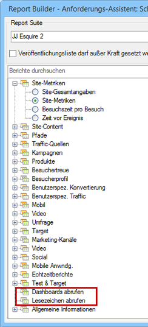

# Mit Lesezeichen markierte Berichte und Dashboard-Kurzberichte importieren

Alle mit Lesezeichen markierten Berichte und Dashboard-Berichte werden ab sofort in Schritt 1 des Anforderungs-Assistenten als Dimensionen gelistet und können als Report Builder-Anforderungen importiert werden.

Wenn Sie einen mit Lesezeichen markierten Bericht auswählen, belegt der Anforderungs-Assistent alle Dimensionen und Metriken, die diesen mit Lesezeichen markierten Bericht definieren. Der Datumsbereich, die Granularität und das ausgewählte Segment werden ebenfalls auf Basis des ausgewählten Lesezeichens aktualisiert.

So werden in Schritt 1 des Anforderungs-Assistenten ein Dashboard und die zugehörigen Kurzberichte angezeigt:

Wenn Sie auf **[!UICONTROL Ihre Dashboards abrufen]** oder auf **[!UICONTROL Ihre Lesezeichen abrufen]** klicken, werden Ihre vorhandenen Dashboard- und/oder Lesezeichendaten abgerufen und in das Arbeitsblatt eingefügt.

>[!NOTE]
>
>In Report Builder ist die Liste der verfügbaren Dashboards und Lesezeichen auf den Benutzer und die Dashboards beschränkt, die für die Report Suite gelten, die Sie in Schritt 1 des Assistenten ausgewählt haben. In Marketing Reports &amp; Analysen hingegen haben Sie Zugriff auf alle Lesezeichen und Dashboards, auf die Sie zugreifen können, unabhängig davon, welche Report Suites diese Dashboards und Lesezeichen verwenden.

>[!NOTE]
>
>Es werden ausschließlich Daten importiert. Wenn das Lesezeichen ein Diagramm enthält oder der Dashboard-Kurzbericht nur aus einem Diagramm besteht, werden nur die Daten importiert, auf denen das Diagramm basiert.

Sobald Sie eine Anforderung durch Importieren eines Dashboard-Kurzberichts (bzw. eines Lesezeichens) erstellt haben, wird die Anforderung mit der primären Dimension des Kurzberichts (bzw. des Lesezeichens) verknüpft. Das führt dazu, dass in der Baumansicht nicht mehr der Knoten des Dashboard-Kurzberichts (bzw. des Lesezeichens) ausgewählt wird, wenn Sie eine Anforderung bearbeiten, sondern die primäre Dimension.

Mithilfe des importierten Bookmarklet werden die Report Suite, das ausgewählte Segment, die Dimension und die ausgewählten Metriken korrekt festgelegt, und zwar entsprechend derselben Parameter, die für das Lesezeichen zu Reports &amp; Analytics gelten.

>[!IMPORTANT]
>
>Für den Datumsbereich wird derselbe Datumsbereich festgelegt, jedoch als statischer Datumsbereich – auch wenn es sich bei diesem Datumsbereich im Lesezeichen zu Reports &amp; Analytics um einen rollierenden Datumsbereich handelt.

