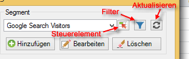
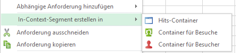
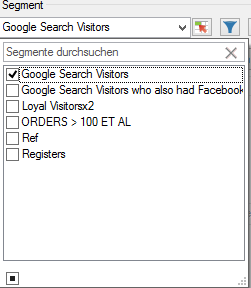
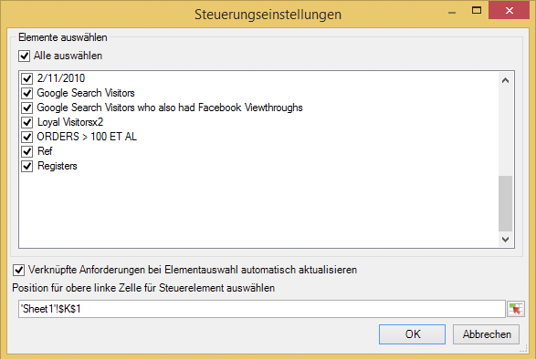
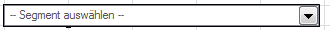
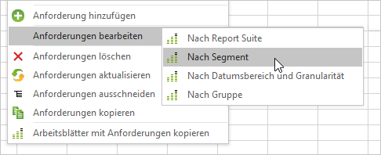

# Segmente verwalten

So können Sie in Report Builder Adobe Analytics-Segmente hinzufügen, bearbeiten, anwenden und filtern.

Im Schritt 1 des Anforderungs-Assistenten von Report Builder gibt es ein Segmentierungsfenster, mit dem Sie folgende Aufgaben ausführen können:  Segmente erstellen und verwalten.

## Segmente hinzufügen oder bearbeiten {#section_B2BC136F9A53498D90C7C2ECC5DB892B}

>[!NOTE]
>
>Um Segmente hinzuzufügen oder zu bearbeiten, wird über die Report Builder-Schnittstelle für Segmente in einem Microsoft Internet Explorer-Fenster der Analytics-Segment-Builder gestartet. Ihre Report Builder-Sitzung bleibt dabei aktiv. Andere Browser (außer Internet Explorer) werden für diesen Vorgang nicht unterstützt.

1. Klicken Sie im Segmentfenster von Schritt 1 des Anforderungs-Assistenten auf **[!UICONTROL Hinzufügen]**.
1. Ein Internet Explorer-Fenster mit der Benutzeroberfläche des Analytics-Segment-Builder wird geöffnet. Informationen zum Erstellen von Segmenten finden Sie unter [Analytics-Segmentierung](https://docs.adobe.com/content/help/de-DE/analytics/components/segmentation/seg-home.html).
1. Nachdem Sie das Segment definiert und gespeichert haben, gehen Sie zurück zum Anforderungs-Assistenten.
1. Klicken Sie auf das Aktualisierungssymbol, um die Segmentliste zu aktualisieren.

>[!IMPORTANT]
>
>Diese Liste wird zwischengespeichert und das neu erstellte Segment wird erst nach einer Aktualisierung angezeigt.

## In-Context-Segmente erstellen {#section_6DD2C663B2854469AA1075438F907678}

Möglicherweise verfügen Sie über bestimmte Kombinationen an Berichtsdimensionen, die Sie in ein Segment umwandeln möchten. Solche Segmente können Sie über die Report Builder-Schnittstelle erstellen. Wählen Sie zum Beispiel einige Seiten aus einer Seitenanforderungsausgabe aus und erstellen Sie auf Basis dieser Werte ein Segment.

1. Wählen Sie die Berichtausgabeelemente aus, die in ein Segment umgewandelt werden sollen.
1. Klicken Sie mit der rechten Maustaste, um **[!UICONTROL In-Context-Segment erstellen in]** auszuwählen und legen Sie den rechten Container fest (Container für Seitenaufrufe, Container für Besuche, Container für Besucher).

   

   Weitere Informationen zu Containern finden Sie unter [Segmentierungsleitfaden](https://docs.adobe.com/content/help/en/analytics/components/segmentation/seg-home.html).

1. Die Segment-Builder-UI wird nun im Internet Explorer gestartet. Die Segment-Builder-UI wird mit dem von Ihnen festgelegten Container und Filter initialisiert.
1. Nachdem Sie dem Segment einen Namen und eine Beschreibung hinzugefügt haben, speichern Sie es.
1. Gehen Sie zurück zum Report Builder und klicken Sie auf das Aktualisierungssymbol, um die Segmentliste zu aktualisieren.
1. Nun können Sie dieses Segment anwenden.

## Segmente suchen und anwenden   {#section_CACA269B48E94CFD91C2D5A15E9C77B7}

Alle Segmente, die in Reports &amp; Analytics, Report Builder oder Data Warehouse erstellt wurden, werden in dieser Segmentliste angezeigt. Klicken Sie zum Aktualisieren der Liste auf das Aktualisierungssymbol .

Sie können bei allen Anforderungen eines oder mehrere Segmente anwenden. Dies beinhaltet auch sequentielle Segmente.

1. Wechseln Sie in der Dropdown-Liste zu **[!UICONTROL Segment]** und klicken Sie im Feld **[!UICONTROL Segment auswählen]** auf den kleinen Pfeil nach unten, um alle Segmente anzuzeigen.

   

1. Aktivieren Sie die Segmente, die Sie anwenden möchten.

>[!NOTE]
>
>Unabhängig davon, ob Sie ein Benutzer mit oder ohne Administratorrechten sind, können Sie in Report Builder nur die Segmente anzeigen, die Ihnen gehören und die für Sie freigegeben wurden. (Auf der Benutzeroberfläche von Marketing Reports &amp; Analytics können Administratoren alle Segmente der Organisation anzeigen.)

## Segmente filtern {#section_376E986D3E684999A7CDB08E53854159}

**Filtern** Sie Segmente, indem Sie auf das Filtersymbol klicken: .

Folgende Filter stehen zur Verfügung:

| Filtername | Beschreibung |
|---|---|
| Tags | Filtert Segmente nach bestimmten  Tags. Beachten Sie, dass Tagfilter mit dem Operator AND arbeiten. Wenn Sie zwei Tags aktivieren, werden im rechten Fenster Segmente angezeigt, die mit **beiden** Tags versehen wurden. |
| Inhaber | Filtert Segmente nach Inhaber. Beachten Sie, dass Inhaberfilter mit dem Operator OR arbeiten. Wenn Sie zwei Inhaber aktivieren, werden im rechten Fenster Segmente angezeigt, die **beiden** Inhabern gehören. |
| Weitere Filter > Nur *Name der Report Suite* | Wenn Sie im Segment Builder in [!DNL marketing reports & analytics] den Filter „Nur *Name der Report Suite*“ anwenden und dann in [!DNL report builder] den erweiterten Filter anzeigen, zeigt der erweiterte Filter nur das Segment für die ausgewählte Report Suite an. |
| Weitere Filter > Meine | Zeigt alle Segmente an, deren Inhaber Sie sind. |
| Weitere Filter > Für mich freigegeben | Zeigt alle Segmente an, die andere für Sie  freigegeben haben. |
| Weitere Filter > Favoriten | Zeigt alle Segmente an, die Sie als  Favoriten gekennzeichnet haben. |
| Weitere Filter > Genehmigt | Zeigt alle offiziell  genehmigten Segmente an. |

## Segmentsteuerelement zu einer Arbeitsmappe hinzufügen {#section_E3E5149A8464441FA5445A98DBD520AC}

Wenn Sie ein Segmentsteuerelement hinzufügen, können Sie innerhalb einer Arbeitsmappe zwischen Segmenten wechseln, anstatt hierfür zum Anforderungs-Assistenten wechseln zu müssen.

1. Klicken Sie neben dem Dropdown-Menü für Segmente auf das Steuerelementsymbol ().

   

1. Aktivieren Sie alle Segmente, die im Segmentsteuerelement angezeigt werden sollen oder aktivieren Sie **[!UICONTROL Alle auswählen]**.
1. Beachten Sie die Option **[!UICONTROL Verknüpfte Anforderungen bei Elementauswahl automatisch aktualisieren]**.

   * Wenn diese aktiviert ist, werden alle Anforderungen aktualisiert, die dieses Steuerelement verwenden.
   * Wenn sie nicht aktiviert ist, werden zwar die verknüpften Anforderungsparameter aktualisiert, jedoch nicht die Anforderungen selbst.

1. Legen Sie die Position für die obere linke Zelle des Steuerelements fest.
1. Klicken Sie auf **[!UICONTROL OK]**. Das Segmentsteuerelement wird an der angegebenen Position angezeigt.

   

## Segmentliste aktualisieren   {#section_22E4A86789444B4A998532396B476EFB}

Jedes Mal, wenn Sie ein neues Segment hinzufügen oder ein vorhandenes bearbeiten, sollten Sie auf das Aktualisierungssymbol () klicken, um die zwischengespeicherte Segmentliste zu aktualisieren.

## Anforderungsübergreifende Verwaltung von Segmenten {#section_C3D63FCBE1A94369A319243313B03C93}

Vor der Version v5.4 konnten Benutzer in Report Builder Segmente in mehreren Anforderungen ändern. Bei diesem Vorgang wurden jeweils die bestehenden Segmente ersetzt. Benutzer, die ein neues Segment zu einer einzelnen Anforderung hinzufügen wollten, konnten dies nicht tun, da durch Hinzufügen des Segments vorherige Segmente entfernt wurden, die der jeweiligen Anforderung bereits zugeordnet waren.

In Report Builder 5.4 ist das Hinzufügen, Entfernen und Ersetzen einzelner oder aller Segmente innerhalb mehrerer Anforderungen zulässig:

1. Wählen Sie mehrere Anforderungen in einer Arbeitsmappe aus.
1. Klicken Sie mit der rechten Maustaste und wählen Sie **[!UICONTROL Anforderungen bearbeiten]** > **[!UICONTROL Nach Segment]** aus.

   

1. Wählen Sie im Dialog „Gruppe bearbeiten“ eine der folgenden vier Optionen aus:

   | Option | Beschreibung |
   |---|---|
   | Fügen Sie  Segment | Sie können eines oder mehrere Segmente auswählen und der Liste der aktuellen Segmente hinzufügen. |
   | Segment(e) ersetzen | Sie können auswählen, welche(s) Segment(e) Sie durch ein Segment bzw. mehrere Segmente ersetzen möchten. |
   | Alle Segmente ersetzen nach | Sie können eines oder mehrere Segmente auswählen und damit vorhandene Segmente ersetzen. |
   | Segment(e) entfernen | Sie können Segmente aus Anforderungen entfernen. |

