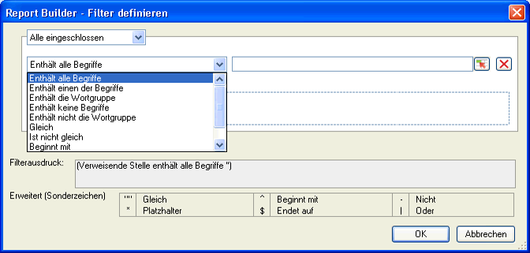

# Übersicht über Filterdimensionen

Sie können Dimensionen filtern, die Sie dem Raster „Zeilenbezeichnungen“ hinzugefügt haben. Filter engen die von Anforderungen zurückgegebenen Daten ein und können sowohl auf Pivot- als auch auf benutzerdefinierte Layouts angewendet werden. Wenn Sie die Filterung von Dimensionen im Pivot-Layout konfigurieren, können Sie zusätzlich die Anzahl der Einträge von einer Zelle angeben.

Das Formular „Ausgewählter Filter“ wird auf der Grundlage des Elements und der Metrik vorbelegt, die in der Report Builder-Anfrage ausgewählt sind.

## Filter definieren – Werte und Sonderzeichen {#section_15840216A4044C40974945FAA435AD93}

Informationen über Filter im Bereich **[!UICONTROL Am meisten bevorzugte Filter]** > **[!UICONTROL Filter definieren]**.

Die folgenden Tabellen enthalten Beispiele und Informationen über Filter:

<table id="table_8AC3A26FF02143DBA949B30F2A46CF11"> 
 <thead> 
  <tr> 
   <th colname="col1" class="entry"> Filter </th> 
   <th colname="col02" class="entry"> Beschreibung </th> 
   <th colname="col2" class="entry"> Beispielfilter </th> 
   <th colname="col3" class="entry"> Übereinstimmungsergebnisse </th> 
  </tr> 
 </thead>
 <tbody> 
  <tr> 
   <td colname="col1"> 
Enthält alle Begriffe 
 </td> 
   <td colname="col02"> 
Enthält jeden durch Leerzeichen getrennten Wert in jeder beliebigen Reihenfolge. 
 </td> 
   <td colname="col2"> 
a b c 
 </td> 
   <td colname="col3"> 
Stimmt überein mit  a b c und  b a c usw. 
 </td> 
  </tr> 
  <tr> 
   <td colname="col1"> 
Enthält einen der Begriffe 
 </td> 
   <td colname="col02"> 
Enthält mindestens einen der Filter (durch Leerzeichen getrennt). 
 </td> 
   <td colname="col2"> 
A B C 
 </td> 
   <td colname="col3"> 
Stimmt überein mit  A1,  B2,  C3, aber nicht mit D4. 
 </td> 
  </tr> 
  <tr> 
   <td colname="col1"> 
Enthält die Wortgruppe 
 </td> 
   <td colname="col02"> 
Enthält den Suchfilter und mögliche andere Begriffe. 
 </td> 
   <td colname="col2"> 
abc 
 </td> 
   <td colname="col3"> 
Stimmt überein mit  abc und  abc def. 
 </td> 
  </tr> 
  <tr> 
   <td colname="col1"> 
Enthält keine Begriffe 
 </td> 
   <td colname="col02"> 
Gibt alles zurück, sofern es keinen von Ihnen eingegebenen Wert enthält. 
 </td> 
   <td colname="col2"> 
a b c 
 </td> 
   <td colname="col3"> 
Stimmt überein mit  d e f, aber nicht mit c d e f. 
 </td> 
  </tr> 
  <tr> 
   <td colname="col1"> 
Enthält nicht die Wortgruppe 
 </td> 
   <td colname="col02"> 
Gibt alles zurück, das nicht Ihre Wortgruppe enthält. 
 </td> 
   <td colname="col2"> 
abc 
 </td> 
   <td colname="col3"> 
Ausgeschlossen sind  abc,  abc def und stimmt überein mit  def 
 </td> 
  </tr> 
  <tr> 
   <td colname="col1"> 
Gleich 
 </td> 
   <td colname="col02"> 
Gibt einen exakten Treffer zurück. 
 </td> 
   <td colname="col2"> 
abc 
 </td> 
   <td colname="col3"> 
  abc wird zurückgegeben, nichts anderes. 
 </td> 
  </tr> 
  <tr> 
   <td colname="col1"> 
Ist nicht gleich 
 </td> 
   <td colname="col02"> 
Gibt alles zurück, das nicht genau Ihrem Eintrag entspricht. 
 </td> 
   <td colname="col2"> 
a 
 </td> 
   <td colname="col3"> 
Stimmt nicht überein mit  a. 
 
Stimmt überein mit a b c. 
 
Stimmt überein mit abc. 
 </td> 
  </tr> 
  <tr> 
   <td colname="col1"> 
Beginnt mit 
 </td> 
   <td colname="col02"> 
Gibt Ergebnisse zurück, die mit einem bestimmten Wert beginnen. 
 </td> 
   <td colname="col2"> 
abc 
 </td> 
   <td colname="col3"> 
Stimmt überein mit  abcd, aber nicht mit  1abc 
 </td> 
  </tr> 
  <tr> 
   <td colname="col1"> 
Endet mit 
 </td> 
   <td colname="col02"> 
Gibt Ergebnisse zurück, die mit einem bestimmten Wert enden. 
 </td> 
   <td colname="col2"> 
xyz 
 </td> 
   <td colname="col3"> 
Sucht nach  wxyz aber nicht  wxyz0 
 </td> 
  </tr> 
  <tr> 
   <td colname="col1"> 
Erweitert (Sonderzeichen) 
 </td> 
   <td colname="col02"> 
Ermöglicht die Suche nach Zeichen in regulären Ausdrücken: 
 
 <code> "", ^, -, *, $, | </code> 
 </td> 
   <td colname="col2"> 
"^Home*Page$" | Sport 
 </td> 
   <td colname="col3"> 
 Dadurch wird ein Filter definiert, der mit  Home beginnt, anschließend nach null oder mehr Zeichen sucht, und dann mit Page endet. 
 
Auch jede Seite mit Sport darin wird erfasst. 
 
Beispiele für Treffer sind: 
 
    <ul id="ul_72D76C5AFEAF405E8A0E4E3C604D10AE"> 
     <li id="li_4D490059B667450DA8A0103167C7B391">HomePage </li> 
     <li id="li_1351619156274092AEB2771D882AD357">Home und (andere Zeichen) Page </li> 
     <li id="li_940EAA99A8CF49308E8471065EB317B1">Home Sport </li> 
     <li id="li_50A895F14A454BE9BF06EE0F07F99B3B">Sport Page </li> 
     <li id="li_F3CE0D07941D4C2485D2DE0B73E00677">Sport </li> 
     <li id="li_E84C15C061824A5D922D9900392F2996">xyz Sport abc </li> 
    </ul> </td> 
  </tr> 
 </tbody> 
</table>

<table id="table_8BBB06C8860745DEA41B39673699DC0F"> 
 <thead> 
  <tr> 
   <th colname="col1" class="entry"> Sonderzeichen </th> 
   <th colname="col2" class="entry"> Zweck </th> 
   <th colname="col3" class="entry"> Hinweise </th> 
  </tr> 
 </thead>
 <tbody> 
  <tr> 
   <td colname="col1"> " " </td> 
   <td colname="col2"> Gleich </td> 
   <td colname="col3"> 
Nicht mit einem Escapezeichen versehen, sofern es nicht mit einem anderen Anführungszeichen verwendet wird. Beispiel: 17"-Display ist keine Wortgruppe. 
 </td> 
  </tr> 
  <tr> 
   <td colname="col1"> * </td> 
   <td colname="col2"> Platzhalterzeichen </td> 
   <td colname="col3"> 
Entspricht dem Sternchen in einem regulären Ausdruck. 
 </td> 
  </tr> 
  <tr> 
   <td colname="col1"> ^ </td> 
   <td colname="col2"> Beginnt mit </td> 
   <td colname="col3"> </td> 
  </tr> 
  <tr> 
   <td colname="col1"> $ </td> 
   <td colname="col2"> Endet mit </td> 
   <td colname="col3"> </td> 
  </tr> 
  <tr> 
   <td colname="col1"> – </td> 
   <td colname="col2"> Nicht </td> 
   <td colname="col3"> </td> 
  </tr> 
  <tr> 
   <td colname="col1"> | </td> 
   <td colname="col2"> Oder </td> 
   <td colname="col3"> 
Nur unterstützt im  Erweiterter Filter (Sonderzeichen). 
 </td> 
  </tr> 
 </tbody> 
</table>
