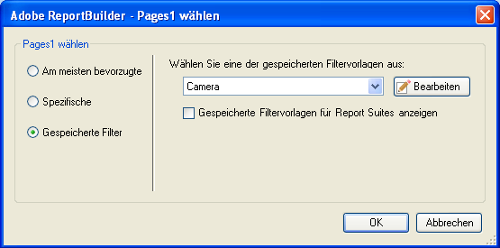

# Gespeicherte Filter

Sie können in ReportBuilder Filter oder andere Parameter speichern, um sie später in anderen Arbeitsblättern oder -mappen wiederzuverwenden. Diese Parameter werden in Analytics gespeichert, um sicherzustellen, dass sie für andere Benutzer ReportBuilder auf anderen Computern verfügbar sind.

Filter werden während der Erstellung im Dialogfeld [!UICONTROL Seiten auswählen] gespeichert. Ein Beispiel für diesen Vorgang finden Sie unter [Spezifische Filter](/help/analyze/report-builder/layout/c-filter-dimensions/t-specific-filters.md).

