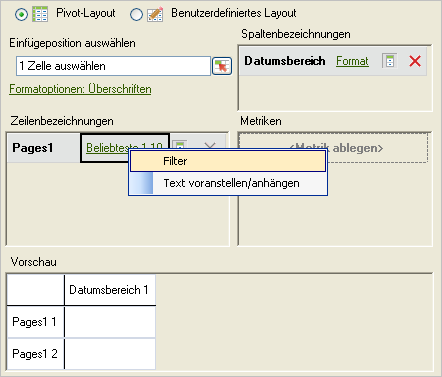
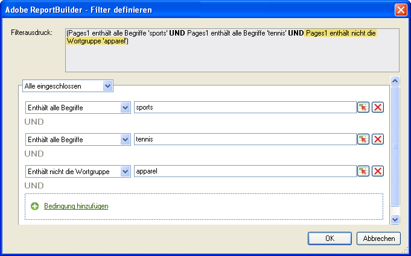
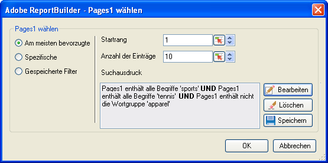

# Bevorzugte Filter

Rangordnung und bedingte Filter, die Sie mit UND/ODER-Suchausdrücken entsprechend Boolscher Logik konfigurieren.

Am meisten bevorzugte Filter sind Ausdrucksfilter, die Sie mit den UND/ODER-Bedingungen der Boolschen Logik konfigurieren, beispielsweise [!UICONTROL Seite enthält nicht ]*`<product name>`* mit Bedingungen oder Gruppen von Bedingungen wie [!UICONTROL Alle eingeschlossen], [!UICONTROL Beliebige eingeschlossen] oder [!UICONTROL Alle ausgeschlossen]. Sie können die Ausdrücke [speichern](/help/analyze/report-builder/layout/c-filter-dimensions/saved-filters.md), um sie in anderen Anforderungen in der aktuellen oder anderen Arbeitsmappen zu verwenden.

**So erstellen Sie am meisten bevorzugte Filter**

1. Erstellen oder bearbeiten Sie eine Anforderung und gehen Sie zum Dialogfeld [!UICONTROL Anforderungs-Assistent: Schritt 2].

   

1. Klicken Sie im Dialogfeld [!UICONTROL Anforderungs-Assistent: Schritt 2] im Raster auf den Link neben der Dimension und wählen Sie dann **[!UICONTROL Filter]**.
1. Aktivieren Sie im Dialogfeld [!UICONTROL Seiten auswählen] die Option **[!UICONTROL Am meisten bevorzugte]** und konfigurieren Sie dann die folgenden Optionen:

   **Startrang:** Der Startrang einer Dimension. Der Standardwert von 1 steht für das Element mit dem höchsten Wert in der Liste der berichteten Daten. Beispielsweise zeigt ein Startrang von 1 für die Dimension [!UICONTROL Seite] die Seite Ihre Website mit der absolut höchsten Besucherzahl an. Sie können beispielsweise 10 oder einen anderen Wert als Startrangzelle angeben, wodurch ein Bericht erstellt wird, der mit 10 als höchstem Wert beginnt. Metriken werden in absteigender Reihenfolge angeordnet, d. h. die Zeileneinträge mit der höchsten Aktivität werden als erste in der Liste aufgeführt. Wenn Sie mehr als 50.000 Seitennamen in einer Anforderung benötigen, aber einen Bericht über tausende von Seiten ausführen, können Sie die Anforderung kopieren und den Startrang so ändern, dass die Daten in Blöcken von 50.000 abgerufen werden.

   **Anzahl der Einträge:** (nur [!UICONTROL Pivot-Layout]) Legt fest, wie viele Elemente für eine bestimmte Metrik über einen Datumsbereich berichtet werden. Einige Metriken können hunderte von Einträge aufweisen, andere nur einige wenige. Beispielsweise zeigt eine Zahl von Einträgen von 25 für die Dimension [!UICONTROL Sitebereich] an, dass der Bericht die 25 am häufigsten besuchten Seiten aufführt.

   Mit Hilfe von Pfeilen können Sie den [!UICONTROL Startrang] und die [!UICONTROL Anzahl der Einträge] für den ersten Datenpunkt im Arbeitsblatt ändern. Standardmäßig ist der [!UICONTROL Startrang] auf 1 und die [!UICONTROL Anzahl der Einträge] auf 10 gesetzt. Diese Werte können von minimal 1 auf maximal 50.000 für bestimmte Metriken gesetzt werden. Jede Metrik hat einen eigenen Maximalwert für [!UICONTROL Anzahl der Einträge]. In diesen Feldern sind keine negativen oder Nullwerte erlaubt. Wenn Sie für [!UICONTROL Startrang] den Wert 15 und für [!UICONTROL Anzahl der Einträge] den Wert 10 wählen, geben Datenanforderungen für die Metrik die 10 am häufigsten besuchten Seiten zurück, wobei die erste der am häufigsten besuchten Seiten die Nummer 15 in der Liste für den jeweiligen Datumsbereich ist. Die 15. bis 25. der am meisten besuchten Seiten werden in absteigender Reihenfolge angezeigt.

   >[!NOTE]
   >
   >Wenn Sie Filter auf bestehende Anforderungen anwenden, ändern sich die angezeigten Daten. Angenommen, Sie haben die zehn beliebtesten [!UICONTROL Seiten] den Zellen $A$1 bis $A$10 zugeordnet, mit einem [!UICONTROL Startrang] von 1 und einer [!UICONTROL Anzahl der Einträge] von 10. Wenn Sie diese Werte auf 1 für den [!UICONTROL Startrang] und nur 3 für die [!UICONTROL Anzahl der Einträge] ändern, werden die vorher in den Zellen $A$4 bis $A$10 angezeigten Daten nicht mehr angezeigt.

1. Um einen Suchausdruck zu erstellen, klicken Sie auf **[!UICONTROL Hinzufügen]**.

   

1. Konfigurieren Sie im Dialogfeld [!UICONTROL Filter definieren] die Ihren Anforderungen entsprechenden Bedingungen.

   : Hiermit können Sie eine Bedingung finden, die in einem Zellenwert definiert ist.

   **Bedingung hinzufügen:** Fügt eine Bedingung zum Ausdruck hinzu. Die Zahl der Bedingungen, die Sie hinzufügen können, ist nicht beschränkt.

1. Klicken Sie auf **[!UICONTROL OK]**.

   

1. Klicken Sie im Dialogfeld [!UICONTROL Seiten auswählen] auf **[!UICONTROL Speichern]**, um den Ausdruck zu speichern.
1. Klicken Sie auf **[!UICONTROL OK]**.
