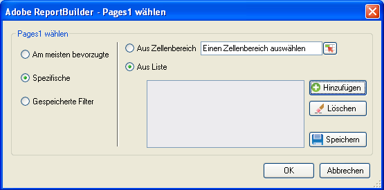

# Spezifische Filter

Filter, die dimensionsspezifische Terme anwenden.

Sie können dimensionsspezifische Filter setzen, indem Sie einen Filter erstellen, für den exakte Kriterien erfüllt werden müssen. Beispielsweise können Sie den folgenden Filtertyp erstellen: Seite unter [!DNL homepage.htm], [!DNL contact_us.html], [!DNL corporate_info.html].

**So erstellen Sie einen spezifischen Filter**

1. Erstellen oder bearbeiten Sie eine Anforderung und gehen Sie zum Dialogfeld [!UICONTROL Anforderungs-Assistent: Schritt 2].

   

1. Klicken Sie im Dialogfeld [!UICONTROL Anforderungs-Assistent: Schritt 2] im Raster auf den Link neben der Dimension und wählen Sie dann **[!UICONTROL Filter]**.

   

1. Aktivieren Sie die Option **[!UICONTROL Spezifisch]** und aktivieren Sie dann eine der folgenden Optionen:

   * **Aus Zellenbereich:** Hier können Sie Daten aus Zellen auswählen. Folgende Optionen stehen zur Auswahl:
   * **Alle Zellen im Bereich:** Hier können Sie jede Zelle für den Bereich zuordnen. Eine Textbeschreibung erläutert, wie viele Gruppen von Zellen Sie auswählen müssen. Um mehr als eine Gruppe von Zellen zuzuordnen, drücken Sie während der Auswahl die Strg-Taste. Wenn der Bereich, der zugeordnet werden muss, mehr als eine Zelle enthält, ist dies die einzige verfügbare Option.
   * **Erste Zelle im Bereich:** Sie müssen nur die Zelle in der linken oberen Ecke des Bereichs auswählen und dann eine Richtung für die Daten wählen. Falls die Anforderung über mehrere Zeiträume geht, müssen Sie außerdem die Richtung der Zeiträume auswählen und entscheiden, ob eine bestimmte Anzahl von Zellen zwischen Zeiträumen übersprungen werden soll.
   * **Aus Liste:** Ermöglicht die Auswahl von Daten aus einer Liste, der Sie Daten hinzufügen können.
1. Wenn Sie die Option **[!UICONTROL Aus Liste]** aktivieren, können Sie aus den verfügbaren aufgelisteten Elementen auswählen oder auf **[!UICONTROL Hinzufügen]** klicken.

   Wenn Sie auf **[!UICONTROL Hinzufügen]** klicken, zeigt das Formular [!UICONTROL Aus Liste auswählen] eine Liste der verfügbaren Dimensionselemente für den Datumsbereich der aktuellen Anforderung an, beschränkt auf die ersten 10.000 Elemente. Sie können diese Elemente durchsuchen oder auf **[!UICONTROL Mehr ...]** klicken, um das [!UICONTROL Suchdialogfeld] anzuzeigen, in dem Sie detaillierter nach Dimensionen suchen können.
1. Klicken Sie im Dialogfeld [!UICONTROL Aus Liste auswählen] auf **[!UICONTROL OK]**.
1. Speichern Sie im Formular [!UICONTROL Seiten auswählen], falls gewünscht, Ihren spezifischen Filter und klicken Sie dann auf **[!UICONTROL OK]**.
