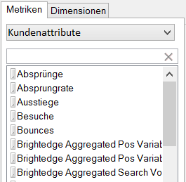
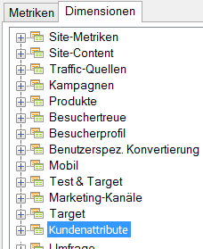

# Kundenattribute

Kundenattribute werden in einer neuen Art von Element namens „VisAttr“ gespeichert, das als Dimension oder Metrik konfiguriert werden kann. 

Weitere Informationen rund um das Hochladen von Kundenattributen finden Sie in der [Experience Cloud-Hilfe](https://docs.adobe.com/content/help/en/core-services/interface/customer-attributes/attributes.html).

* Wenn VisAttr als Metrik konfiguriert ist, wird es sowohl als „Dimension“ als auch als „Metrik“ offengelegt.

    

* Es unterstützt dieselbe Aufschlüsselung wie eine eVar (alles kann durch alles aufgeschlüsselt werden).
* VisAttr unterstützt alle eVar-Metriken.
* VisAttr als Metrik unterstützt „Zusammenfassung“ (z. B. Zeit, die auf der Website verbracht wurde: 0 bis 30, 31 bis 60 …)
* VisAttr ist als Segmentierungsdimension verfügbar.

