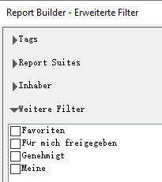
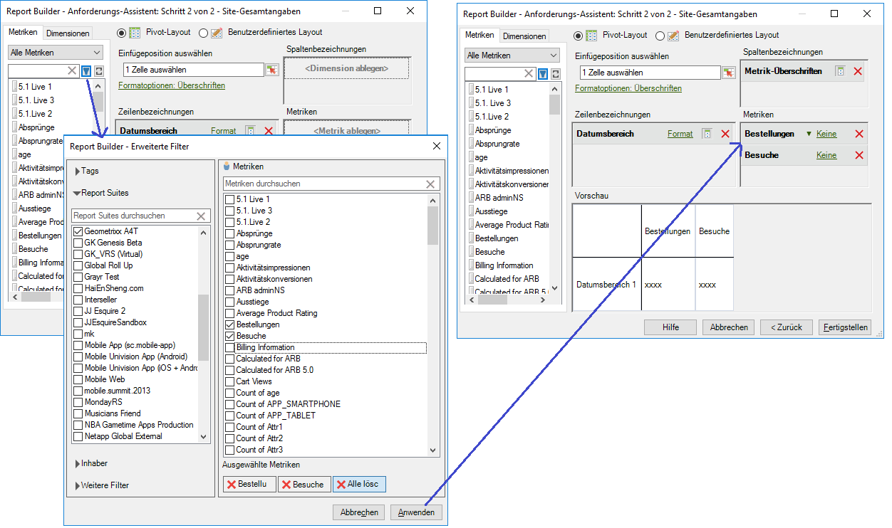

# Berechnete Metriken

Report Builder 5.2 unterstützt vereinheitlichte berechnete Adobe Analytics-Metriken. Neben anderen Innovationen verfügen alle berechneten Metriken jetzt über eine globale ID – sie sind nicht mehr auf eine einzige Report Suite beschränkt.

>[!NOTE]
>
>Vorhandene Arbeitsmappen können auf Anforderungen mit alten Metrik-IDs verweisen. Wenn Sie Report Builder 5.2 verwenden, werden diese alten Metrik-IDs in die neue globale ID konvertiert. Wenn Sie diese Arbeitsmappe für einen Benutzer von Report Builder v5.1 oder älter freigeben, kann dieser Benutzer die berechneten Metriken nicht anzeigen.

Weitere Informationen zum Erstellen und Verwalten von berechneten Metriken mit dem neuen Generator und Manager für berechnete Metriken finden Sie im Handbuch [Berechnete Metriken](https://docs.adobe.com/content/help/de-DE/analytics/components/calculated-metrics/cm-overview.html).

In Schritt 2 des Anforderungs-Assistenten können Sie berechnete Metriken filtern und anwenden.

## Berechnete Metriken filtern {#section_376E986D3E684999A7CDB08E53854159}

**Filtern** Sie berechnete Metriken, indem Sie auf das Filtersymbol klicken:  

  Im Dialogfeld „Erweiterte Filter“ werden die Standardmetriken und berechneten Metriken aufgeführt.

Folgende Filter stehen zur Verfügung:

| Filtername | Beschreibung |
|---|---|
| Tags | Filtert berechnete Metriken mit bestimmten Tags. Beachten Sie, dass Tagfilter mit dem Operator AND arbeiten. Wenn Sie zwei Tags aktivieren, werden im rechten Fenster Metriken angezeigt, die mit **beiden** Tags versehen wurden. |
| Report Suites | Wenn Sie im Generator für berechnete Metriken in [!DNL Reports & Analytics] den Filter „Nur *Name der Report Suite*“ anwenden und dann in [!DNL Report Builder] den erweiterten Filter anzeigen, zeigt der erweiterte Filter nur die berechneten Metriken für die ausgewählte Report Suite an. |
| Inhaber | Filtert berechnete Metriken nach Inhaber. Beachten Sie, dass Inhaberfilter mit dem Operator OR arbeiten. Wenn Sie zwei Inhaber aktivieren, werden im rechten Fenster Metriken angezeigt, die **beiden** Inhabern gehören. |
| Weitere Filter > Genehmigt | Zeigt alle offiziell  genehmigten Metriken an. |
| Weitere Filter > Favoriten | Zeigt alle Metriken an, die Sie als Favoriten markiert haben. |
| Weitere Filter > Meine | Zeigt alle Metriken an, deren Inhaber Sie sind. |
| Weitere Filter > Für mich freigegeben | Zeigt alle Metriken an, die für Sie freigegeben wurden. |

## Berechnete Metriken anwenden  {#section_DF5CF349460A45FDA4B6E6BB8B52F18E}

Wenn Sie die Filter ausgewählt haben, klicken Sie auf **[!UICONTROL Übernehmen]**, um sie auf Ihre Anforderung anzuwenden. Die ausgewählten Metriken werden zum Berichtslayout hinzugefügt.

