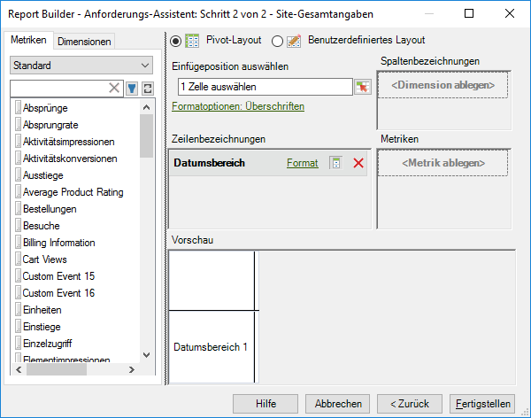

# Traffic- und Commerce-Metriken in derselben Anforderung kombinieren

Ab sofort können Sie diese beiden Metriktypen in ein und derselben Anforderung kombinieren, anstatt zwei separate Anforderungen erstellen zu müssen.

Traffic- und Commerce-Metriken werden nun in derselben Metrikkategorie in Schritt 2 des Anforderungs-Assistenten angezeigt. Bisher wurden diese Metriken getrennt in einer Commerce- und einer Traffic-Kategorie angezeigt.

Die neue gruppierte Kategorie heißt **[!UICONTROL Standard]**.

