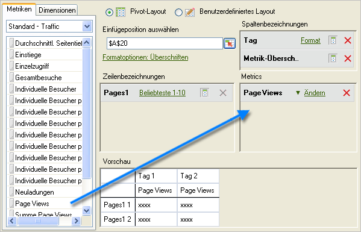
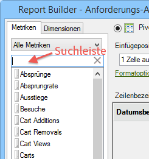
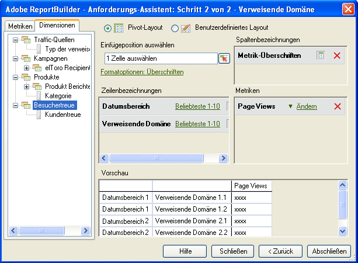

# Metriken und Dimensionen hinzufügen

Schritte zum Hinzufügen von Metriken und Dimensionen zu einer Anforderung.

1. [Erstellen Sie die Datenanforderung](/help/analyze/report-builder/data-requests/data-requests.md) im [!UICONTROL Dialogfeld Anforderungs-Assistent: Schritt 1] und klicken Sie dann auf **[!UICONTROL Weiter]**.
1. Doppelklicken Sie im Dialogfeld [!UICONTROL Anforderungs-Assistent: Schritt 2] auf Metriken oder ziehen Sie sie an die gewünschte Position.

   

   Wenn Sie Metriken hinzufügen, werden sie nicht aus der Registerkarte [!UICONTROL Metriken] entfernt, da Metriken innerhalb einer Anforderung mehrfach verwendet werden können. Beispielsweise kann die Zwischensumme einer Metrik neben jedem Wert angezeigt werden. Allerdings ändert sich die Liste der verfügbaren Metriken jedes Mal, wenn Sie eine Dimension hinzufügen oder entfernen.

   Metriken können nur im Abschnitt [!UICONTROL Metriken] des Layoutbereichs hinzugefügt werden. Metriken werden dem Layout [!UICONTROL Spaltenbezeichnung] als [!UICONTROL Metrik-Überschrift] hinzugefügt. Wenn Sie eine [!UICONTROL Metrik-Überschrift] aus dem [!UICONTROL Spalten-Layout] in das [!UICONTROL Zeilen-Layout] verschieben, wird sie dort angezeigt und die zugehörige Metrik wird für die Aufschlüsselung verwendet.

   Beachten Sie, dass auf der Registerkarte „Metriken“ direkt über der Metrikenliste eine Suchleiste angezeigt wird.

   

   Beachten Sie:

   * Wenn Sie einen Suchbegriff eingeben, wird die Liste automatisch aktualisiert und es werden nur die Metriken angezeigt, deren Kennzeichnungen mit dem Suchbegriff übereinstimmen.
   * Die Treffer sind nicht von der Schreibweise abhängig. Sie entspricht einer Suche mit der Option „enthält“.
   * Suchen nach vollständigen Wörtern oder anderen speziellen Suchoptionen (beginnt mit, endet mit, AND, OR usw.) werden nicht unterstützt.

      Der Suchbegriff wird gelöscht, wenn Sie den Anforderungs-Assistenten verlassen (z. B. durch Klicken auf „Beenden“ oder „Abbrechen“), Sie zu Schritt 1 des Anforderungs-Assistenten zurückkehren oder Sie die Metrikkategorie ändern.

      Der Suchbegriff wird in den folgenden Fällen nicht gelöscht:

   * Sie fügen ein Metrikelement aus der Liste per Drag-and-drop (oder Doppelklick) zum Metrikfeld „Pivot-Layout/Benutzerdefiniertes Layout“ hinzu.
   * Sie entfernen ein Metrikelement aus dem Metrikfeld „Pivot-Layout/Benutzerdefiniertes Layout“.
   * Sie klicken auf die Registerkarte „Dimension“ und kehren dann zur Registerkarte „Metrik“ zurück.
   * Sie rufen andere Unterformulare auf (modal oder amodal), bei denen Sie, wenn Sie sie verlassen, zu Schritt 2 des Anforderungs-Assistenten zurückkehren. Beispiele für diese Formulare:

      * Formulare für Dimensionsfilter
      * Formulare für die Datumsbereichformatierung
      * Formulare für Formatoptionen
      * Formulare für das Voranstellen/Anhängen von Text
      * Formulare für das Festlegen des Ausgabebereichs

1. (Optional) Um eine Anforderung nach Metrik zu sortieren, klicken Sie einfach auf die Metrikbezeichnung.
1. Dimensionen werden auf die gleiche Weise wie Metriken hinzugefügt.

Auf der Registerkarte [!UICONTROL Dimensionen] zeigt das System Dimensionen an, die eine Aufschlüsselung oder Classification des in Schritt 1 ausgewählten Basisberichts darstellen. Außerdem werden Informationen über die Konfiguration der Report Suite angezeigt. Wenn Sie eine Dimension auf dem Layoutraster ablegen, wird sie aus der Strukturansicht entfernt und eine Neuberechnung der Liste der verfügbaren Dimensionen durchgeführt.

Die Dimension [!UICONTROL Datum] wird automatisch hinzugefügt. Die verfügbaren Datumsdimensionen hängen von der im Dialogfeld [!UICONTROL Anforderungs-Assistent: Schritt 1] gewählten Granularität ab. (Gültige Werte sind:

    * Stunde
    * Tag
    * Woche
    * Monat
    * Jahr
    * Datumsbereich (wenn keine Granularität angegeben ist)

1. Ändern Sie Metriken und Dimensionen, indem Sie [Formatoptionen](/help/analyze/report-builder/layout/t-format-display-headers.md) und Filter konfigurieren.
1. Klicken Sie auf **[!UICONTROL Fertigstellen]**. 
Im folgenden Beispiel gehören die Dimensionen zur Metrik [!UICONTROL Seite]. Hier erstellt die Dimension [!UICONTROL Verweisende Domäne] einen Detailbericht für [!UICONTROL Seite] und [!UICONTROL Verweisende Domäne]. Die Registerkarte [!UICONTROL Dimension] wird nur mit Dimensionen aktualisiert, die für einen Detailbericht verwenden können.

