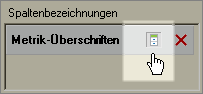

# Überschriften aus- oder einblenden

Dieser Vorgang beschreibt, wie Sie Überschriften aus- oder einblenden.

Klicken Sie im Dialogfeld [!UICONTROL Anforderungs-Assistent: Schritt 2] im [!UICONTROL Pivot-Layout] oder im [!UICONTROL benutzerdefinierten Layout] auf **[!UICONTROL Ausblenden/Anzeigen]**.

