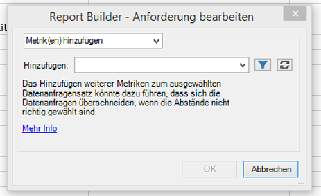
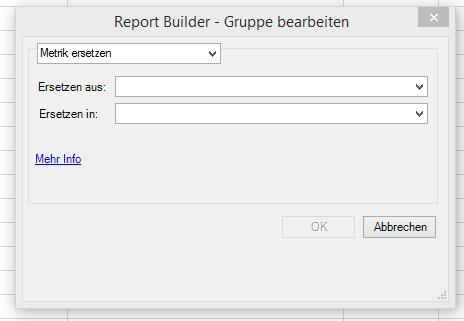
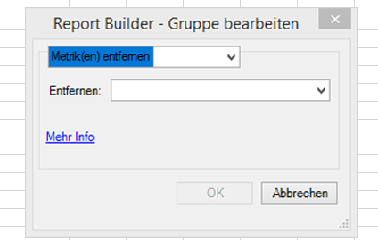

# Metriken mit Mehrfachanforderungen bearbeiten

Mit der Funktion „Metriken mit Mehrfachanforderungen bearbeiten“ können Sie Metriken in einer vorhandenen Anforderung bzw. in einer Gruppe von Anforderungen mühelos hinzufügen, entfernen oder ersetzen.

## Metriken hinzufügen {#section_3FBDA9668039404895059618D70FCBCD}

Bedenken Sie Folgendes

* Metriken können nur zu Anforderungen des Typs „Pivot-Layout“ hinzugefügt werden. Wenn einige der ausgewählten Anforderungen benutzerdefinierte Layouts sind, können keine Metriken hinzugefügt werden. Der Grund dafür liegt darin, dass Report Builder nicht weiß, wo im Arbeitsblatt die neue Metrik hinzugefügt werden soll, da das Layout benutzerdefiniert ist.
* Deshalb ist die Option **[!UICONTROL Metrik(en) hinzufügen]** nicht verfügbar, wenn Sie ausschließlich benutzerdefinierte Layout-Anforderungen ausgewählt haben.
* Durch das Hinzufügen von Metriken erhöht sich die Größe einer Anforderung, weshalb sie sich mit einer anderen überschneiden könnte. Achten Sie darauf, dass Ihre Anforderung rundherum ausreichend Platz zum Hinzufügen von Metriken hat.
* Wenn die hinzugefügte Metrik bereits in einer der ausgewählten Anforderungen vorhanden ist, wird sie nicht zu dieser hinzugefügt.

So fügen Sie eine oder mehrere Metriken hinzu:

1. Wählen Sie mindestens eine Anforderung in Excel aus, klicken Sie mit der rechten Maustaste darauf und wählen Sie **[!UICONTROL Metriken bearbeiten]** aus. (Oder klicken Sie auf **[!UICONTROL Verwalten]** > **[!UICONTROL Mehrere bearbeiten]** > `<choose metric>` > **[!UICONTROL Gruppe bearbeiten]**, um die zu ändernde Anforderungsgruppe auszuwählen.)
1. Wählen Sie **[!UICONTROL Metrik(en) hinzufügen]** und danach die entsprechenden Metriken aus.

   

1. Aktualisieren Sie die Anforderung, um die tatsächlichen Daten anzuzeigen. Die Offline-Daten werden so lange angezeigt, bis Sie eine Aktualisierung durchführen.

## Metrik ersetzen {#section_D773AAC7B30C4FBEBDB66B203C217818}

Bedenken Sie Folgendes

* Nur 1:1-Ersetzungen sind erlaubt, nicht aber 1:viele oder viele:1.
* Wenn die ausgewählte Metrik, die ersetzt werden soll, nicht in einer der ausgewählten Anforderungen vorhanden ist, wird diese Anforderung nicht geändert.
* Die neue Metrik wird an derselben Stelle platziert die ersetzte Metrik. Das bedeutet:

   * **In einem Pivot-Layout**: Wenn eine Anforderungen des Typs „Pivot-Layout“ Datum, Besuch, Besucher, Unique Visitors pro Tag ausgibt und „Besucher“ durch „Umsatz“ ersetzt wird, so lautet das aktualisierte Anforderungs-Layout wie folgt: Datum, Besuch, Umsatz, Unique Visitors pro Tag.
   * **In einem benutzerdefinierten Layout**: Wenn die Metrik „Besucher“ in Zelle F11 ausgegeben wird, so wird im aktualisierten Anforderungs-Layout „Umsatz“ ebenfalls in Zelle F11 gezeigt.

* Wenn auf die ersetzte Metrik eine Operation angewendet wird (Durchschnitt, pre-pended text, post-pended text, microcharting), wird diese Operation auch auf die neue Metrik angewendet.

So ersetzen Sie eine Metrik:

1. Wählen Sie mindestens eine Anforderung in Excel aus, klicken Sie mit der rechten Maustaste darauf und wählen Sie **[!UICONTROL Metriken bearbeiten]** aus. (Oder klicken Sie auf **[!UICONTROL Verwalten]** > **[!UICONTROL Mehrere bearbeiten]** > **`<choose metric>`** > **[!UICONTROL Gruppe bearbeiten]**, um die zu ändernde Anforderungsgruppe auszuwählen.)

1. Wählen Sie **[!UICONTROL Metrik ersetzen]** aus.

   

1. Wählen Sie aus, welche Metrik ersetzt werden soll und durch welche Metrik sie ersetzt werden soll.
1. Aktualisieren Sie die Anforderung. Die Offline-Daten werden so lange angezeigt, bis Sie eine Aktualisierung durchführen.

## Metriken entfernen {#section_D3CD5BAC7670416593B633B2B8423C60}

Bedenken Sie Folgendes

* Wenn eine der zum Entfernen ausgewählten Metriken in einer ausgewählten Anforderungen nicht vorhanden ist, wird diese Anforderung nicht geändert.
* Wenn in einem Pivot-Layout eine Metrik entfernt wird, rücken im Layout die Metriken nach, die hinter der entfernten Metrik stehen.

   **Beispiel**: Wenn eine Anforderungen des Typs „Pivot-Layout“ die Werte für Datum, Besuche, Besucher, Unique Visitors pro Tag ausgibt und „Besuche“ entfernt wird, so zeigt das aktualisierte Layout für die Anforderung: Datum, Besucher, Unique Visitors pro Tag.

So entfernen Sie Metriken:

1. Wählen Sie mindestens eine Anforderung in Excel aus, klicken Sie mit der rechten Maustaste darauf und wählen Sie **[!UICONTROL Metriken bearbeiten]** aus. (Oder klicken Sie auf **[!UICONTROL Verwalten]** > **[!UICONTROL Mehrere bearbeiten]** > **`<choose metric>`** > **[!UICONTROL Gruppe bearbeiten]**, um die zu ändernde Anforderungsgruppe auszuwählen.)

1. Wählen Sie **[!UICONTROL Metrik(en) entfernen]**.

   

1. Wählen Sie mindestens eine Metrik aus, die aus der Anforderung entfernt werden soll.
1. Aktualisieren Sie die Anforderung. Die Offline-Daten werden so lange angezeigt, bis Sie eine Aktualisierung durchführen.

