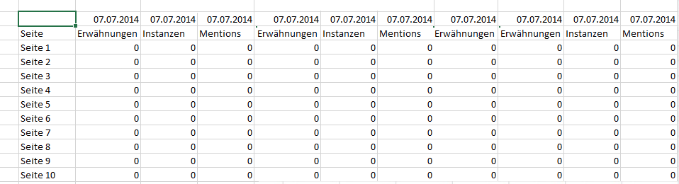

# Offline-Modus zum Erstellen und Bearbeiten von Anforderungen

Im Offline-Modus werden Platzhalterdaten zurückgegeben, um das Erstellen und Bearbeiten von Anforderungen zu beschleunigen.

Wenn Sie eine neue Anforderung erstellen oder bearbeiten, werden Berichts-API-Aufrufe zum Abrufen der Antwort gestartet. Dadurch wird die Anforderungserstellung verlangsamt, weil Sie warten müssen, bis die Daten zurückgegeben werden, bevor Sie zum nächsten Schritt übergehen können. Im Offline-Modus werden nur Platzhalterdaten zurückgegeben; es müssen also keine API-Aufrufe gestartet werden.

So aktivieren Sie den Offline-Modus:

1. Klicken Sie im Report Builder-Menü auf **[!UICONTROL Optionen]**.

   

1. Aktivieren Sie neben **[!UICONTROL Aktivieren Sie den Offline-Modus, um Anforderungen zu erstellen und zu bearbeiten]** das Kontrollkästchen.
1. Geben Sie im Feld **[!UICONTROL Metrikdaten anzeigen als]** die Platzhalterdaten ein, die bei Ihrer Anforderung zurückgegeben werden sollen. Geben Sie zum Beispiel „1“ ein.
1. Klicken Sie auf **[!UICONTROL OK]**.
1. Nun können Sie mithilfe des Anforderungs-Assistenten Ihre Anforderung erstellen und ausführen (im Offline-Modus).
1. Ihre Anforderung, bei der Sie für die Platzhalterdaten „1“ eingegeben haben, wird etwa wie folgt aussehen:

   

   >[!IMPORTANT]
   >
   >Stellen Sie sicher, dass Sie den Offline-Modus deaktiviert haben, bevor Sie Ihre Anforderung mit echten Daten ausführen. Hierfür gehen Sie einfach zurück zu **[!UICONTROL Optionen]** und entfernen den Haken.

