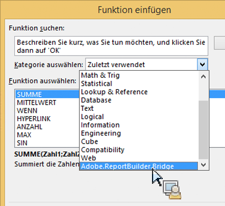
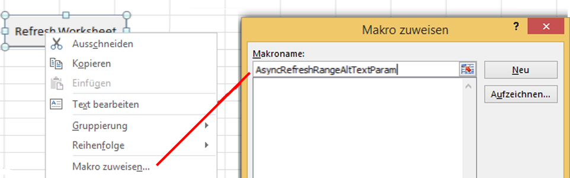
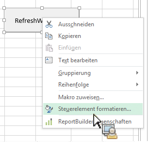
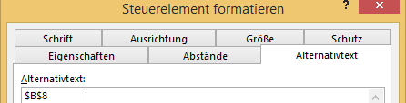

# Report Builder-Funktionen über Microsoft Excel-Funktionen aufrufen

Dank dieser Funktion wird die Report Builder-Verwendung in den normalen Excel-Workflow integriert, ohne dass Sie auf die Report Builder-Benutzeroberfläche zugreifen müssen.

Sie können beispielsweise Report Builder-Anforderungen automatisch aktualisieren, deren Eingabefilter auf Daten basieren, die in Excel aus anderen Quellen abgerufen wurden. Genau dies können Sie mithilfe der Zeichenfolgenfunktion RefreshRequestsInCellsRange(..) durchführen. Alle Aufrufe sind asynchron. Sie werden sofort zurückgegeben und warten nicht, bis ein Aufruf vollständig ausgeführt wird.

>[!NOTE]
>
>Damit dies funktioniert, muss Report Builder 5.0 (oder höher) installiert sein.

In der nachfolgenden Tabelle sind alle exponierten Funktionen aufgelistet.

| Name der Funktion | Beschreibung |
|---|---|
| string AsyncRefreshAll() | Aktualisiert alle in einer Arbeitsmappe vorhandenen Report Builder-Anforderungen. |
| string AsyncRefreshRange(string rangeAddressInA1Format) | Aktualisiert alle Report Builder-Anforderungen in der angegebenen Zellenbereichsadresse (ein Zeichenfolgenausdruck, der einen Zellenbereich im A1-Format darstellt, z. B. „Sheet1!A2:A10“). |
| string AsyncRefreshRangeAltTextParam() | Aktualisiert alle Report Builder-Anforderungen, die im angegebenen, über den Alternativtext des MS-Formularsteuerelements weitergeleiteten Zellenbereich vorhanden sind. |
| string AsyncRefreshActiveWorksheet() | Aktualisiert alle im aktiven Arbeitsblatt vorhandenen Report Builder-Anforderungen. |
| string AsyncRefreshWorksheet(string worksheetName) | Aktualisiert alle im angegebenen Arbeitsblatt vorhandenen Report Builder-Anforderungen (der Arbeitsblattname, wie er auf der Registerkarte angezeigt wird.) |
| string AsyncRefreshWorksheetAltTextParam(); | Aktualisiert alle Report Builder-Anforderungen, die im angegebenen, über den Alternativtext des MS-Formularsteuerelements weitergeleiteten Arbeitsblattnamen vorhanden sind. |
| string GetLastRunStatus() | Gibt eine Zeichenfolge zurück, die den Status der letzten Ausführung beschreibt. |

Um auf diese Funktionen innerhalb von ReportBuilder zuzugreifen, wechseln Sie zu [!UICONTROL Formeln] > [!UICONTROL Funktion einfügen]. Am Ende der Kategorienliste finden Sie Adobe.ReportBuilder.Bridge:



## Verwenden dieser Funktionen in einer Formel {#section_034311081C8D4D7AA9275C1435A087CD}

Beispiel: Die Formel

```
=IF(OR(ISTEXT(P5),ISBLANK(P5)),AsyncRefreshRange("P9"),"")
```

bedeutet: „Wenn die Zelle P5 Text enthält oder leer ist, aktualisieren Sie den Bereich der Zelle P9.“

## Verwenden von Report Builder-Funktionen mit „Steuerelement formatieren“ {#section_26123090B5BD49748C8D8ED7A1C5ED84}

Ab sofort können Sie einem Steuerelement, das Sie erstellt haben, ein Makro zuweisen. Dieses Steuerelement kann eine Funktion sein, die eine Arbeitsmappenanforderung aktualisiert. Beispielsweise werden mit der Funktion AsyncRefreshActiveWorksheet alle Anforderungen in einem Arbeitsblatt aktualisiert. Manchmal möchten Sie jedoch vielleicht nur bestimmte Anforderungen und nicht alle aktualisieren.

1. Legen Sie den Makro-Parameter fest.
1. Klicken Sie mit der rechten Maustaste auf das Steuerelement und wählen Sie **[!UICONTROL Makro zuweisen]** aus.
1. Geben Sie den ReportBuilder-Funktionsnamen ein (ohne Parameter und Klammern).



## Weiterleiten von Parametern zu Report Builder-Funktionen über „Steuerelement formatieren“ {#section_ECCA1F4990D244619DFD79138064CEF0}

Die beiden Funktionen, die einen Parameter annehmen, können mit „Steuerelement formatieren“ verwendet werden, jedoch nur über das Feld für Alternativtext:

* AsyncRefreshRange(string rangeAddressInA1Format)
* AsyncRefreshWorksheet(string worksheetName)

1. Klicken Sie mit der rechten Maustaste auf das Steuerelement und wählen Sie **[!UICONTROL Steuerelement formatieren]** aus.

   

1. Klicken Sie auf die Registerkarte [!UICONTROL Alt-Text].

   

1. Geben Sie unter [!UICONTROL Alternativtext] den Zellenbereich ein, der aktualisiert werden soll.
1. Öffnen Sie unter [!UICONTROL Formeln] > [!UICONTROL Funktion einfügen] > [!UICONTROL Adobe.ReportBuilder.Bridge] die Liste der Report Builder-Parameter.

1. Wählen Sie eine der beiden Funktionen aus, die auf AltTextParam enden, und klicken Sie auf **[!UICONTROL OK]**.

