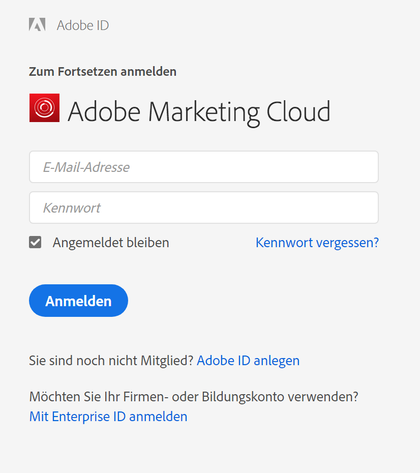
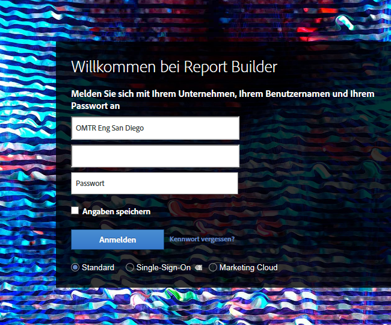

# Anmelden bei Report Builder

>[!IMPORTANT]
>
>Report Builder Version 5.6.47 und höher unterstützt nur die Anmeldung von Experience Clouden und unterstützt keine Legacy-Anmeldungen wie SiteCatalyst Single-Sign-on oder die Standardanmeldung. Bis zum 30. April 2021 müssen alle Report Builder-Benutzer den Report Builder Hinzufügen auf Version 5.6.47 oder höher aktualisieren, die eine wichtige Aktualisierung des Anmeldevorgangs enthält.

Um sich bei Report Builder anzumelden, verwenden Sie Ihr Experience Cloud-Anmeldekonto.

## Experience Cloud {#section_1FA230F35AB54021A874A7A28DE4C850}

Die Experience Cloud-Anmeldung erlaubt die Verwendung Ihrer Enterprise ID (E-Mail und Passwort) zur Anmeldung bei Adobe Experience Cloud. Klicken Sie auf **[!UICONTROL Anmelden]** > **[!UICONTROL Anmelden mit einer Enterprise ID]**, um zurück zur Single-Sign-On-Seite Ihres Unternehmens geleitet werden. Für weitere Informationen zu Enterprise ID klicken Sie [hier](https://helpx.adobe.com/de/enterprise/kb/enterprise-id-faq.html#whatis).

>[!NOTE]
>
>Die Experience Cloud-Anmeldung ist sitzungsbasiert und der Token läuft nach 30 Tagen ab.

## Bei Report Builder anmelden

So melden Sie sich bei Report Builder an

1. Klicken Sie in Excel auf **[!UICONTROL Add-Ins]**.
1. Klicken Sie auf **[!UICONTROL Anmelden]**. Durch die folgenden Aktionen wird der Anmeldevorgang ebenfalls gestartet:

   * Klicken Sie auf **[!UICONTROL Erstellen]**.
   * [Wählen Sie eine Anforderung im Anforderungs-Manager](/help/analyze/report-builder/manage-requests/r-arb-manage-requests.md) aus und klicken Sie dann auf  **** Hinzufügen  **[!UICONTROL verwalten]**.
   * Klicken Sie bei Dublette auf eine Anforderung in Excel.

1. Füllen Sie diese Felder auf der [!UICONTROL Anmeldeseite] aus und klicken Sie auf **[!UICONTROL OK]**.

## Alte Anmeldearten

>[!IMPORTANT]
>
>Bis zum 30. April 2021 funktionieren ältere Anmeldetypen nicht mehr. Alle Report Builder müssen das Hinzufügen auf Version 5.6.47 oder höher aktualisieren, das eine wichtige Aktualisierung des Anmeldevorgangs enthält. **Report Builder Version 5.6.47 und höher unterstützt nur die Anmeldung von Experience Clouden und unterstützt keine Legacy-Anmeldungen wie die Standardanmeldung oder das SiteCatalyst Single-Sign-On.**

<!--  -->

* [Standard ](/help/analyze/report-builder/setup/login.md#section_6D54B8ADAE7F416BB83F5082B3771CFA)
* [SiteCatalyst Single-Sign-On](/help/analyze/report-builder/setup/login.md#section_6970A5F926774976B85FFE576610E85F)

## Standard {#section_6D54B8ADAE7F416BB83F5082B3771CFA}

Verwenden Sie diese Anmeldung, um sich mit Ihren Adobe Analytics-Anmeldedaten bei Report Builder anzumelden.

**Anmeldung bei Report Builder – Felddefinitionen**

| Feld | Definition |
|--- |--- |
| Firma | Der Firmenname, den Sie für die Anmeldung bei Adobe Analytics verwenden. |
| Benutzername | Der Benutzername, den Sie für Adobe Analytics verwenden. Für einen Benutzer geplante Aufgaben werden seinem Benutzernamen zugeordnet. Sie können von jedem Computer aus auf Ihre geplanten Aufgaben zugreifen, wenn Sie sich mit Ihren Anmeldedaten bei ReportBuilder anmelden. |
| Passwort | Ihr Analytics-Passwort. |
| „Angaben speichern“ | Die Anmeldeinformationen sind verschlüsselt in einem Benutzerprofil auf dem Rechner mit der Report Builder-Installation gespeichert. Da die Anmeldeinformationen gespeichert werden, kann jeder, der denselben PC benutzt wie der Ersteller, der die Arbeitsmappe mit dem Bericht geöffnet hat, die Daten aktualisieren und bearbeiten. Wenn Sie den Computer mit anderen teilen und Daten vertraulich behandeln möchten, aktivieren Sie diese Option nicht.  Um die automatische Anmeldung zu deaktivieren, klicken Sie auf der Symbolleiste auf **[!UICONTROL Mit anderen Anmeldeangaben anmelden]** und deaktivieren Sie **[!UICONTROL Anmeldung speichern]**. |
| Proxy-Server verwenden | Aktivieren Sie diese Option, wenn Sie auf das Internet über einen Proxy-Server zugreifen und einen Proxy-Benutzernamen mit zugehörigem Passwort angeben müssen. |

## Single Sign-On {#section_6970A5F926774976B85FFE576610E85F}

Dieser (bestehende) Single-Sign-On ermöglicht lediglich den Zugang zu Adobe Analytics und nicht zur gesamten Experience Cloud.

Sie können auch eine Domäne eingeben. Das System erkennt diese und leitet Sie zur Anmeldeseite Ihres Unternehmens weiter, wo Sie sich bei Adobe Analytics anmelden können.
