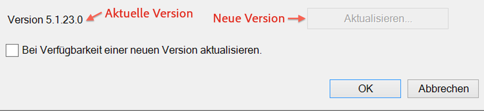
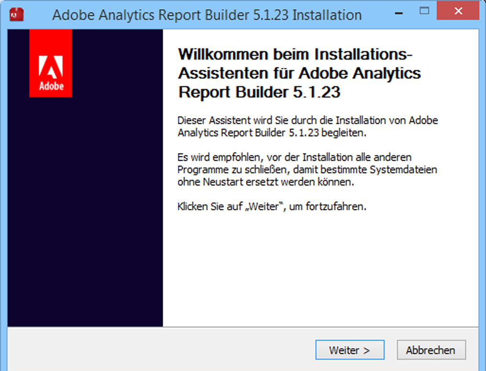

# Report Builder aktualisieren

Schritte und Überlegungen für die Aktualisierung von Report Builder.

## Aktualisierte FAQs {#section_AFE40FF5544C418790A1C298C25CC18A}

**F: Behalte ich die alte Version von Report Builder bei der Aktualisierung bei?**

A: Nein, die alte Version wird entfernt.

**F: Werden meine vorhandenen Berichte verloren gehen?**

A: Nein, alle vorhandenen Berichte funktionieren auch weiterhin.

**F: Muss ich die neue Version neu authentifizieren?**

A: Nein, alle Ihre Einstellungen, einschließlich Authentifizierungsfunktionen, funktionieren auch weiterhin.

## Upgrade-Anweisungen {#section_73B8110A619549189A30079735E81867}

1. Melden Sie sich bei der aktuellen Version von Report Builder an.
1. Navigieren Sie zum Menü **[!UICONTROL Optionen]**, um ein Upgrade auf die neueste Version durchzuführen. Ihre aktuelle Versionsnummer wird neben der Schaltfläche des Dialogfelds „Option“ angezeigt.

   

1. Wenn eine neue Version verfügbar ist, klicken Sie auf **[!UICONTROL Aktualisieren...]**. Auf der Schaltlfläche können Sie ablesen, auf welche Version Sie aktualisieren, beispielsweise: „Aktualisieren auf Version 5.0.50“.

   >[!NOTE]
   >
   >Wenn diese Schaltfläche ausgegraut ist, ist keine neue Version von Report Builder verfügbar.

1. Markieren Sie optional das Kontrollkästchen **[!UICONTROL Bei Verfügbarkeit einer neuen Version aktualisieren]**. Auf diese Weise wird in Zukunft die Aktualisierung automatisch gestartet, sobald eine neue Version verfügbar ist.
1. Wenn der Setup-Bildschirm angezeigt wird, klicken Sie auf **[!UICONTROL Weiter >]**.

   

1. Sobald das Upgrade abgeschlossen ist, melden Sie sich wieder bei Report Builder an.

## Anweisungen für manuelles Upgrade {#section_27A0200010DC4747A718F1A65B180599}

Sie können die neueste Version von Report Builder immer von Adobe Analytics erhalten.

1. Melden Sie sich bei Adobe Analytics an und gehen Sie zu **[!UICONTROL Werkzeuge]**.
1. Klicken Sie auf **[!UICONTROL Report Builder]**.
1. Wählen Sie auf der Anzeige **[!UICONTROL Überblick]** entweder die 32-Bit- oder die 64-Bit-Version aus.
1. Klicken Sie auf **[!UICONTROL Jetzt herunterladen!]**

