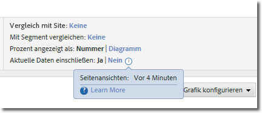
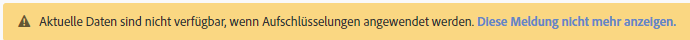

# Aktuelle Daten

Mit der Option „Aktuelle Daten einschließen“ in Reports &amp; Analytics können Sie die jüngsten Analytics-Daten abrufen, und das häufig noch bevor die Daten vollständig verarbeitet und abgeschlossen sind. Die aktuellen Daten zeigen die meisten Metriken in Minutenschnelle und liefern so relevante Daten für die rasche Entscheidungsfindung.

Die Option wird in den Berichtseinstellungen angezeigt:

„Aktuelle Daten“ ist standardmäßig für alle Berichte aktiviert, die diese Funktion unterstützen. Wenn Sie es vorziehen, alle Metriken nach der vollständigen Verarbeitung der Daten anzuzeigen, stehen Ihnen mehrere Optionen zur Verfügung:

* Verwenden Sie Analysis Workspace, da hier vollständig verarbeitete Daten verwendet werden.
* Klicken Sie in der Berichtseinstellung für aktuelle Daten auf „Nein“, um nur vollständig verarbeitete Daten zu verwenden.
* Entfernen Sie das Berechtigungselement „Aktuelle Daten“Admin Console, um zu verhindern, dass diese Option Benutzern ohne Administratorrechte angezeigt wird. Weitere Informationen finden Sie unter [Produktberechtigungen für Analytics-Profil](/help/admin/admin-console/permissions/analytics-tools.md) im Admin-Benutzerhandbuch.

Aufgrund der Priorisierung der Datenverfügbarkeit können aktuelle Daten derzeit nicht mit Segmenten, Classifications, Unterteilungen, Pfaden und einigen Metriken verwendet werden. Wenn eine dieser Funktionen verwendet wird, dann wird für die aktuellen Daten im Bericht „Nein“ erzwungen und es wird ein gelber Hinweis angezeigt, der erklärt, warum keine aktuellen Daten verfügbar sind.

## Typische Latenz aktueller Daten

Die Metriken werden in einem der drei nachfolgenden Zeitrahmen dargestellt. Mit dem Uhrensymbol neben dem Umschalter „Aktuelle Daten einschließen“ rufen Sie den tatsächlichen Latenzwert für die einzelnen Metriken in einem Bericht ab.

| Zeitrahmen | Metriken |
| --- | --- |
| Unter 10 Minuten | Instanzen und Seitenansichten in Traffic-Variablen |
| Zwischen 10 und 35 Minuten | Konversionsereignisse, Instanzen und Seitenansichten für Konversionsvariablen |
| Zwischen 45 und 120 Minuten | Alle anderen Daten, z. B. Besuche, Unique Visitors und Beiträge |

Die Werte in der Anzeige der aktuellen Daten weichen von den Werten in der abgeschlossenen Anzeige ab, da ein Teil der Daten in der Anzeige der aktuellen Daten noch nicht vollständig verarbeitet ist. Bei Trendberichten liegt die Datenabweichung in der Regel bei maximal 1 %.

## Berechnete Metriken

Die berechneten Metriken können anhand von Metriken mit abweichenden Latenzen erstellt werden. Daher wird ein Teil der jüngsten Werte u. U. anhand von unvollständigen Daten in der Anzeige der aktuellen Daten berechnet.

Sie erstellen beispielsweise die berechnete Metrik „Seitenansichten pro Besuch“ mit der Formel `Page Views divided by Visits`. Die Seitenansichten werden in der Regel innerhalb von 10 Minuten angegeben und die Besuche innerhalb von 2 Stunden, sodass die berechnete Metrik in diesem Latenzfenster anhand von unvollständigen Metriken berechnet wird. Wenn Sie eine neue Seite veröffentlichen, die 4000 Treffer aus 4000 verschiedenen Besuchen in einem Zeitrahmen von 2 Stunden verzeichnet, kann die Latenzabweichung zwischen diesen Metriken zu unvollständigen Berechnungen führen.

Bei Berichten zu neuen Werten oder zu kurzen Zeitrahmen ist dieser Datenunterschied am stärksten sichtbar. Wenn ein Bericht über einen längeren Datumsbereich erstellt wird, wirken sich die Latenzabweichungen in den letzten Stunden der Berichterstellung eher nicht merklich auf die berechneten Metriken aus.

Wenn Sie berechnete Metriken haben, die von diesen Unterschieden betroffen sein können, deaktivieren Sie entweder die aktuellen Daten oder verwenden Sie Metriken mit derselben erwarteten Latenzfenster.

## Heruntergeladene Berichte

Wenn Sie einen Bericht herunterladen und dabei die Anzeige der aktuellen Daten aktiviert ist, wird der Bericht in die Warteschlange eingestellt, erzeugt und dann an den Browser zurückgegeben. Wenn Daten gesammelt werden, während der Bericht erstellt wird, werden diese Daten im Bericht angezeigt. Dieses Zeitfenster kann dazu führen, dass der heruntergeladene Bericht etwas mehr Daten enthält.
