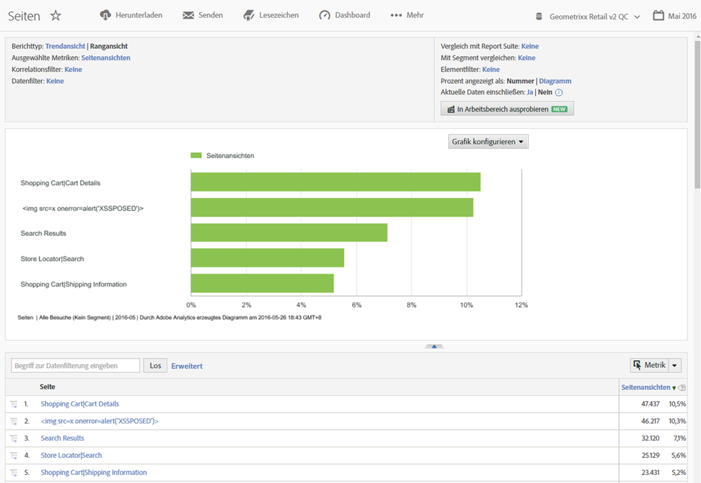
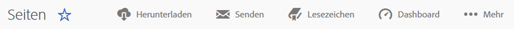
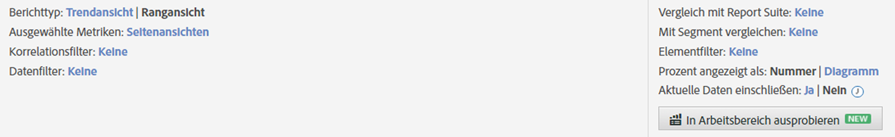
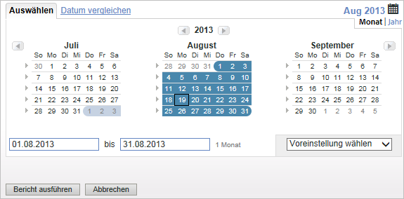
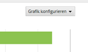
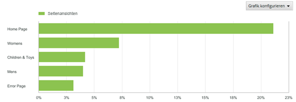
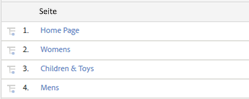

# Berichtsfunktionen

Eine Einführung in die Funktionen eines Berichts, einschließlich der Symbolleiste, des Kalenders und der Detailtabelle

Das folgende Beispiel zeigt einen [!UICONTROL Seitenbericht]. Die Konfigurationsoptionen können je nach ausgeführtem Bericht variieren. So sollten Sie z. B. besser die Granularität und den Seitennamen für einen Metrik-Bericht festlegen, als in einem Site-Content-Bericht [!UICONTROL Trendansicht] oder [!UICONTROL Rangansicht] auszuwählen.

## Beispiel für einen Seitenbericht {#section_288CC85536684C2DB184141358481EF0}

Ein Beispiel für einen Seitenbericht (**[!UICONTROL Berichte]** > **[!UICONTROL Site-Content]** > **[!UICONTROL Seitenberichte]** > **[!UICONTROL Seiten]**).

{width=&quot;672px&quot;}

## Berichtssymbolleiste {#section_0D674177AE6C4A71B07234DB25910ECD}

Ermöglicht die Freigabe Ihrer Berichtsdaten an Entscheidungsträger, die anhand der Daten Änderungen an Ihrer Site- oder Marketingstrategie vornehmen können

{width=&quot;672px&quot;}

Siehe auch [Anpassen eines Berichts](/help/analyze/reports-analytics/reports-customize/customizing-reports-overview.md).

## Berichtskopf und -einstellungen {#section_12A90FAE02EC43FB9F11F0E2CE8FAE8F}

Zeigt Berichtseinstellungen an und ermöglicht das Konfigurieren des Berichtstyps, das Auswählen von Metriken und anderes mehr. Die für diese Gruppe verfügbaren Optionen variieren entsprechend der ausgeführten Berichte. 

{width=&quot;672px&quot;}

Weitere Informationen finden Sie unter [Anpassen eines Berichts](/help/analyze/reports-analytics/reports-customize/customizing-reports-overview.md).

## Kalender {#section_8C6C4AD84D9043E8ABD53FF8F645AAB1}

Legen Sie das Datum fest, indem Sie auf die Kalenderschaltfläche klicken und einen Datumsbereich auswählen. Zum Leistungsvergleich können Sie auch zwei Zeiträume wählen.

{width=&quot;672px&quot;}

Siehe [Auswählen eines Datums oder eines Datumsbereichs](/help/analyze/reports-analytics/reports-customize/customizing-reports-overview.md) und [Vergleichen von Daten](/help/analyze/reports-analytics/reports-customize/customizing-reports-overview.md).

## Diagrammtyp {#section_8B9CBA4096E64FC3B744E2E06EB83C19}

Wählen Sie den gewünschten Diagrammtyp aus:

Siehe [Ändern von Berichtsdiagrammen](/help/analyze/reports-analytics/reports-customize/t-reports-graphs.md).

## Diagrammanzeige {#section_4C78ADC82C234CC6841AC92C803636F4}

Je nach ausgewähltem Diagrammtyp werden normalerweise die obersten Elemente aus der Detailliste angezeigt. Bei einem Trenddiagramm, das verschiedene Zeiträume enthält, werden alle Zeiträume angezeigt:

Siehe [Anpassen von Berichten](/help/analyze/reports-analytics/reports-customize/customizing-reports-overview.md).

## Metriken {#section_8B8F9EC72B864E29B91039E7B7381EAD}

Fügen Sie Metriken zu Ihrem Bericht hinzu. Administratoren können hier Standardmetriken einrichten.

Siehe [Metriken](/help/analyze/reports-analytics/metrics.md).

## Detailtabelle {#section_449A5DC848744F65A10DA12E189B835D}

Die Details bilden den Hauptteil der Berichtsdaten. Im vorliegenden Fall werden Seiten aufgelistet und nach Seitenansichten bemessen, d. h. danach, wie oft sie im betreffenden Zeitraum geladen wurden:

In der Detailtabelle können Sie Daten filtern, Aufschlüsselungen erstellen, Metriken hinzufügen und anderes mehr.

Siehe [Anpassen von Berichten](/help/analyze/reports-analytics/reports-customize/customizing-reports-overview.md).
