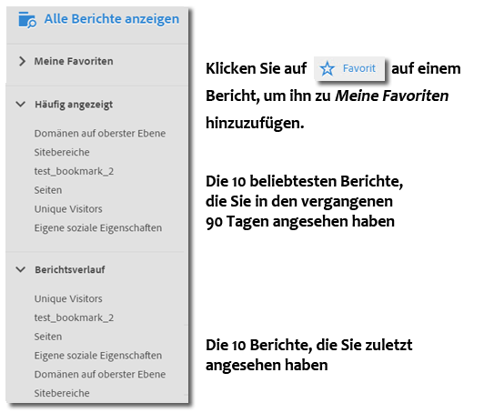
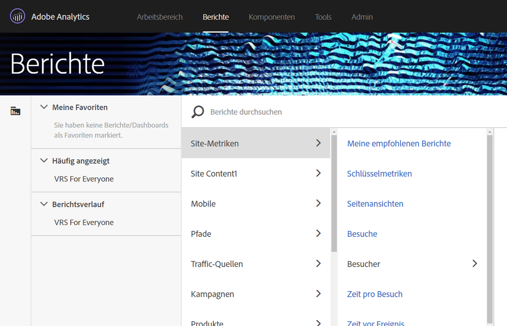
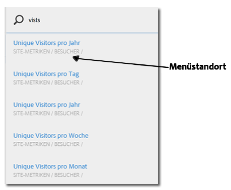

# Menü „Berichte“{#reports-menu}

Eine Übersicht zum Menü „Berichte“ in Reports &amp; Analytics.

Das Menü „Berichte“ bietet:

* Zugriff auf das vollständige Berichts-Set
* Möglichkeit zur Festlegung von Favoritenberichten für schnellen Zugriff
* Häufig angezeigte Berichte
* Erweiterte Suche

„Meine Favoriten“, „Häufig angezeigt“ und „Berichtsverlauf“ sind alle Report Suite-spezifisch. Wenn Sie die Report Suites ändern, verändern sich alle drei Listen.

Mithilfe einer hierarchischen Spaltenansicht ist die Navigation in Berichten möglich. Click **[!UICONTROL View All Reports]**, or press the Forward Slash key (/), and then press the Down Arrow key (?) to quickly display and navigate the menu using the Arrow keys. Betätigen Sie die Escape-Taste, um das Menü zu schließen, ohne den aktuellen Bericht zu ändern, oder betätigen Sie die Eingabetaste, um den ausgewählten Bericht zu laden.

{width = "672 px"}

Details zu individuellen Berichten finden Sie unter [Berichtsbeschreibungen](https://marketing.adobe.com/resources/help/en_US/reference/index.html?f=reports_descriptions).

## Suche nach Berichten {#section_E5EF11E36CB9451AA7B079E585CA7DB6}

Das Menü „Berichte“ bietet eine erweiterte Suchoberfläche. Click **[!UICONTROL View All Reports]** , or press the Forward Slash key (/) , and then begin typing to quickly find a report. Die Berichtssuche umfasst nun alle Elemente der linken Navigationsleiste in Analytics (Admin, Komponenten usw.).

Betätigen Sie die Tabulatortaste oder die Taste „Pfeil nach unten“ (↓), um durch die Liste mit den Berichten zu navigieren. Betätigen Sie die Escape-Taste, um die Suche zu schließen ohne den aktuellen Bericht zu ändern, oder betätigen Sie die Eingabetaste, um den ausgewählten Bericht zu laden.

>[!NOTE]
>
>Sie können die Berichtsliste auch nach prop, evar und Ereignisnummer durchsuchen. Geben Sie in der Suchleiste die Prop, eVar oder die Ereignisnummer ein.

## Navigationsübersicht {#section_A6A0A369207149BABE504753B48A42D7}

<table id="table_3BA295966BBC4C94ABDC3718D1894698"> 
 <thead> 
  <tr> 
   <th colname="col1" class="entry"> Menüelement </th> 
   <th colname="col2" class="entry"> Beschreibung </th> 
  </tr>
 </thead>
 <tbody> 
  <tr> 
   <td colname="col1">Experience Cloud-Lösungsmenü </td> 
   <td colname="col2"> Durch Klicken auf dieses Symbol wird das Experience Cloud-Menü erweitert, damit Sie auf andere Marketing Cloud-Lösungen zugreifen können. </td> 
  </tr> 
  <tr> 
   <td colname="col1">Menü „Berichte“ ein-/ausblenden  </td> 
   <td colname="col2"> Durch Klicken auf diese Schaltfläche wird das Menü „Berichte“ erweitert oder reduziert, sodass Sie einen Bericht über die gesamte Breite des Browser-Fensters sehen können. </td> 
  </tr> 
  <tr> 
   <td colname="col1">Segmente  </td> 
   <td colname="col2">Öffnet die Segmentschiene, über die Sie Segmente hinzufügen und verwalten können. Sie können über die Segmentschiene auch auf die Schnittstellen <a href="https://marketing.adobe.com/resources/help/en_US/analytics/segment/seg_build_ui.html" format="http" scope="external">Segmentaufbau</a> und <a href="https://marketing.adobe.com/resources/help/en_US/analytics/segment/seg_manage.html" format="http" scope="external">Segment-Manager</a> zugreifen. </td> 
  </tr> 
  <tr> 
   <td colname="col1">Metriken  </td> 
   <td colname="col2"> Öffnet die Metrikschiene, über die Sie Metriken und berechnete Metriken hinzufügen und verwalten können. </td> 
  </tr> 
  <tr> 
   <td colname="col1"> Alle Berichte anzeigen </td> 
   <td colname="col2">Alle Ihre Report-Suite-spezifischen Berichte, Dashboards, Lesezeichen, berechneten Metriken und Ziele sind in den Abschnitten von Alle Berichte anzeigen enthalten. Sie können jederzeit hier klicken, um durch alles, was für Sie zur Verfügung steht, zu navigieren. </td> 
  </tr> 
  <tr> 
   <td colname="col1">Suchleiste innerhalb von Alle Berichte anzeigen </td> 
   <td colname="col2"> 
 Ermöglicht Ihnen die Suche nach der benötigten Ressource. Die Suchleiste verwendet die sogenannte „Fuzzy-Suche“ (unscharfe Suche), sodass es nicht notwendig ist, den gesuchten Begriff exakt einzugeben. Die Suchergebnisse werden in einer direkten Liste angezeigt, in der Sie mithilfe der Pfeile nach oben und nach unten navigieren können. Wenn Sie die Eingabetaste betätigen, während Sie sich auf einem der Suchergebnisse befinden, werden Sie direkt zu diesem Bericht weitergeleitet. 
 </td> 
  </tr> 
  <tr> 
   <td colname="col1"> Meine Favoriten  </td> 
   <td colname="col2">Berichte, die Sie als Favoriten gekennzeichnet haben, können Sie aus diesem Bereich einfach abrufen. Auf Pro-Benutzer- und Pro-Report-Suite-Basis werden zehn Favoriten und ein Mehr...-Link angezeigt, wenn Sie über mehr als zehn Favoriten verfügen. 
Beachten Sie, dass Sie in „Meine Favoriten“ Berichte, jedoch keine Dashboards umbenennen können. 
 
Favoriten ähneln Lesezeichen, sie werden jedoch nicht in einem Ordner gespeichert oder wie Lesezeichen über den <a href="../../../analyze/reports-analytics/bookmarks.md#concept_55B5E0DF20B14AAF8819CB8244464406" format="dita" scope="local"> Lesezeichen-Manager</a> verwaltet. 
 </td> 
  </tr> 
  <tr> 
   <td colname="col1"> Häufig angezeigt </td> 
   <td colname="col2"> Adobe Analytics verfolgt die zehn Berichte, die Sie während der vergangenen 90 Tage am häufigsten angezeigt haben, und zeigt diese hier an, sortiert nach der Häufigkeit der Anzeige. Wenn Sie diese Report Suite mehr als 90 Tage nicht verwendet haben, wird die Liste mit einer allgemeinen Liste der zehn beliebtesten Berichte ausgefüllt. </td> 
  </tr> 
  <tr> 
   <td colname="col1"> Berichte – Verlauf </td> 
   <td colname="col2"> Hier finden Sie die letzten zehn Berichte oder Dashboards, auf die Sie in den vergangenen 90 Tagen zugegriffen haben. Sie können auf einfache Weise zu einem früheren Schritt in Ihrer Analyse oder Ihrem Bericht zurückgelangen. </td> 
  </tr> 
  <tr> 
   <td colname="col1"> Herunterladen </td> 
   <td colname="col2">Ermöglicht Ihnen das Herunterladen des Berichts in den Formaten PDF, CSV, Excel und Word. </td> 
  </tr> 
  <tr> 
   <td colname="col1"> Senden </td> 
   <td colname="col2">Ermöglicht es Ihnen, den Bericht umgehend per E-Mail zu versenden oder die E-Mail einmalig oder wiederkehrend zu terminieren. Die Formatierungsoptionen umfassen PDF, CSV, Excel, HTML, Word und Mobil (nur Text).</td> 
  </tr> 
  <tr> 
   <td colname="col1"> Lesezeichen... </td> 
   <td colname="col2">Lets you <a href="../../../analyze/reports-analytics/bookmarks.md#concept_55B5E0DF20B14AAF8819CB8244464406" format="dita" scope="local"> bookmark</a> the report. </td> 
  </tr> 
  <tr> 
   <td colname="col1"> Dashboard... </td> 
   <td colname="col2">Lets you add the report to a <a href="../../../analyze/reports-analytics/dashboard.md#concept_8CD3ACA2830A4994A68A31D8773B57E0" format="dita" scope="local"> dashboard</a>. </td> 
  </tr> 
  <tr> 
   <td colname="col1">Mehr... </td> 
   <td colname="col2"> Damit können Sie alle oder mehrere der folgenden Aktionen durchführen: Drucken, Daten extrahieren, einen Warnhinweis hinzufügen, einen benutzerdefinierten Bericht erstellen, ein Diagramm kopieren, einen Link zu diesem Bericht erstellen und ein neues Fenster öffnen. </td> 
  </tr> 
  <tr> 
   <td colname="col1">Report Suite-Auswahl  </td> 
   <td colname="col2">Hier können Sie <a href="https://marketing.adobe.com/resources/help/en_US/reference/report_suites_admin.html" format="https" scope="external">normale Report Suites</a> und <a href="https://marketing.adobe.com/resources/help/en_US/reference/virtual-report-suites.html" format="https" scope="external">Virtual Report Suites</a> auswählen. </td> 
  </tr> 
  <tr> 
   <td colname="col1">Kalender  </td> 
   <td colname="col2">Öffnet den <a href="../../../analyze/reports-analytics/overview/report-overview.md#section_8C6C4AD84D9043E8ABD53FF8F645AAB1" format="dita" scope="local">Kalender</a>, mit dem Sie den Berichtszeitraum festlegen können. </td> 
  </tr> 
 </tbody> 
</table>

## Anpassen des Menüs „Alle Berichte“{#section_7E47312747564FBE8A55EE5726B7DFF4}

Administratoren können die Berichte ändern, die im Menü „Berichte“ enthalten sind. Siehe [Menüanpassung](https://marketing.adobe.com/resources/help/en_US/reference/index.html?f=customize_menus) in der Admin-Hilfe.
