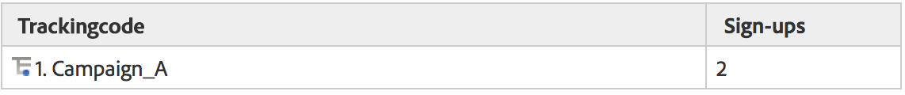
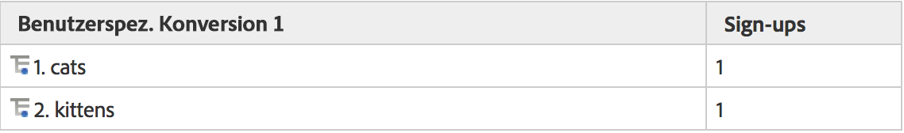
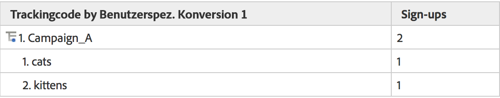

# Subrelationen

Vollständige Subrelationen sind für alle Konversionsberichte aktiviert. So lassen sich beliebige eVar-Elemente weiter aufschlüsseln. Das Menü „Unterteilung nach“ in der Berichtstabelle wurde passend zum standardmäßigen Menü für die Analytics-Berichterstellung gestaltet und sorgt so für ein einheitliches Aussehen.

## Funktionsweise von Subrelationen {#section_5BD862BB74FE411B96B59204520E4631}

Um die Funktionsweise von Subrelationen zu verstehen, stellen Sie sich folgendes Beispiel vor:

1. Ein Benutzer kommt über Kampagne_A auf Ihre Website und landet zunächst auf der Startseite.
1. Der Benutzer sucht nach dem Begriff „Katzen“. Ihm werden die Suchergebnisse angezeigt. eVar1 verfolgt interne Suchbegriffe nach.
1. Der Benutzer meldet sich bei einer Mailingliste an, was von event1 nachverfolgt wird.
1. Ein anderer Benutzer kommt ebenfalls über Kampagne_A auf Ihre Website und landet zunächst auf der Startseite.
1. Dieser Benutzer sucht nach „Kätzchen“. Ihm werden die Suchergebnisse angezeigt (eVar1). Auch er meldet sich bei der Mailingliste an (event1).

Wenn Sie einen Trackingcode-Bericht generieren würden, sähe das Ganze wie folgt aus:

Wenn Sie einen eVar1-Bericht generieren würden, sähe das Ganze wie folgt aus:

Wenn Sie den Kampagnenbericht in Subrelation zu eVar1 setzen würden, käme folgendes Ergebnis heraus:

Wenn Sie den eVar1-Bericht in Subrelation zu Kampagnen setzen würden, käme folgendes Ergebnis heraus:

Wegen der Beständigkeit von Konversionsvariablen werden eVar-Werte in zwei Datenspalten gespeichert: der Wert, der ausgelöst wird, und der Wert, der bestehen bleibt. Wenn Sie einen Rohdatenexport für dieses Beispiel ansehen würden, sähe er wie folgt aus (vereinfachte Darstellung):

Unser Backend funktioniert, indem post_campaign und post_evar1 die in Kampagne und evar1 festgelegten Werte beibehalten können. Subrelationsberichte berücksichtigen ausdrücklich nur die Treffer, die Erfolgsereignisse enthalten (Zeilen, die hellgelb hervorgehoben sind). Anschließend erstellen sie die Subrelationsberichte basierend auf den fortbestehenden Werten (in diesem Fall: post_campaign und post_evar1; Zellen hellgelb hervorgehoben).

Zusammenfassend führen Subrelationen folgende Schritte aus, um den Bericht zu erstellen:

* Isolieren der Bildanforderungen, die die Erfolgsereignisse beinhalten, die Sie im Bericht anzeigen.
* Ausgeben der beibehaltenen Werte aller in der Subrelation verwendeten Konversionsvariablen.
* Organisieren der Werte basierend auf der Reihenfolge der Subrelation. Wenn eine Variable keinen fortbestehenden Wert enthält (wenn beispielsweise eine eVar nie definiert wurde oder abgelaufen ist), wird sie unter „Keine“ gespeichert.
