# Berichtsdiagramme ändern

In diesen Schritten wird beschrieben, wie Sie das Diagramm so anpassen können, dass es für die vorgesehene Zielgruppe den größten Nutzen bietet.

Die verfügbaren Diagrammtypen sind vom Berichtstyp abhängig, den Sie ausführen. Zum Beispiel sind Trendkantengraphen bei Trendberichten hilfreich, jedoch können Sie auch ein Vertikalbalkendiagramm mit Trendlinien verwenden, das Trends über Tage, Wochen, Monate usw. eindeutig illustriert. Alternativ dazu könnten Sie ein Kreisdiagramm verwenden, um die Prozentwerte der angezeigten Dateien zu veranschaulichen.

**So ändern Sie ein Berichtsdiagramm**

1. Einen Bericht ausführen.
1. Klicken Sie auf **[!UICONTROL Grafik konfigurieren]**.
1. Wählen Sie einen Diagrammtyp aus.

   **[!UICONTROL Trendlinie]**: Trendlinien zeigen tägliche Trends für die Berichtmetriken an sind für die Trendbildung einer Metrik über Zeit pro Linie nützlich.

   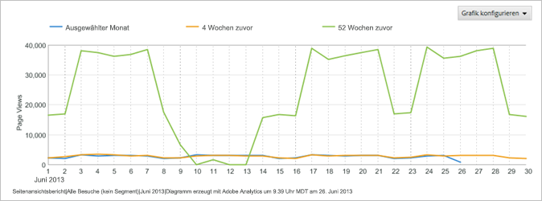

   **[!UICONTROL Glatte Linie]**: Sie verwenden diesen Diagrammtyp mit dem [!UICONTROL Video-Detailbericht]. Er zeigt die Anzahl oder Prozentwerte der Ansichten bestimmter Videosegmente. Wenn die Ansicht eines bestimmten Videosegments verstärkt auftaucht, deutet das darauf hin, dass die Besucher zurückgespult und sich den Abschnitt mehrere Male angesehen haben. Beim Einsatz von Prozentwerten stellen die Prozentangaben im Diagramm den Anteil aller angezeigten Segmente dar, nicht den prozentualen Anteil der Besucher, die das Segment anzeigten. Im Diagrammbeispiel beträgt die Summe aller Berichtsegmente 39. Die Anzahl der Ansichten des 0 bis 10 Sekunden langen Segments ist 10, demnach beträgt der Prozentsatz der Ansichten dieses Segments in etwa 26 Prozent.

   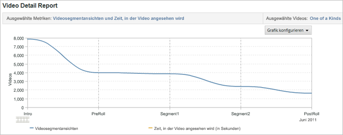

   **[!UICONTROL Bereich]**: Das Bereichsdiagramm entspricht dem Trendkantengraph, füllt jedoch den Bereich unter den Linien aus. Sie müssen einen Trendbericht zur Anzeige des Bereichsdiagramms einblenden.

   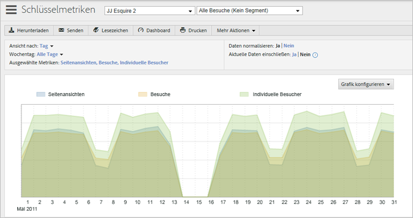

   **[!UICONTROL Gestapelter Bereich]**: Diagramme vom Typ „Gestapelter Bereich“ sind nützlich, wenn eine Trendbildung von einer Anzahl von Produkten oder Kampagnen über einen bestimmten Zeitraum vorgenommen wird. Wenn Sie zum Beispiel eine Trendbildung für die fünf obersten Produkte mit Angabe des Umsatzes durchführen, können Sie schnell erkennen, wie viel Gesamtumsatz diese Produkte über einen bestimmten Zeitraum einbringen. Die Anzeige kann weiter detailliert werden, indem Sie mithilfe eines Suchfilters bestimmte Produkte ein- bzw. ausschließen.

   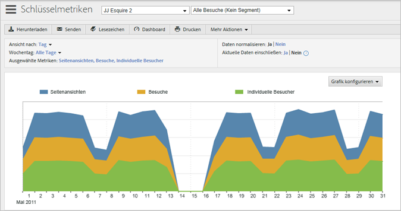

   **[!UICONTROL Vertikalbalken]**: Das Vertikalbalken-Diagramm zeigt die relativen Prozentwerte für die Berichtmetriken.

   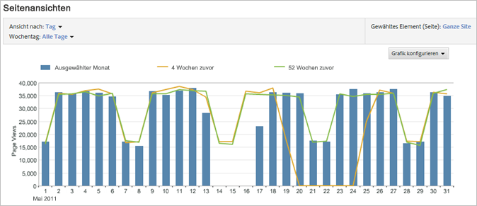

   **[!UICONTROL Stapel-Vertikalbalken]**: Durch das Stapeln ähnlicher Elemente erhalten Sie einen Überblick über den Gesamteinfluss eines Elements. In einem [!UICONTROL Kampagnenbericht] können Sie zum Beispiel ähnliche Erfolgsmetriken stapeln und sehen, welche Kampagne den meisten Gesamterfolg generiert. Eine Stapelung erleichtert die Suche nach Kampagnen, bei denen es sich nicht um Topleistungen in einer Metrik, jedoch um Topleistungen in einer Kombination von Metriken handelt.

   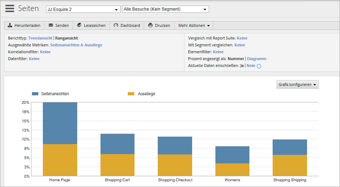

   **[!UICONTROL Horizontalbalken]**: Das Horizontalbalken-Diagramm ähnelt dem Vertikalbalken-Diagramm, die Spalten sind jedoch horizontal.

   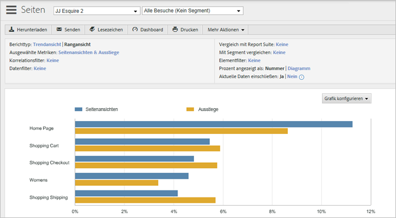

   **[!UICONTROL Stapel-Horizontalbalken]**: Das Stapel-Horizontalbalken-Diagramm ähnelt dem Vertikalbalken-Diagramm, die Spalten sind jedoch horizontal.

   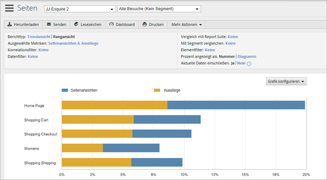

   **[!UICONTROL Kreis (Torten)]**: Das Tortendiagramm zeigt die oberen Metrik-Prozentwerte im Verhältnis zueinander und enthält den Prozentwert der ausgewählten Metriken im Verhältnis zum Gesamten. Sie können das Tortendiagramm für Rangberichte anzeigen.

   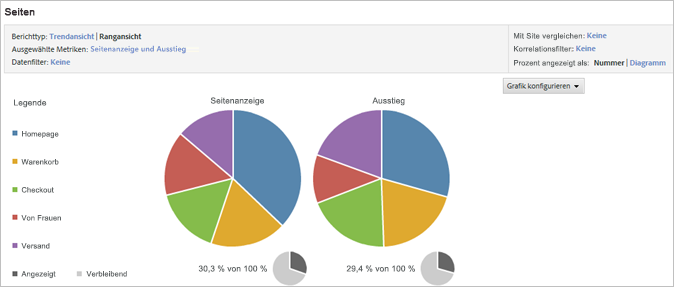

   **[!UICONTROL Streuung]**: Das Streuungsdiagramm enthält eine Streuungsanzeige der Metriken, die Sie im Verhältnis zueinander auswählen. Streuungsdiagramme ermöglichen Ihnen die Visualisierung von Daten in zwei Dimensionen, sodass Sie erkennen können, bei welchen Elementen es sich um Ausreißer handelt.

   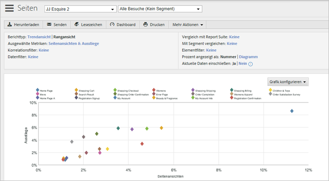

   **[!UICONTROL Punkt]**: Das Punktdiagramm enthält eine Streuungsanzeige der Metriken, die Sie im Verhältnis zueinander auswählen. Die Position der Punkte zeigt den Bezug der Metriken zueinander auf der horizontalen und vertikalen Achse, und die Größe der Punkte stellt die wichtigste Berichtsmetrik dar. Punktdiagramme ermöglichen Ihnen die Visualisierung von Daten in zwei Dimensionen, sodass Sie erkennen können, bei welchen Elementen es sich um Ausreißer handelt.

   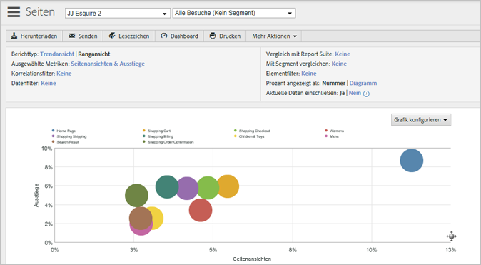
