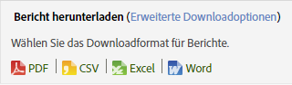

# Berichtsplanung und -verteilung

Informationen zum Planen, Herunterladen und Verteilen von Berichten.

## Report schedule and distribution {#concept_4EA333DFC7FD4E9CA086385A3DA10BE9}

Informationen zum Planen, Herunterladen und Verteilen von Berichten.

Verwenden Sie die Zeitplan- und Verteilungstools, um einen Bericht zur Bereitstellung in einer Adobe Analytics-Anwendung vorzumerken, den automatischen Versand von Dateien zu prüfen und die Bereitstellung abzuändern oder zu beenden.

Aufgrund der unterschiedlichen Verarbeitungsmechanismen und Plattformen gelten für die unterschiedlichen Arten von herunterladbaren und terminierten Berichten von Adobe Analytics verschiedene Einschränkungen hinsichtlich der Höchstzahl an Zeilen, die sie in einer einzigen Anforderung verarbeiten können. Hier sind die Grenzen für jede Art:

* Word, CSV, Excel, HTML und PDF: Dieselbe Anzahl an Zeilen, die im Bericht zu sehen sind. Standardmäßig ist die Grenze auf 50 Zeilen festgelegt. Sie können sie jedoch auch auf maximal 200 erhöhen. Detailbericht haben eine feste Höchstgrenze von 50 Zeilen.
* Datenextraktion: 50.000 Zeilen
* Data Warehouse: Unbegrenzt

Hinweis: Diese Einschränkungen gelten für individuelle terminierte und heruntergeladene Berichte. Dashboards sind auf den Platz beschränkt, der in einem Reportlet verfügbar ist.

## Bericht senden {#task_27642CD33D484FD0BF59EBD159EEF52C}

In diesen Schritten wird beschrieben, wie Sie Berichte in einer Vielzahl von Formaten herunterladen und per E-Mail versenden können und wie Sie die Bereitstellung von Berichten planen.

<!-- 

t_send_report.xml

 -->

1. Run a report, then click **[!UICONTROL More]** &gt; **[!UICONTROL Send]**.
1. Legen Sie die Auslieferungsoptionen fest:

   | Option | Beschreibung |
   |--- |--- |
   | Format | Wählen Sie PDF oder HTML aus. |
   | Senden an | Geben Sie eine E-Mail-Adresse an, an die der Bericht gesendet werden kann. |
   | Betreff | Betreff der E-Mail |
   | Zeitplan | Wählen Sie aus, ob Sie den Bericht sofort oder in einem anderen Intervall senden möchten. |

1. Click **[!UICONTROL Advanced Delivery Options]** to specify a delivery schedule.

   <table id="choicetable_2934E54FEE6E4D33B07EAC21F6DF628E"> 
   <thead class="chhead sthead"> 
   <th class="choptionhd"> Option </th> 
   <th class="chdeschd"> Beschreibung </th> 
   </thead> 
   <tr class="chrow strow"> 
   <td class="choption"><strong>Berichtsdateiname</strong></td> 
   <td class="chdesc stentry"> 
Gibt den Namen des Berichts an. Das Standardformat ist <code>&lt;Berichtname&gt; für &lt;Suite&gt; - &lt;Datumsbereich für Bericht&gt; </code>. 
 
Um einen benutzerspezifischen Namen festzulegen wählen Sie Benutzerdefiniert aus . 
 </td> 
   </tr> 
   <tr class="chrow strow"> 
   <td class="choption"><strong>Berichtsformat</strong></td> 
   <td class="chdesc stentry"> 
Ermöglicht die Auswahl des Formats für die Auslieferung (PDF, CSV, Excel, HTML, Word oder Mobil). Wenn Sie CSV auswählen können Sie auch die Kodierung für CSV auswählen: 
 
 
      <ul id="ul_4A2EB8D9512246589994052CF482BFD7"> 
      <li id="li_A4FC4D795A9D4F92AAB187ACDFBA180D"> 
  Shift-JIS: Japanische Zeichenkodierung. 
 </li> 
      <li id="li_405C7EC97F994D649A50F84466FADA3D"> 
  EUC-JP: Extended Unix Code, hauptsächlich für Japanisch, Koreanisch und vereinfachtes Chinesisch. 
 </li> 
      </ul> 
 </td> 
   </tr> 
   <tr class="chrow strow"> 
   <td class="choption"><strong>Berichtsinhalt</strong></td> 
   <td class="chdesc stentry"> 
  Anzahl der Zeilen in der Tabelle: Gibt die Anzahl der Zeilen an, die in der versendeten Tabelle des Berichts angezeigt werden sollen. 
 
  Sprache für Kopf- und Fußzeile: Gibt die Sprache der Kopfzeile und Fußzeile an. 
 
  Kommentare: Gibt den Text an, der zu Beginn des Berichts erscheint. 
 </td> 
   </tr> 
   <tr class="chrow strow"> 
   <td class="choption"><strong>Digitalsignaturdatei senden</strong></td> 
   <td class="chdesc stentry"> 
Wenn Sie einen Bericht anfordern, z. B. einen mit Lesezeichen versehenen Bericht oder Data Warehouse-Anforderungen, können Sie eine Datensignatur anfordern. Die digitale Signatur von Adobe schränkt nicht den Kreis der Personen ein, die Zugriff auf die Daten haben. Der Zweck der digitalen Signaturdatei (.sig) ist vielmehr, die Gültigkeit der gelieferten Berichtsdatei zu verifizieren. Mithilfe der Digitalsignatur kann der Berichtempfänger sichergehen, dass die Datei von Adobe stammt und nicht unbefugterweise verändert wurde. 
 </td> 
   </tr> 
   <tr class="chrow strow"> 
   <td class="choption"><strong>Berichtsziel</strong></td> 
   <td class="chdesc stentry"> 
  E-Mail: Hier können Sie die E-Mail-Adresseinstellungen, die Betreffzeile und Notizen konfigurieren. 
 
  FTP: Hier können Sie FTP-Einstellungen, z. B. Host, Port, Verzeichnis, Benutzername und Passwort, konfigurieren. 
 </td> 
   </tr> 
   </table>

1. Click **[!UICONTROL Scheduling Options]**.

   <table id="choicetable_589A39087F4C497D8913364FFF0125B7"> 
   <thead class="chhead sthead"> 
   <th class="choptionhd"> Option </th> 
   <th class="chdeschd"> Beschreibung </th> 
   </thead> 
   <tr class="chrow strow"> 
   <td class="choption"><strong>Bericht jetzt senden</strong></td> 
   <td class="chdesc stentry"> 
Sendet den Bericht sofort. 
 </td> 
   </tr> 
   <tr class="chrow strow"> 
   <td class="choption"><strong>Für später einplanen</strong></td> 
   <td class="chdesc stentry"> 
Zeigt Optionen für die Auswahl eines Zeitrahmens sowie Auslieferungsoptionen an. 
 </td> 
   </tr> 
   <tr class="chrow strow"> 
   <td class="choption"><strong>Berichtszeitraum</strong></td> 
   <td class="chdesc stentry"> 
  Fest: Verhindert, dass das Datum im Zeitverlauf angepasst wird. 
 
 Rollierend: Ermöglicht, dass das Datum im Zeitverlauf angepasst wird. Berücksichtigen Sie dabei: 
 
 
      <ul id="ul_5CDCCBEFEB364800A428614183A0E6A1"> 
      <li id="li_37B8F32A9E3B4979B5239A58F0C5A71C"> 
Wenn Sie das Start- und Enddatum rollierend einstellen und einen täglichen Bericht des Vortags auswählen, erhalten Sie jeden Tag eine E-Mail mit einem Bericht des vorherigen Tags. 
 </li> 
      <li id="li_83FFD2400C6A453783CDD9BB3B9BA3F9"> 
Wenn Sie das Startdatum fest und das Enddatum rollierend einstellen, erhalten Sie am ersten Tag einen Bericht für den vorherigen Tag. Am zweiten Tag erhalten Sie einen Bericht für die vorherigen zwei Tage, am dritten Tag einen Bericht für die vorherigen drei Tage usw. 
 </li> 
      <li id="li_28F8552D699841BC942058247D39DBB9"> 
Wenn Sie sowohl Start- als auch Enddatum fest einstellen, erhalten Sie jeden Tag einen identischen Bericht für die angegebenen Tage. 
 </li> 
      <li id="li_A594A6E2A4044ED6AC0A80F88EB203B3"> 
Die Auswahl eines rollierenden Start- und feststehenden Enddatums ist nicht möglich. 
 </li> 
      </ul> 
 </td> 
   </tr> 
   <tr class="chrow strow"> 
   <td class="choption"><strong>Auslieferungshäufigkeit</strong></td> 
   <td class="chdesc stentry"> 
  Stündlich: Die Auslieferung der E-Mail erfolgt jede Stunde, alle zwei Stunden oder in einem beliebigen anderen Stundenintervall. 
 
 Täglich: Die Auslieferung der E-Mail erfolgt jeden Tag, jeden zweiten Tag, alle drei Tage oder in einem beliebigen anderen Tagesintervall. Die Auslieferung kann auch an allen Wochentagen erfolgen. 
 
 Wöchentlich: Die Auslieferung der E-Mail erfolgt jede Woche, jede zweite Woche, alle drei Wochen oder in einem beliebigen anderen Wochenintervall. Sie können auch den Wochentag festlegen, an dem die Auslieferung erfolgen soll. 
 
  Monatlich: Gibt das Intervall in der Anzahl der Monate an. Sie können auch einen bestimmten Tag im Monat bzw. einen Tag in einer bestimmten Woche des Monats für die Auslieferung festlegen. 
 
  Jährlich: Gibt an, an welchem Tag des Jahres die Auslieferung des Berichts erfolgt. Sie können auch einen bestimmten Wochentag in einer beliebigen Woche des Jahres für die Auslieferung festlegen. 
 
  Tageszeit: Bezieht sich auf die Zeitzone, die für die jeweilige Report Suite gilt. 
 </td> 
   </tr> 
   <tr class="chrow strow"> 
   <td class="choption"><strong>Optionen für das Ende der Auslieferung</strong></td> 
   <td class="chdesc stentry"> 
  Niemals beenden: Gibt kein Ende an. 
 
  Nach &lt;Wert&gt; Vorfällen beenden: Gibt die Anzahl der Vorfälle vor Beendigung der Auslieferung an. 
 
  Beenden am: Hier können Sie ein bestimmtes Datum angeben. 
 
Sollen die Daten am selben Tag verarbeitet werden wie die Berichtsdaten, enthält der Bericht nur Daten, die zu dem Zeitpunkt in der Datenbank vorliegen, zu dem der Bericht gesendet wird. Da die Verarbeitung der Daten eines Tages bis zu 24 Stunden dauern kann, stehen vollständige Daten zum Zeitpunkt des Berichtversands eventuell nicht zur Verfügung. Um vollständige Daten zu erhalten, sollten Sie die Verarbeitungszeit stets auf 24 Stunden nach Ende des Berichtzeitraums einstellen. 
 </td> 
   </tr> 
   </table>

## Bericht drucken {#task_0F7CF6D6ED54462CAE4A793E271AF7E5}

In diesen Schritten wird beschrieben, wie Sie einen Bericht drucken.

<!-- 

t_reports_print.xml

 -->

1. Einen Bericht ausführen.
1. Click **[!UICONTROL More]** &gt; **[!UICONTROL Print]**.  

## Einen Bericht mit einfachen Optionen herunterladen {#task_43660107A1C9485D92981CD75B562577}

Sie können detaillierte Informationen zu einem bestimmten Bericht in den Exportformaten PDF, CSV, Excel oder als Rohdaten herunterladen.

<!-- 

t_download-report.xml

 -->

1. In **Analytics** &gt; **[!UICONTROL Berichte]** können Sie einen Bericht zur Ansicht öffnen.
1. Klicken Sie auf **[!UICONTROL Herunterladen]**.

   

1. Wählen Sie das gewünschte Format für den Bericht aus: 

   * **[!UICONTROL PDF]**: Legt fest, dass der Bericht im Adobe PDF-Format heruntergeladen wird, sodass Sie ihn an andere weitergeben können, unabhängig davon, welches Computersystem der Empfänger verwendet.
   * **[!UICONTROL CSV]**: Legt fest, dass der Bericht im [!DNL .csv] Format (kommagetrennte Werte) heruntergeladen wird.
   * **[!UICONTROL Excel]**: Legt fest, dass der Bericht im Microsoft Excel-Format heruntergeladen wird, sodass Sie ihn an andere weitergeben können, die den Bericht dann in einem Tabellenkalkulationsprogramm öffnen können.
   * **[!UICONTROL Word]**: Legt fest, dass der Bericht im Microsoft Word-Format heruntergeladen wird.
   >[!NOTE]
   >
   >Wenn Sie einen der Rohdatenexportformate verwenden, um einen Bericht herunterzuladen und der Seitenname leer ist, hatte Adobe Analytics wahrscheinlich nicht genug Zeit, die Daten zu verarbeiten. Laden Sie den Bericht später herunter.

## Terminierte Berichte verwalten {#task_C17677C543454FF2B06D10EA5652DFBC}

Informationen über die Verwaltung von terminierten Berichten

<!-- 

t_schedule_manage.xml

 -->

Im [!UICONTROL Manager für geplante Berichte] können regelmäßige Berichtauslieferungen bearbeitet und gelöscht werden. Richten Sie Auslieferungspläne ein, um Ihre Berichte per E-Mail oder FTP an bestimmte Adressen zu senden. Sie können diese Pläne zum automatischen Versand der Berichte in bestimmten, befristeten oder unbefristeten Intervallen konfigurieren oder die Auslieferung eines sich wiederholenden Berichts stoppen.

Im [!UICONTROL „Manager für geplante Berichte“] werden die Elemente angezeigt, die von einem bestimmten Benutzer erstellt wurden. Wenn das Benutzerkonto in der Anwendung deaktiviert wird, werden alle geplanten Auslieferungen gestoppt.

1. To access the manager, click **[!UICONTROL Analytics]** &gt; **[!UICONTROL Components]** &gt; **[!UICONTROL Scheduled Reports]**.

## Berichtlink freigeben {#task_9711DDE9E140451B8C914EC5513E21EC}

In diesen Schritten wird beschrieben, wie Sie einen Bericht freigeben, indem Sie einen Link (URL) für den Bericht generieren, der an andere Benutzer gesendet werden kann.

<!-- 

t_reports_share_link.xml

 -->

Wenn der Empfänger auf den Link klickt, fordert das System zur Eingabe der Anmeldeangaben (Firmenname, Benutzername und Passwort) auf. Nach der Anmeldung wird dem Empfänger der vom Verfasser erstellte Bericht angezeigt. Dabei gelten die standardmäßigen Zugriffsrechte.

**So geben Sie einen Bericht-Link frei**

1. Einen Bericht ausführen.
1. Click **[!UICONTROL More]** &gt; **[!UICONTROL Link to This Report]**.

## Abmeldung von terminierten Berichten {#concept_6B48360F935740B6851BA85D32DEF637}

Sie können sich von terminierten Berichten abmelden. Sie erhalten dann den Bericht nicht mehr; selbst, wenn Ihr Benutzername erneut zum terminierten Bericht hinzugefügt wird.

<!-- 

t_schedule_unsubscribe.xml

 -->

>[!IMPORTANT]
>
>Damit Sie den Bericht erneut erhalten, muss ein neuer Zeitplan erstellt werden.

So melden Sie sich von einem terminierten Bericht ab:

1. Suchen Sie die E-Mail mit dem Link zu dem Bericht, von dem Sie sich abmelden möchten.

   

1. Click the **[!UICONTROL click here]** link next to **[!UICONTROL To cancel automatic delivery of this report]**.

1. Bestätigen Sie, dass Sie keine weitere Zustellung des Berichts wünschen.

   >[!NOTE]
   >
   >Dieser Arbeitsablauf ist gleich, unabhängig davon, ob Sie der Planer oder der Empfänger des Berichts sind.

Die Abmeldung von einem Bericht bricht den terminierten Bericht nicht ab.

Um einen terminierten Bericht abzubrechen, rufen Sie den Zeitplan-Manager auf und klicken auf das rote X neben dem Berichtsnamen. [Mehr …](../../analyze/reports-analytics/scheduling.md#task_C17677C543454FF2B06D10EA5652DFBC)
