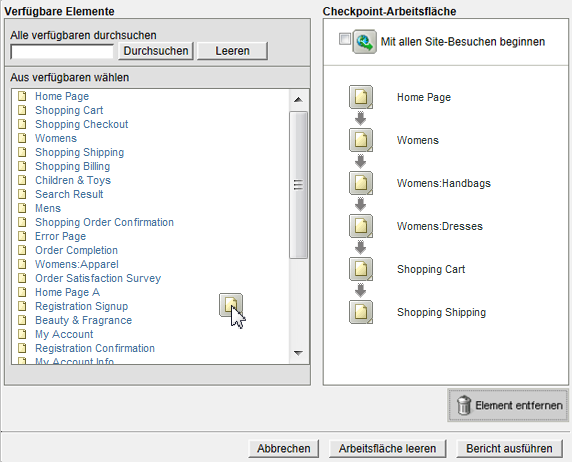
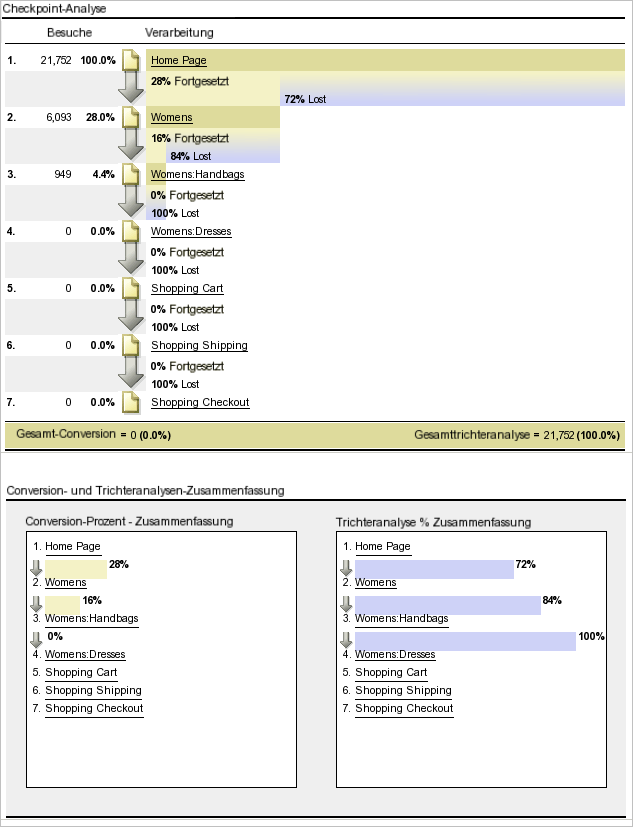
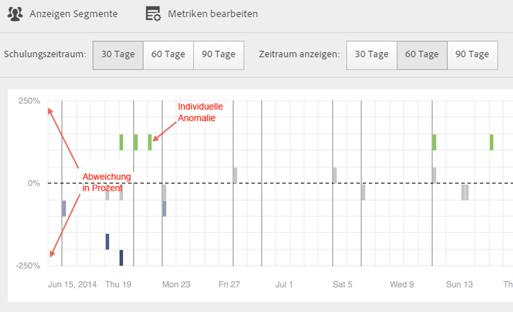
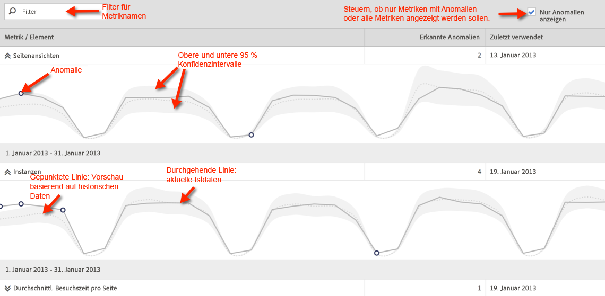
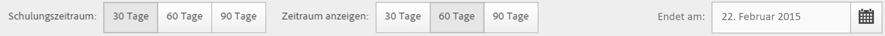
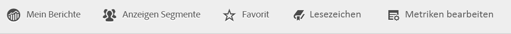
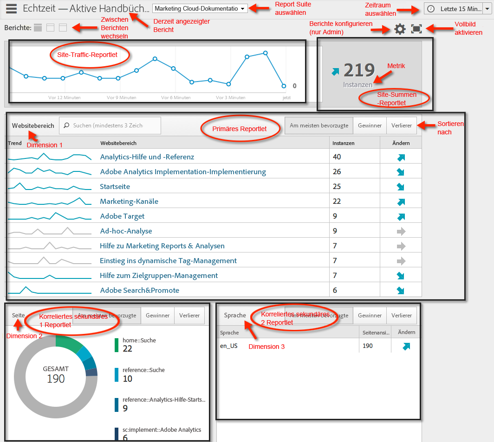
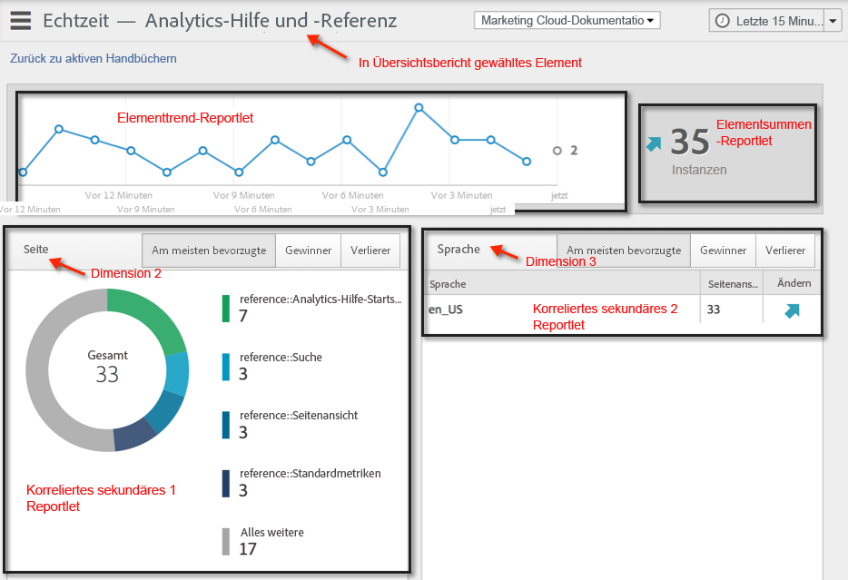

# Verschiedene Berichtstypen ausführen

Schritte zum Ausführen der verschiedenen Berichtstypen.

## Rangbericht ausführen {#task_C570BA4A213F4F2EB7B30E012934BE7D}

In Rangberichten zeigt die Tabelle die Rangordnung der Berichtsseiten als Zahl oder Prozentwert im Verhältnis zur Metrik an. Bei Rangberichten können mehrere Metriken in einem Bericht angezeigt werden.

<!-- 

t_reports_ranked.xml

 -->

1. Erstellen Sie einen Bericht, wie zum Beispiel einen [!UICONTROL Seitenbericht] (**[!UICONTROL Berichte]** > **[!UICONTROL Site-Content]** > **[!UICONTROL Seiten]**).
1. Klicken Sie im Berichtkopf auf **[!UICONTROL Rangansicht]**.
1. Klicken Sie auf die Spaltenüberschrift in der Tabelle, um den Bericht nach Rang zu ordnen.

   Rangberichte können bis zu 200 in der Tabelle aufgelistete Elemente enthalten (wie zum Beispiel Produkte, Kategorien, Webseiten usw.) und zehn Metriken (Umsatz, Bestellungen, Ansichten usw.).

## Trendbericht ausführen {#task_F03B4E760B9E4EA29FC3F654E6316887}

Trendberichte zeigen Metriken im Zeitverlauf an. Sie können diesen Berichtstyp verwenden, um die Leistung eines Segments von einem Zeitraum zum nächsten anzuzeigen.

<!-- 

t_reports_trended.xml

 -->

Die meisten Konversions- und Traffic-Berichte verfügen über eine Trendanzeige. Mit dem [!UICONTROL Kalender] lassen sich Verbesserungen aus allen Zeitraumunterteilungen anzeigen, einschließlich Tage eines Monats, Wochen eines Jahres, Wochen eines Quartals, Monate eines Jahres usw. Trendberichte zeigen Trends einer Metrik (Umsatz, Bestellungen, Ansichten usw.) für bis zu fünf Elemente (Produkte, Kategorien, Webseiten usw.) an.

**So führen Sie einen Trendbericht aus**

1. Führen Sie einen Konversions- oder Traffic-Bericht aus, wie zum Beispiel **[!UICONTROL Berichte]** > **[!UICONTROL Site-Content]** > **[!UICONTROL Seiten]**.
1. Klicken Sie unter **[!UICONTROL Berichttyp]** auf **[!UICONTROL Trendansicht]**.

## Konversionstrichterbericht ausführen {#task_B926A74AA6A641138C2986C1635120CB}

Konversionstrichterberichte geben Auskunft über den Prozentsatz an Besuchern, die einen bestimmten Satz an Ereignissen durchlaufen haben, um eine bestimmte Aktion auszuführen. So ermitteln Sie beispielsweise, wie viele Besucher während des Besuchs Ihrer Webseite Artikel in den Warenkorb gelegt und letztlich einen Artikel gekauft haben. Dieser Bericht zeigt auch die Anzahl der Besucher an, die den Vorgang nicht beendet haben.

<!-- 

t_reports_conversion_funnel.xml

 -->

Um diesen Bericht auszuführen, wählen Sie einen Bericht aus, z. B. einen Seitenbericht (**[!UICONTROL Berichte]** > **[!UICONTROL Kampagnen]** > **[!UICONTROL Trackingcode]** > **[!UICONTROL Kampagnen-Konversionstrichter]**).

Siehe [Konversionsberichte](https://docs.adobe.com/content/help/de-DE/analytics/components/dimensions/evar.html), um eine Beschreibung anzuzeigen.

## Fallout-Bericht ausführen {#task_8FD97C8260464F9DA731A93DB8F80184}

Der [!UICONTROL Fallout-Bericht] zeigt die Anzahl der Besucher an, die eine zuvor festgelegte Folge von Seiten besucht haben. Außerdem werden hier die Konversions- und Trichteranalyseraten jedes Schritts angezeigt.

<!-- 

t_reports_fallout.xml

 -->

Sehen Sie sich die neue Anzeige [Fallout-Analyse](https://docs.adobe.com/content/help/de-DE/analytics/analyze/analysis-workspace/visualizations/fallout/fallout-flow.html) in Analysis Workspace an.

1. Klicken Sie in [!UICONTROL Adobe Analytics] auf **[!UICONTROL Berichte]** > **[!UICONTROL Pfade]** > **[!UICONTROL Seiten]** > **[!UICONTROL Trichteranalyse]**.
1. Klicken Sie auf der Seite [!UICONTROL Fallout-Bericht] auf **[!UICONTROL Fallout-Bericht-Report Builder starten]**.

   

1. Legen Sie auf der Seite [!UICONTROL Checkpoints definieren] die Checkpoints fest, die Sie für den Bericht verwenden möchten.
1. Klicken Sie auf **[!UICONTROL Bericht ausführen]**.

   

>[!MORELIKETHIS]
>
>* [Fallout-Bericht – Beschreibung](https://docs.adobe.com/content/help/de-DE/analytics/analyze/analysis-workspace/visualizations/fallout/fallout-flow.html)

## Seitenflussbericht ausführen {#task_133E8B87C3F04DA0A42D10CBA499305B}

Seitenflussberichte zeigen die Reihenfolge an, in der Ihre Besucher auf Seiten zugreifen und auf Ihrer Website navigieren. Dieser Bericht bietet Antworten

Sehen Sie sich die neue [Flussvisualisierung](https://docs.adobe.com/content/help/en/analytics/analyze/analysis-workspace/visualizations/fallout/fallout-flow.html) in Analysis Workspace an.

Führen Sie einen [Pfadbericht](https://docs.adobe.com/content/help/de-DE/analytics/analyze/analysis-workspace/visualizations/flow/flow.html) aus.

Klicken Sie zum Beispiel auf **[!UICONTROL Berichte]** > **[!UICONTROL Pfade]** > **[!UICONTROL Seiten]** > **[!UICONTROL Nächster Seitenfluss]**.

Sie lesen diesen Bericht von links nach rechts, beginnend mit der ausgewählten Seite. Die nach der ausgewählten Seite angezeigten Seiten werden als Zweig angezeigt, der sich nach rechts erstreckt.

Der Prozentsatz, zu dem jede nachfolgende Seite angezeigt wurde, ist neben dem Seitennamen angegeben. Die Breite der Linie, die mit jeder nächsten Seite verbunden ist, stellt diesen relativen Prozentwert dar.

**[!UICONTROL Pfadansichten]**: Zeigt die Häufigkeit der Anzeige einer Seite an, wenn diese auf die angezeigten Pfade beschränkt sind.

So kann die Seite der Datenschutzregeln z. B. insgesamt 10.000 Mal angezeigt worden sein, aber nur 500 dieser Seitenansichten erfolgten unmittelbar nach der Homepage. Aus diesem Grunde wird der Begriff Pfadansicht verwendet.

Gleichermaßen wird der prozentuale Anteil durch die relative Breite der Linie dargestellt. Standardmäßig zeigt dieser Bericht fünf Zweitstufenverzweigungen und fünf Drittstufenverzweigungen an. Sie können die Anzahl der Verzweigungen erweitern, um bis zu zehn Zweitstufenverzweigungen und fünf Drittstufenverzweigungen anzuzeigen. Dadurch dehnen Sie die Höhe des Berichts aus und müssen wahrscheinlich scrollen, um das ganze Diagramm anzuzeigen.

## Trichterbericht ausführen {#task_2BBF6FACD48F479E8B2EE458919941CB}

Sie können Erfolgsereignisse auswählen und diese einem [!UICONTROL „Einkaufskonversionstrichter“]- oder [!UICONTROL „Produktkonversionstrichter“]-Bericht hinzufügen.

<!-- 

t_reports_funnel.xml

 -->

1. Klicken Sie auf **[!UICONTROL Berichte]** > **[!UICONTROL Produkte]** > [Produkt-Konversionstrichter](https://docs.adobe.com/content/help/de-DE/analytics/analyze/reports-analytics/t-running-report-types.html).

## Marketingkanalbericht ausführen {#task_64ADED5CC75248319E06E3E029B47F78}

Marketingkanalberichte geben einen Überblick über die Zuordnung der First Touch- und Last Touch-Kanäle mit standardmäßigen Berichterstellungsmetriken wie Umsatz, Bestellungen und Kosten. Diese Berichte ermöglichen Ihnen eine Analyse der Umsätze der einzelnen Kanäle.

<!-- 

t_reports_marketing_channel.xml

 -->

Weitere Informationen finden Sie im [Marketingkanal](/help/components/c-marketing-channels/analyze-mc.md)-Hilfesystem.

## Anomalieerkennungsbericht ausführen {#task_4808C96327354D789C075823F5C3A049}

Beschreibt, wie Sie die Diagramme für die Zusammenfassung und individuelle Metriken bei der Anomalieerkennung interpretieren.

<!-- 

t_anomaly_view.xml

 -->

Sehen Sie sich die neuen Funktionen für [Anomalieerkennung und Beitragsanalyse](https://docs.adobe.com/content/help/de-DE/analytics/analyze/analysis-workspace/virtual-analyst/anomaly-detection/anomaly-detection.html) in Analysis Workspace an!

**[!UICONTROL Berichte]** > **[!UICONTROL Site-Metriken]** > **[!UICONTROL Anomalieerkennung]**.

>[!NOTE]
>
>Die Anomalieerkennung können Sie auch aus Projekten in Analysis Workspace ausführen. [Mehr …](https://docs.adobe.com/content/help/en/analytics/analyze/analysis-workspace/virtual-analyst/anomaly-detection/anomaly-detection.html)

Informationen zum Einrichten der Anomalieerkennung finden Sie im [Referenzhandbuch](https://docs.adobe.com/content/help/de-DE/analytics/analyze/reports-analytics/getting-started.html#Setting_up_Anomaly_Detection).

Bei der Anomalieerkennung werden zwei Diagrammtypen angezeigt: Ein Zusammenfassungsdiagramm und Diagramme für individuelle Metriken. Diagramme für individuelle Metriken werden nur angezeigt, wenn mindestens eine Anomalie für diese Metrik erkannt wurde.

<table id="table_88163CD8FC164342855D90D01F9C581A"> 
 <thead> 
  <tr> 
   <th colname="col1" class="entry"> 
Diagrammtyp 
 </th> 
   <th colname="col2" class="entry"> 
Funktion 
 </th> 
  </tr> 
 </thead>
 <tbody> 
  <tr> 
   <td colname="col1"> 
Zusammenfassungsdiagramm 
 
 
 </td> 
   <td colname="col2"> 
 
     <ul id="ul_D26DA3024CD7468291369F549557B28A"> 
      <li id="li_1C22B6E02FFB479FB71EFAD89EB37A4E">Jedes Kästchen steht für eine Anomalie (pro Tag verfolgt), die einer Metrik unten entspricht. </li> 
      <li id="li_8FC587D3FF4E452D83263CC7A10B6675">Grüne Kästchen geben Anomalien oberhalb der Trendlinie und blaue Kästchen Anomalien unterhalb der Trendlinie an. </li> 
      <li id="li_25135AB691BF443599AF2A3A60E2E71A">Gibt das Ausmaß der Anomalie an: Je größer die Anomalie, desto dunkler die Farbe des Datenpunktes und desto größer der Abstand zur Trendlinie. </li> 
      <li id="li_0C42AFA8897D420D8AB1A5D0F65B3B3A">Durch Klicken auf individuelle Anomalien wird das individuelle Metrikdiagramm dieser Anomalie (unterhalb des Zusammenfassungsdiagramms) nach oben geholt. </li> 
      <li id="li_85C0F426952547B5A75D6BD31DE19CA5">Die Abweichungsprozentwerte (links neben dem Diagramm) werden wie folgt berechnet: 
       <ul id="ul_BEC0A88BFFAC4CF78BC9885FEB749694"> 
        <li id="li_1BAB2F50482745B69937DFAF1E09982E">Wenn die oberen Grenzen und der erwartete Wert identisch sind, beträgt die Abweichung in Prozent 100 % </li> 
        <li id="li_CA48064F5788448C8646CCE196161237">Andernfalls ist die Abweichung in Prozent ((Istwert – oberer Grenzwert) / (oberer Grenzwert – erwarteter Wert)) * 100 </li> 
        <li id="li_4090357A0D214BC7B1C3DE0615875554">Wenn die unteren Grenzen und der erwartete Wert identisch sind, beträgt die Abweichung in Prozent –100% </li> 
        <li id="li_EF694E1A4E874ECD94E1E8F7302E494F">Andernfalls ist die Abweichung in Prozent ((unterer Grenzwert – Istwert) / (erwarteter Wert – unterer Grenzwert)) * –100 </li> 
       </ul> </li> 
      <li id="li_5C05EF7023484CC993E96D63E842B65C">Durch Klicken auf Anzeigen Segmente wird die Segmentschiene eingeblendet, die es Ihnen ermöglicht, Segmente auf einen Anomalieerkennungsbericht anzuwenden. <a href="https://docs.adobe.com/content/help/en/analytics/components/segmentation/seg-home.html"  > Weitere Informationen</a> zur Segmentierung. </li> 
      <li id="li_1B41CABF13D1407886C68EE3BC201E60">Durch Klicken auf Metriken bearbeiten können Sie Metriken auswählen und die Auswahl für Metriken aufheben, für die Sie Anomalien erkennen möchten. </li> 
     </ul> 
 </td> 
  </tr> 
  <tr> 
   <td colname="col1"> 
Diagramm für individuelle Metrik 
 
 
 </td> 
   <td colname="col2"> 
 
     <ul id="ul_739C5687013743A29B63089FDA763F45"> 
      <li id="li_456A0BDA4D4E46CE9CC1C3DBAA1E2220">Zeigt Anomaliedatenpunkte für individuelle Trendmetriken (einschließlich berechneter Metriken) als Punkte an. </li> 
      <li id="li_89FD847C65F04F48BCA7CD38D0EC51CD">Zeigt die aktuellste Anomalie oben an und sortiert sekundär nach Anzahl der Anomalien. </li> 
      <li id="li_98B97A9706DE4455B8D8850904CBDE03">Zeigt eine durchgehende Linie an, um die derzeit erfassten Istdaten anzugeben. Diese werden mit der Vorschau und der Fehlertoleranz verglichen, um zu bestimmen, ob Anomaliedatenpunkte vorliegen. </li> 
      <li id="li_0EEA38DDDC344BF3879430E67D74EB72">Zeigt eine gepunktete Linie an, die eine Vorschau basierend auf historischen Daten (also dem Schulungszeitraum) darstellt. </li> 
      <li id="li_035BD2725D004AEDB630BF8DFF4DA4F3">Zeigt die oberen und unteren 95 % Konfidenzintervalle/-grenzen grau schattiert an. </li> 
      <li id="li_021A3D1F2EDB4319B9B39620EF1C038A">Sie können individuelle Berichte aus- und einblenden, indem Sie neben dem Metriknamen auf die doppelten Pfeile nach oben bzw. unten klicken. </li> 
      <li id="li_722E4B9FC21047AC96D7B143197E293D">Ändert die Anzeigereihenfolge der Metrikdiagramme aufgrund von Drilldowns im Übersichtsbericht (siehe oben). </li> 
      <li id="li_A2441169B185475AA68A64F81E6E40B8">Sie können Diagramme anhand von Suchbegriffen, wie „Seite“ für alle seitenbezogenen Metriken, filtern. </li> 
      <li id="li_F1BBBFCA8E2A43C29658E4FCAA36C904">Sie können alle definierten Metriken oder nur diejenigen mit Anomalien anzeigen. </li> 
     </ul> 
 </td> 
  </tr> 
 </tbody> 
</table>

## Anomalieerkennung einrichten {#task_AF347B34F56E44A6AE70E019B6EB2F08}

Schritte zur Auswahl von Report Suites, Metriken und Schulungs-/Anzeigezeiträumen für die Anomalieerkennung.

<!-- 

t_anomaly_config.xml

 -->

Sie richten die Anomalieerkennung unabhängig für jede Report Suite ein.

1. Gehen Sie zu **[!UICONTROL Analysen > Berichte > Site-Metriken > Anomalieerkennung]**.
1. Wählen Sie die Report Suite, für die Sie die tägliche Anomalieerkennung verfolgen möchten. Um eine Liste der Report Suites anzuzeigen, klicken Sie auf das Dropdown-Menü der Report Suite-Auswahl.
1. Um die Metriken auszuwählen und/oder gefilterte Metriken zu definieren, klicken Sie oben rechts im Bildschirm auf **[!UICONTROL Metriken bearbeiten]**:  .

   Sie können Metriken aus der Liste mit allen Metriken (einschließlich berechneter Metriken) oder aus einer Liste mit verfolgten Metriken auswählen. Sie können auch nach bestimmten Begriffen filtern, um die Liste einzugrenzen. 1. Sobald der Bericht generiert wurde, definieren Sie den **[!UICONTROL Schulungszeitraum]** und den **[!UICONTROL Ansichtszeitraum]** zur Anomalieerkennung. (Den Schulungszeitraum kann man sich als „Lernzeitraum“ für den Algorithmus vorstellen.)

   

   Bedenken Sie Folgendes:

* Der Schulungszeitraum endet direkt vor Beginn des Anzeigezeitraums.
* Der Standardwert für die beiden Zeiträume beträgt 30 Tage. Sie können sie aber auf 60 oder 90 Tage verlängern.
* Wenn Sie den Schulungszeitraum verlängern, erhalten Ihre Daten mehr Kontext, und die Größe einer Anomalie kann reduziert werden.

   Der Metrikbericht für die Anomalieerkennung wird bei jeder Änderung eines Parameters aktualisiert.
1. Optional: Wenden Sie Segmente auf den Bericht an, indem Sie auf **[!UICONTROL Segmente anzeigen]** klicken und ein oder mehrere vorhandene Segmente auswählen oder ein neues Segment erstellen und dieses anwenden.

   

   Weitere Informationen zum Erstellen und Verwalten von Segmenten erhalten Sie im [Leitfaden zur Analysesegmentierung](https://docs.adobe.com/content/help/de-DE/analytics/components/segmentation/seg-home.html). 1. (Optional) Fügen Sie den Bericht zu den Favoriten hinzu oder setzen Sie ein Lesezeichen.
1. (Optional) Ändern Sie das Enddatum des Anzeigezeitraums. Der Standardwert ist „Gestern“.
1. Sie können den Bericht nun interpretieren. [Anzeigen von Diagrammen zur Anomalieerkennung](/help/analyze/reports-analytics/t-running-report-types.md#task_4808C96327354D789C075823F5C3A049).

## Echtzeitbericht ausführen {#task_5D25929C918E40B18965222FA94176B0}

Beschreibt, wie Sie Echtzeitberichte anzeigen und interpretieren.

<!-- 

reports_realtime.xml

 -->

**[!UICONTROL Berichte > Site-Metriken > Echtzeit]**.

Bei der Echtzeitberichterstattung stehen zwei Hauptberichte zur Verfügung: ein Übersichtsbericht und ein Detailbericht. Sie bestehen jeweils aus mehreren Reportlets.

Informationen zum Konfigurieren von Echtzeitberichten finden Sie im [Analytics-Referenzhandbuch](https://docs.adobe.com/content/help/de-DE/analytics/landing/home.html#RealTime_Reports_Configuration).

1. Sehen Sie sich den **[!UICONTROL Übersichtsbericht]** und dessen Komponenten an:  

   <table id="choicetable_8586BECF55E843B2B5CD41205567EA32"> 
   <thead class="chhead sthead"> 
   <th class="choptionhd"> Benutzeroberflächenkomponente </th> 
   <th class="chdeschd"> Beschreibung </th> 
   </thead> 
   <tr class="chrow strow"> 
   <td class="choption"><strong>Report Suite auswählen</strong></td> 
   <td class="chdesc stentry"> Zeigt die Report Suite an, die von diesem Echtzeitbericht behandelt wird. Informationen zum Ändern der Report Suite finden Sie unter <a href="https://docs.adobe.com/content/help/de-DE/analytics/admin/admin-tools/real-time-reports/t-realtime-admin.html"  >Konfiguration von Echtzeitberichten </a>. </td> 
   </tr> 
   <tr class="chrow strow"> 
   <td class="choption"><strong>Zwischen Berichten wechseln</strong></td> 
   <td class="chdesc stentry"> Damit können Sie zwischen den eingerichteten Berichten (höchstens 3) wechseln. </td> 
   </tr> 
   <tr class="chrow strow"> 
   <td class="choption"><strong>Zeitraum wählen</strong></td> 
   <td class="chdesc stentry"> Damit können Sie den allgemeinen Zeitraum für alle Reportlets im Bericht wählen. </td> 
   </tr> 
   <tr class="chrow strow"> 
   <td class="choption"><strong>Berichte konfigurieren</strong></td> 
   <td class="chdesc stentry"> Dieser Zahnradsymbol-Link ist nur sichtbar, wenn Sie über Admin-Rechte verfügen. Wenn Sie darauf klicken, gelangen Sie zum Report Suite-Manager unter Admin Tools &gt; Report Suites &gt; Einstellungen bearbeiten &gt; Echtzeit  . </td> 
   </tr> 
   <tr class="chrow strow"> 
   <td class="choption"><strong>Vollbildansicht</strong></td> 
   <td class="chdesc stentry"> Das Symbol für die Vollbildansicht ist nur sichtbar, wenn Ihr Bildschirm auf ein bestimmtes Seitenverhältnis (entweder 16:9 oder 16:10) eingestellt ist UND wenn Ihr Browser die Vollbildansicht unterstützt. Beachten Sie, dass Sie keine Aktionen im Bildschirm ausführen können, während der Vollbildmodus aktiviert ist (drücken Sie Esc, um diesen zu verlassen). Im Vollbildmodus kommt es zu keinen Timeouts. </td> 
   </tr> 
   <tr class="chrow strow"> 
   <td class="choption"><strong>Site-Traffic-Bericht</strong></td> 
   <td class="chdesc stentry"> Die Daten der blauen Trendlinie zeigen den gesamten Datenverkehr für die ganze Site an. Die X-Achse verwendet wörtliche Beschriftungen (vor 15 Minuten, vor 10 Minuten) mit Ausnahme des aktuellen Wertes, der als Echtzeitausdruck angezeigt wird. </td> 
   </tr> 
   <tr class="chrow strow"> 
   <td class="choption"><strong>Site-Summen-Reportlet</strong></td> 
   <td class="chdesc stentry"> Zeigt die Site-Gesamtangaben für die gewählte Metrik des Echtzeitberichts für die letzten N Minuten an. „N“ kann über die Zeitraumauswahl konfiguriert werden. 
Die Farbe und Richtung des Pfeils basieren auf dem folgenden Algorithmus: 
      <ul id="ul_9F40CEA33798467393CB1266BB36D500"> 
      <li id="li_CCD01A44F912487DA5681EA50113643C">Erheblicher Gewinn (Pfeil nach oben): &gt; 100 % </li> 
      <li id="li_7402491A9A614851B7F2AE0C77BD9A97">Gewinn (Pfeil nach rechts oben): zwischen 5 % und 100 % </li> 
      <li id="li_BCA79C08B5714D4B9315068112C66107"> Flach (Pfeil nach rechts): zwischen 5 % und -5 % </li> 
      <li id="li_234ECBD7D83A4AE680E4A70BF288681F"> Verlust (Pfeil nach rechts unten): zwischen -5 % und -100 % </li> 
      <li id="li_10C5EA8803604C1CA714D3DB27478B31"> Erheblicher Verlust (Pfeil nach unten): &lt; -100 % </li> 
      </ul> 
 
Wenn die Site-Gesamtangaben in „Instanzen“ angegeben werden, spiegeln diese Instanzen die Dimension im primären Reportlet wider. Wenn ein instanzspezifischer Name vorhanden ist (wie „Seitenansichten“), wird dieser Name in der Site-Gesamtangabe angegeben. 
 </td> 
   </tr> 
   <tr class="chrow strow"> 
   <td class="choption"><strong>Primäres Reportlet</strong></td> 
   <td class="chdesc stentry"> Bericht für die primäre Dimension des Echtzeitberichts und für die zugehörige Metrik. Stellt eine Trendlinie für dieses Element für den gewählten Zeitraum dar. Die Metrikgesamtangabe stellt die Summe für die vollständige Trendlinie dar. Mit dem Pfeil wird angegeben, ob das Element erheblichen Gewinn, Gewinn, keine Veränderung, Verlust oder erheblichen Verlust aufweist. </td> 
   </tr> 
   <tr class="chrow strow"> 
   <td class="choption"><strong>Suchdialogfeld</strong></td> 
   <td class="chdesc stentry"> Die Suche wirkt sich auf alle Reportlets aus. Die Suche wird beibehalten, während Sie den Bericht anzeigen. </td> 
   </tr> 
   <tr class="chrow strow"> 
   <td class="choption"><strong>Sortieren nach... Beliebteste/Gewinner/Verlierer</strong></td> 
   <td class="chdesc stentry"> Sie können zwischen der Sortierung nach Beliebteste (Standard), Gewinner (Dimensionen mit dem größten Wachstum) und Verlierer (Dimension mit einem Trend nach unten) umschalten. 
Hier finden Sie die Formel, mit der Gewinner oder Verlierer bestimmt werden: Das früheste Beispiel wird über eine einfache Berechnung der Prozentsatzänderung mit dem vorletzten Beispiel verglichen. Wenn also „Letzte 15 Minuten“ gewählt ist und n die aktuelle Minute darstellt, wird n-1 mit n-15 verglichen. Eine Gewichtung wird derzeit dabei nicht vorgenommen. Die aktuelle Minute wird ignoriert, da sie nicht vollständig ist und wahrscheinlich zu einer falschen Prozentsatzänderung führen würde. 
 
Diese Formel ist bei allen im Echtzeitbericht verwendeten Metriken konsistent. 
 </td> 
   </tr> 
   <tr class="chrow strow"> 
   <td class="choption"><strong>Sekundäres 1 Reportlet</strong></td> 
   <td class="chdesc stentry"> Stellt Echtzeitberichte für die Dimension des zweiten bereitgestellten Berichts und für die Metrik dar. 
Das sekundäre 1 Reportlet zeigt die Top 4 der Kategorien an. Die fünfte Kategorie ist eine Aggregation aller restlichen Werte. Für jede Kategorie wird die gesamte Rohansicht dieser Kategorie bereitgestellt. Darüber hinaus wird die Summe für alle Kategorien in der Mitte angezeigt. 
 
 Wenn Sie mit dem Cursor auf einen Abschnitt zeigen, wird die zugehörige Kategorie hervorgehoben. Außerdem wird die Trendlinie der Kategorie unter dem Donut angezeigt. 
 
 Wenn Sie mit dem Cursor auf ein Einzelelement zeigen, werden das Einzelelement und der zugehörige Abschnitt hervorgehoben. Außerdem wird die Trendlinie der Kategorie unter dem Donut angezeigt. 
 </td> 
   </tr> 
   <tr class="chrow strow"> 
   <td class="choption"><strong>Sekundäres 2 Reportlet</strong></td> 
   <td class="chdesc stentry"> Stellt Echtzeitberichte für die Dimension des dritten bereitgestellten Berichts und für die Metrik dar. Wenn Sie mit dem Cursor auf die Elementbeschriftung zeigen, wird die Beschriftung nach rechts verschoben und eine Trendlinie für das gewählte Element wird angezeigt. </td> 
   </tr> 
   </table>

1. Klicken Sie auf einen Einzelposten im primären Reportlet, um die **[!UICONTROL Detailansicht]** für diesen Einzelposten anzuzeigen:  

   | **Elementtrend-Reportlet** | Stellt die Trendlinie des Elements, das im Übersichtsbericht ausgewählt wurde, für die letzten N Minuten dar. N kann über die Zeitraumauswahl konfiguriert werden. |
   |---|---|
   | **Elementsummen-Reportlet** | Stellt eine Gesamtmetrik für das Element, das im Übersichtsbericht ausgewählt wurde, für die letzten N Minuten dar. N kann über die Zeitraumauswahl konfiguriert werden. |
   | **Korreliertes sekundäres 1 Reportlet** | Dieses Reportlet ist dem sekundären 1 Reportlet sehr ähnlich. Der einzige Unterschied besteht in der Datenquelle, mit der dieser Bericht gefüllt wird: In diesem Beispiel wird die Korrelation (oder Aufschlüsselung) zwischen einer bestimmten Seite (die Sie im primären Reportlet des Übersichtberichts ausgewählt haben) und den angezeigten Instanzen dargestellt. |
   | **Korreliertes sekundäres 2 Reportlet** | Dieses Reportlet ist dem sekundären 2 Reportlet sehr ähnlich. Der einzige Unterschied besteht in der Datenquelle, mit der dieser Bericht gefüllt wird: In diesem Beispiel wird die Korrelation (oder Aufschlüsselung) zwischen einer bestimmten Seite (die Sie im primären Reportlet des Übersichtberichts ausgewählt haben) und der Sprachdimension dargestellt. |
