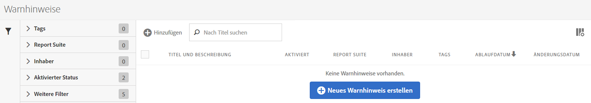
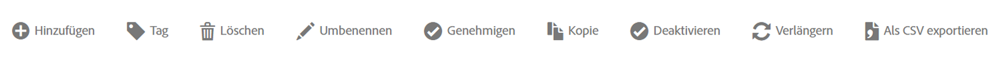

# Warnhinweis-Manager

The Alert Manager ( **[!UICONTROL Analytics]** &gt; **[!UICONTROL Components]** &gt; **[!UICONTROL Alerts]**) is structured very much like the [Segment Manager](https://marketing.adobe.com/resources/help/en_US/analytics/segment/seg_manage.html) and the [Calculated Metric Manager](https://marketing.adobe.com/resources/help/en_US/analytics/calcmetrics/cm_manager.html) and allows you to

* Access the Alert Builder by clicking **[!UICONTROL + Add]**.
* Warnhinweise mit einem Tag versehen: Dadurch können Sie sie zur einfachen Anwendung organisieren.
* Warnhinweise löschen
* Warnhinweise umbenennen
* Warnhinweise genehmigen
* Warnhinweise kopieren
* Warnhinweise aktivieren/deaktivieren
* Ein Ablaufdatum für den Warnhinweis **verlängern**: When one or more alerts are selected, they can be renewed by clicking **[!UICONTROL Renew]**.This extends their expiration dates to be 1 year from the day **[!UICONTROL Renew]** was clicked, regardless of their original expiration date.
* Einen Warnhinweis als .CSV-Datei exportieren
* Warnhinweise durch Doppelklicken auf den Titel bearbeiten
* Nach Warnhinweisen suchen
* Warnhinweise zu anderen Report Suites hinzufügen
* Den Eigentümer eines Warnhinweises angeben oder ändern
* Andere Filter hinzufügen
* Ein **Ablaufdatum** für den Warnhinweis definieren

