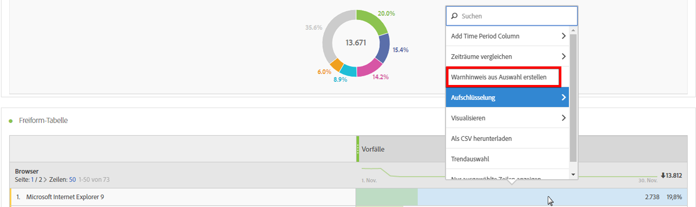
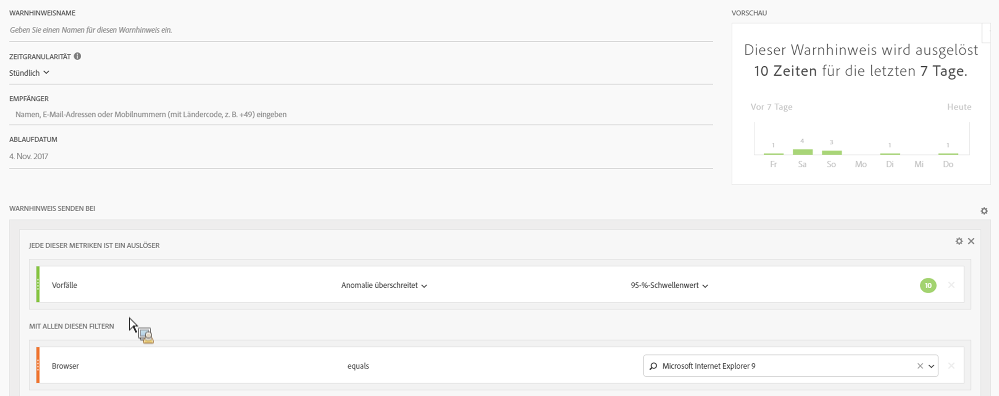
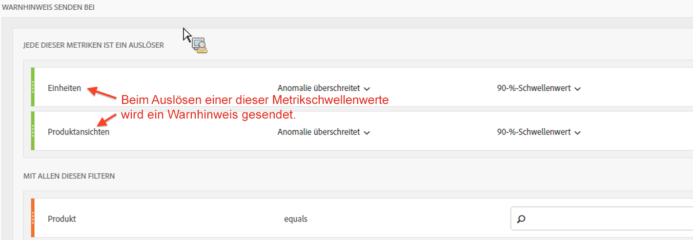

# Intelligente Warnhinweise – Anwendungsfälle

## Erstellen eines einfachen Warnhinweises, der nach zwei Segmenten gefiltert wird {#filter}

## Erstellen eines Warnhinweises aus einer Tabellenauswahl {#from-selection}

In Freiform-Tabellen können Sie nun kontextbezogene Warnhinweise erstellen, indem Sie mit der rechten Maustaste auf eine Tabellenzeile klicken und **[!UICONTROL Warnhinweis aus Auswahl erstellen auswählen]**.

Dadurch wird die Warnhinweiserstellung unverzüglich mit den entsprechenden Werten ausgefüllt, um einen Warnhinweis mit den korrekten Metriken und Filtern zu erstellen:

## Warnhinweise zusammenfassen (stapeln), anstatt mehrere Warnhinweise zu erstellen {#stacking}

Durch das Stapeln von Warnhinweisen wird dafür gesorgt, dass Warnhinweise kombiniert werden und nicht separat angezeigt werden.

