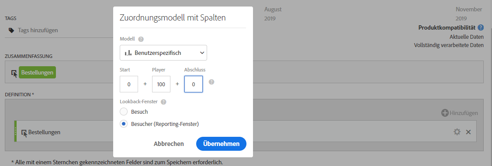
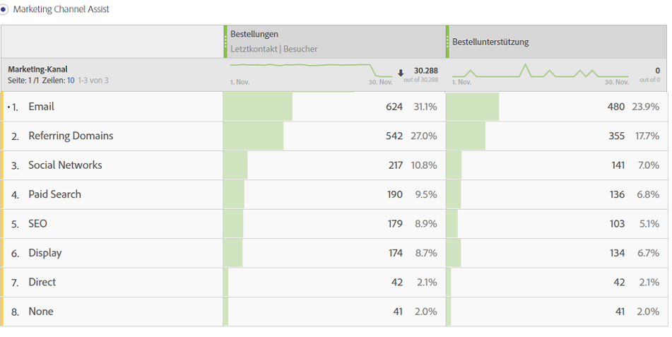

# Bestellbeitragsmetrik

Erläutert, wie Sie eine Metrik erstellen, die zeigt, welche Marketing-Kanäle zur Erhöhung der Bestellungen beitragen. Dies kann an beliebige relevante Dimensionen oder Erfolgsereignisse angepasst werden.

1. Benennen Sie die Metrik im Generator für berechnete Metriken „Assisted Orders“ (Unterstützte Bestellungen).
1. Ziehen Sie eine Bestellungsmetrik in die Arbeitsfläche „Definition“. Passen Sie das Attributionsmodell anschließend über das Zahnradsymbol für Einstellungen an, indem Sie das Kontrollkästchen **[!UICONTROL Nicht standardmäßige Attributionsmodelle verwenden]** aktivieren.

   

1. Wählen Sie als Attributionsmodell **[!UICONTROL Benutzerdefiniert]** aus. Ändern Sie die Attributstärke zu 0 (Starter), 100 (Player) und 0 (Closer).

   

1. Speichern Sie die Metrik.
1. Erstellen Sie eine Freiformtabelle in Analysis Workspace mit der Dimension „Marketing-Kanal“ sowie mit „Bestellungen“ und Ihrer neuen Metrik „Assisted Orders“.

   

Dies ist eine einfache Möglichkeit, um festzustellen, welche Marketing-Kanäle zur Erhöhung der Bestellungen beigetragen haben. Alternativ können Sie in einer Freiformtabelle mit der rechten Maustaste auf eine Metrik klicken und das Attributionsmodell direkt über die Tabelle anpassen.
